<div align="center">
  

  <h1>Jipyheonjeon (집현전)</h1>

  [](https://jipyheonjeon.kr)
  [](./LICENSE)
  [](https://python.org)
  [](https://react.dev)
  [](https://fastapi.tiangolo.com)
  [](https://openai.com)
</div>

---

<details open>
<summary><b>🇰🇷 한국어</b></summary>

## 목차

- [개요](#개요)
- [핵심 기능](#핵심-기능)
- [데이터 처리 파이프라인](#데이터-처리-파이프라인)
- [기술 스택](#기술-스택)
- [시스템 아키텍처](#시스템-아키텍처)
- [프로젝트 구조](#프로젝트-구조)
- [로컬 개발 환경](#로컬-개발-환경)
- [API 엔드포인트](#api-엔드포인트-요약)
- [참고문헌](#참고문헌)
- [라이선스](#라이선스)

---

## 개요

Jipyheonjeon은 학술 논문의 탐색, 분석, 정리 전 과정을 지원하는 AI 기반 연구 보조 시스템이다. 5개 학술 데이터베이스(arXiv, Google Scholar, Connected Papers, OpenAlex, DBLP)에 대한 병렬 검색과 BM25-semantic hybrid ranking을 수행하고, LLM 기반 multi-agent system을 통해 체계적 문헌 고찰(systematic literature review) 수준의 리뷰 리포트를 자동 생성한다. 인용 네트워크 그래프와 지식 그래프를 통해 문헌 간 관계를 시각적으로 탐색할 수 있다.

> **데이터 저장**: 외부 DBMS 의존성을 제거하기 위해 JSON 파일 기반 스토리지(`papers.json`, `users.json`, `bookmarks.json`)를 채택하였다.

---

## 핵심 기능

### 1. 다중 출처 학술 문헌 검색

5개 학술 데이터베이스에 대해 병렬 검색을 수행하며, 의도 적응형(intent-adaptive) 랭킹 파이프라인을 통해 검색 결과를 정제한다.

| 출처 | 특성 |
|------|------|
| **arXiv** | 프리프린트 서버 (CS/Physics/Math) |
| **Google Scholar** | 광범위한 학술 커버리지 |
| **Connected Papers** | 유사 논문 네트워크 기반 탐색 |
| **OpenAlex** | 오픈 액세스 학술 메타데이터 |
| **DBLP** | 컴퓨터 과학 서지 데이터베이스 |

**검색 파이프라인 (7단계):**

1. **쿼리 분석**: GPT-4o-mini 기반 zero-shot intent classification (8종: `paper_search`, `topic_exploration`, `method_search`, `survey`, `latest_research` 등), 키워드 추출, 쿼리 개선 (confidence >= 0.8이고 stem overlap >= 0.5일 때만 개선 쿼리 적용)
2. **소스별 쿼리 최적화**: arXiv 검색 문법(`ti:`, `abs:`, `cat:`), DBLP 키워드 형식, Google Scholar 자연어 형식으로 각각 변환
3. **캐시 조회**: SHA-256 기반 캐시 키, in-memory + file 2-tier 캐시 (TTL 1시간, 최대 200 엔트리, LRU 방식 퇴거)
4. **병렬 검색**: 5개 출처에 대해 `asyncio` 기반 동시 검색 수행
5. **교차 출처 중복 제거**: 3.5단계 cascade deduplication — DOI 정규화 매칭 → 정규화 제목 매칭(NFKD → ASCII) → Jaccard 퍼지 제목 매칭(J >= 0.85, length ratio >= 0.80) → 선택적 임베딩 유사도(cosine >= 0.90, Union-Find 자료구조로 그룹 병합). 메타데이터 풍부도(richness score) 기준으로 대표 레코드를 선정하고 누락 필드를 병합
6. **의도 적응형 4-signal hybrid ranking**: BM25 Okapi (Robertson et al., 1995) + dense semantic similarity (OpenAI `text-embedding-3-small`, cosine distance) + log-normalized citation count (`log(1+c)/log(1+max_c)`) + step-wise recency decay의 가중 합산. 검색 의도에 따라 가중치 프리셋이 자동 선택됨 (예: `latest_research`의 경우 recency 0.50, `survey`의 경우 citations 0.40)
7. **LLM-as-a-Judge 관련성 필터링**: 배치 단위(10편) 병렬 평가 (`ThreadPoolExecutor`, max 5 workers), 0.0–1.0 스케일 점수화, threshold 0.65 미만 제거. LLM 실패 시 키워드 오버랩 기반 fallback 점수 적용 (제목 가중치 70% + 초록 가중치 30%)

### 2. LLM 기반 체계적 문헌 분석 (Deep Review)

선택된 논문에 대해 두 가지 분석 모드를 제공한다.

| 모드 | 방식 | 특성 |
|------|------|------|
| **Fast Mode** | 단일 LLM 호출 (GPT-4.1, 32K tokens, t=0.4) | 전체 논문을 하나의 프롬프트로 일괄 분석. Multi-agent 비사용 |
| **Deep Mode** | Fan-out/Fan-in multi-agent orchestration | 병렬 분석 → 교차 검증 → 사실 검증의 다단계 파이프라인 |

**Deep Mode 파이프라인:**

```
ReviewOrchestrator (Fan-out/Fan-in Pattern, ThreadPoolExecutor)
    │
    ├── [Step 1] Paper Loading — papers.json에서 논문 데이터 적재
    │
    ├── [Step 2] Parallel Analysis — Researcher Agent × N (병렬)
    │       4-Stage Tool-Chain: Comprehensive Analysis → Key Contribution
    │       Extraction → Methodology Deep-Dive → Critical Evaluation
    │
    ├── [Step 3] Advisor Validation — 5-Criterion Scoring (25점 만점)
    │       Completeness, Accuracy, Depth, Balance, Insight (각 0-5)
    │       APPROVED (20+) / NEEDS_REVISION (15-19) / REJECTED (<15)
    │
    ├── [Step 3.5] Fact Verification Pipeline (3-Phase)
    │       Phase A: ClaimExtractor — LLM 기반 주장 추출 및 5가지 유형 분류
    │           (statistical[t=0.9] / comparative[0.8] / methodological[0.7]
    │            / factual[0.7] / interpretive[검증 제외])
    │       Phase B: EvidenceLinker — 3-Stage Cascade 검증
    │           Stage 1: 정규식 수치 exact match
    │           Stage 2: FAISS IndexFlatIP semantic search (cosine >= 0.95 → auto-VERIFIED)
    │           Stage 3: LLM Judge (GPT-4o-mini, t=0.1) → verified/partially/contradicted
    │       Phase C: CrossRefValidator — 논문 간 claim pair 관계 판정
    │           (supports/contradicts/extends/independent)
    │           합의도: STRONG / MODERATE / WEAK / DIVIDED
    │
    └── [Step 4] Report Generation — Markdown/HTML dual-format 리포트
```

**리포트 구성:**
- 요약 (Abstract), 방법론 분석, 논문 간 교차 분석, 핵심 인사이트 도출
- 연구 갭 및 향후 방향 제시
- 주장 검증 통계 — 검증률/부분검증/반박 분포 시각화

### 3. 문헌 유사도 네트워크 시각화

수집된 논문 간의 내용 유사도를 Plotly.js 기반 인터랙티브 그래프로 시각화한다.

- **임베딩 기반 엣지 생성**: OpenAI `text-embedding-3-small` 모델의 cosine similarity를 사용하여 논문 간 유사도 엣지를 자동 생성 (threshold 0.7, top-k=10)
- **인용 엣지**: `difflib.SequenceMatcher` 기반 제목 매칭 (ratio >= 0.65)으로 실제 citation 관계 연결
- **그래프 자료구조**: NetworkX `MultiDiGraph` (Hagberg et al., 2008)
- 출판 연도별 노드 색상 그라데이션, 인용 수/연도 기반 필터링
- 노드 선택 시 상세 메타데이터 패널 연동

> 실제 인용 관계(reference/cited-by) 심층 탐색은 별도의 인용 트리(Citation Tree) 기능을 통해 depth 1–3까지 지원된다.

### 4. 개인 연구 라이브러리 (MyPage)

리뷰 결과를 체계적으로 관리하는 개인화된 연구 워크스페이스이다.

- **북마크 관리**: 리뷰 세션 저장, 토픽별 분류, 드래그앤드롭 정렬 (dnd-kit)
- **하이라이트**: GPT-4.1 기반 자동 생성 + 수동 주석, significance 점수(1–5), 6개 카테고리별 색상 구분 (key_finding, methodology, limitation, strength, weakness, question)
- **노트**: 북마크별 메모 작성 및 자동 저장
- **인용 트리**: 참조/피인용 관계를 1–3 depth로 양방향 탐색
- **내보내기**: BibTeX, 리포트 다운로드

### 5. 대화형 문헌 탐색 (RAG 기반 채팅)

저장된 논문 리뷰와 지식 그래프를 활용한 Retrieval-Augmented Generation (Lewis et al., 2020) 기반 대화형 인터페이스를 제공한다.

**3-Layer Context Assembly:**
1. **Bookmark Report Context**: 최대 10개 리뷰 리포트 (각 4000자), 번호 매김 인용 참조
2. **User Highlight Injection**: significance >= 4인 하이라이트 상위 5개를 key findings로 주입
3. **LightRAG Knowledge Graph Retrieval**: hybrid 모드(Local + Global) 검색, key entities(최대 8) + relationships(최대 8) + KG analysis

- SSE(Server-Sent Events) 기반 실시간 스트리밍 응답 (GPT-4o-mini, t=0.7)

### 6. 지식 그래프 (LightRAG 자체 구현)

수집된 논문에서 학술 엔티티와 관계를 추출하여 지식 그래프를 구축한다. LightRAG (Guo et al., 2024)의 dual-level retrieval 개념을 자체 구현하였다 (`src/light_rag/`).

**엔티티 추출**: GPT-4o-mini 기반 구조화 정보 추출. 6개 엔티티 유형(Concept, Method, Dataset, Task, Metric, Tool)과 관계를 논문 텍스트에서 JSON 형식으로 추출. 비동기 배치 처리(`asyncio.Semaphore`, max 동시 4).

**Triple-Index Embedding**: OpenAI `text-embedding-3-small`으로 Entity / Relation / Chunk 각각에 대해 FAISS `IndexFlatIP` (L2 정규화 후 Inner Product ≈ Cosine) 인덱스를 구축.

**검색 모드:**

| 모드 | 전략 | 적합한 쿼리 유형 |
|------|------|-----------------|
| naive | 청크 벡터 유사도 검색 (standard RAG) | 일반 질의 |
| local | 키워드 → 엔티티 벡터 검색 → 이웃 관계 그래프 탐색 | 구체적, 사실 확인형 질의 |
| global | 키워드 → 관계 벡터 검색 → 엔티티 그룹 추출 | 주제적, 종합적 질의 |
| hybrid | local + global 결합 | 복합 질의 |
| mix | hybrid + naive 통합 | KG + 벡터 검색 병합 |

### 7. 학회 포스터 생성 (Beta)

Deep Review 리포트를 바탕으로 학회 발표용 포스터를 자동 생성한다. Gemini (`gemini-3-pro-image-preview`) 기반 HTML 포스터 생성 후, self-critique loop (최대 2회 iterative refinement)을 통해 품질을 자동 검증한다.

> 현재 Beta 기능으로 비활성화되어 있다.

### 8. 관리자 대시보드

시스템 전반을 모니터링하는 관리자 전용 페이지이다.

- 시스템 통계 (사용자 수, 논문 수, 북마크 수, 소스별 분포)
- 사용자 관리 (역할 변경, 삭제)
- 논문/북마크 관리 (조회, 필터링, 삭제)

---

## 데이터 처리 파이프라인



---

## 기술 스택

### Frontend
| 기술 | 용도 |
|------|------|
| React 19 + TypeScript | UI 프레임워크 |
| Vite 7 | 빌드 도구 |
| Plotly.js | 인터랙티브 그래프 시각화 |
| Axios | HTTP 클라이언트 |
| dnd-kit | 드래그앤드롭 |
| React Markdown | 마크다운 렌더링 |

### Backend
| 기술 | 용도 |
|------|------|
| FastAPI + Uvicorn | 비동기 API 서버 |
| Python 3.12 | 런타임 |
| JWT + bcrypt | 인증 (24시간 토큰 만료) |
| LangChain 0.3 | LLM 오케스트레이션 |
| LangGraph 0.2 | 멀티에이전트 워크플로우 |
| slowapi | API Rate Limiting |

### AI / LLM
| 기술 | 용도 |
|------|------|
| OpenAI GPT-4.1 | 심층 리뷰 (Fast Mode), AI 하이라이트 생성 |
| OpenAI GPT-4o-mini | 쿼리 분석, 관련성 필터링, 채팅, 엔티티 추출, Fact Verification |
| OpenAI `text-embedding-3-small` | Dense semantic retrieval, 유사도 계산, KG 인덱싱 |
| Google Gemini (`gemini-3-pro-image-preview`) | 포스터 생성 (Beta) |
| FAISS `IndexFlatIP` | ANN 벡터 인덱스 (Johnson et al., 2019) |
| NetworkX `MultiDiGraph` | 그래프 자료구조 (Hagberg et al., 2008) |
| BM25 Okapi (`rank_bm25`) | Sparse lexical retrieval (Robertson et al., 1995) |

### 인프라
| 기술 | 용도 |
|------|------|
| AWS EC2 (ap-northeast-2) | 서버 호스팅 |
| Nginx | 리버스 프록시 + 정적 파일 서빙 |
| Let's Encrypt | SSL 인증서 |
| systemd | 프로세스 관리 |

---

## 시스템 아키텍처

```
┌─────────────────────────────────────────────────────────┐
│                     Client (Browser)                     │
│              React 19 + TypeScript + Plotly.js           │
└──────────────────────────┬──────────────────────────────┘
                           │ HTTPS
                           ▼
┌──────────────────────────────────────────────────────────┐
│                    Nginx (Reverse Proxy)                  │
│            jipyheonjeon.kr → Let's Encrypt SSL           │
│         /api/* → FastAPI    /* → web-ui/dist             │
└──────────────────────────┬──────────────────────────────┘
                           │
                           ▼
┌──────────────────────────────────────────────────────────┐
│                   FastAPI (api_server.py)                 │
│         CORS · Rate Limiting (slowapi) · Logging         │
│                                                          │
│  ┌────────┐┌────────┐┌────────┐┌──────────┐┌─────────┐  │
│  │  Auth  ││ Search ││Reviews ││Bookmarks ││  Chat   │  │
│  │ Router ││ Router ││ Router ││  Router  ││ Router  │  │
│  └───┬────┘└───┬────┘└───┬────┘└────┬─────┘└────┬────┘  │
│  ┌───┴────┐┌───┴────┐┌───┴─────┐┌──┴──────┐┌───┴────┐  │
│  │LightRAG││ Admin  ││Explorer.││  Papers ││  deps/ │  │
│  │ Router ││ Router ││ Router  ││  Router ││ config │  │
│  └───┬────┘└───┬────┘└───┬─────┘└────┬────┘└───┬────┘  │
│      │         │         │           │         │        │
│  ┌───▼─────────▼─────────▼───────────▼─────────▼─────┐  │
│  │              Agent System (app/)                    │  │
│  │                                                     │  │
│  │  SearchAgent (QueryAgent 내장)                      │  │
│  │  ├─ 5 Collectors (asyncio parallel)                │  │
│  │  ├─ 3.5-Stage Cascade Deduplicator                 │  │
│  │  ├─ 4-Signal Intent-Adaptive Hybrid Ranker         │  │
│  │  └─ LLM-as-a-Judge Relevance Filter                │  │
│  │                                                     │  │
│  │  DeepAgent (모드 분기)                               │  │
│  │  ├─ [Fast] Single LLM call (GPT-4.1, 32K)         │  │
│  │  └─ [Deep] ReviewOrchestrator (Fan-out/Fan-in)     │  │
│  │     ├─ Researcher ×N (ThreadPoolExecutor)          │  │
│  │     ├─ Advisor (5-Criterion, 25pt scoring)         │  │
│  │     └─ Fact Verification (3-Phase Cascade)         │  │
│  │                                                     │  │
│  │  GraphRAG Agent ─── LightRAG                        │  │
│  │  ├─ FAISS Triple-Index (Entity/Relation/Chunk)     │  │
│  │  └─ Dual-Level Retrieval (Local/Global/Hybrid/Mix) │  │
│  └─────────────────────────────────────────────────────┘  │
│                                                          │
│  ┌─────────────────────────────────────────────────────┐  │
│  │         Data Layer (JSON 파일 기반, data/)           │  │
│  │  papers.json  │ paper_graph.pkl │ embeddings.index   │  │
│  │  users.json   │ bookmarks.json  │ light_rag/         │  │
│  │  cache/       │ workspace/      │ (threading.Lock)   │  │
│  └─────────────────────────────────────────────────────┘  │
└──────────────────────────────────────────────────────────┘
                           │
                           ▼
            ┌──────────────────────────┐
            │     External APIs        │
            │  OpenAI  │  Google AI    │
            │  arXiv   │  Scholar      │
            │  OpenAlex│  DBLP         │
            │  Connected Papers        │
            └──────────────────────────┘
```

---

## 프로젝트 구조

```
PaperReviewAgent/
├── api_server.py              # FastAPI 엔트리포인트 (CORS, 미들웨어, 라우터 등록)
├── routers/                   # API 라우터 (9개)
│   ├── auth.py                #   인증 (JWT 로그인/회원가입)
│   ├── search.py              #   논문 검색 (멀티소스, 7단계 파이프라인)
│   ├── papers.py              #   논문 관리 (저장/조회/그래프)
│   ├── reviews.py             #   심층 리뷰 (Fast/Deep 모드 분기, 비동기 처리)
│   ├── bookmarks.py           #   북마크 (CRUD + 하이라이트)
│   ├── chat.py                #   RAG 채팅 (3-layer context, SSE 스트리밍)
│   ├── lightrag.py            #   지식 그래프 (LightRAG dual-level retrieval)
│   ├── exploration.py         #   인용 트리 탐색
│   ├── admin.py               #   관리자 대시보드
│   └── deps/                  #   공통 의존성 패키지
│       ├── config.py          #     환경변수, API 키
│       ├── storage.py         #     파일 I/O, Lock 관리
│       ├── auth.py            #     JWT 디코딩
│       ├── middleware.py      #     Rate Limiter
│       ├── agents.py          #     에이전트 싱글톤 초기화
│       └── openai_client.py   #     OpenAI/LightRAG 싱글톤
├── app/                       # 에이전트 모듈
│   ├── SearchAgent/           #   검색 에이전트 (5 collectors + QueryAgent)
│   ├── QueryAgent/            #   쿼리 분석 (intent classification, relevance filtering)
│   ├── DeepAgent/             #   심층 리뷰 (ReviewOrchestrator + Fact Verification)
│   └── GraphRAG/              #   그래프 RAG 에이전트
├── src/                       # 핵심 라이브러리
│   ├── collector/             #   논문 수집기 + Deduplicator + SimilarityCalculator
│   ├── graph/                 #   그래프 빌더 (NetworkX MultiDiGraph)
│   ├── graph_rag/             #   HybridRanker (BM25 + Semantic + Citation + Recency)
│   ├── light_rag/             #   LightRAG (자체 구현: entity extraction, KG, dual-level retrieval)
│   └── utils/                 #   유틸리티
├── web-ui/                    # React 프론트엔드
│   └── src/
│       ├── App.tsx            #   메인 앱 (라우팅, 상태 관리)
│       ├── components/        #   UI 컴포넌트
│       ├── hooks/             #   커스텀 훅 (북마크, 채팅, 하이라이트)
│       ├── api/client.ts      #   API 클라이언트
│       └── types.ts           #   TypeScript 인터페이스
└── data/                      # 데이터 저장소 (JSON 파일 기반, threading.Lock 동시성 제어)
    ├── raw/papers.json        #   수집된 논문 데이터
    ├── graph/                 #   NetworkX 그래프 (pickle)
    ├── embeddings/            #   FAISS 벡터 인덱스
    ├── light_rag/             #   지식 그래프 (엔티티/관계, Triple FAISS Index)
    ├── cache/                 #   검색 캐시 (2-tier, SHA-256 키, 1시간 TTL)
    └── workspace/             #   리뷰 세션별 워크스페이스 (24시간 TTL)
```

---

## 로컬 개발 환경

### 요구사항
- Python 3.12+
- Node.js 20+
- OpenAI API Key (필수)
- Google API Key (선택, 포스터 생성 시 필요)

### 환경변수

| 변수 | 필수 | 설명 | 기본값 |
|------|------|------|--------|
| `OPENAI_API_KEY` | 필수 | OpenAI API 키 | - |
| `JWT_SECRET` | 필수 | JWT 서명 시크릿 | - |
| `GOOGLE_API_KEY` | 선택 | Gemini 포스터 생성용 | - |
| `CORS_ORIGINS` | 선택 | 허용 Origin (쉼표 구분) | `*` |

### 실행 방법

```bash
# 1. 저장소 클론
git clone https://github.com/your-repo/PaperReviewAgent.git
cd PaperReviewAgent

# 2. Python 가상환경 + 의존성
python -m venv .venv
source .venv/bin/activate    # Windows: .venv\Scripts\activate
pip install -r requirements.txt

# 3. 환경변수 설정
export OPENAI_API_KEY="your-key"
export JWT_SECRET="your-secret"

# 4. 백엔드 서버 시작
python api_server.py    # http://localhost:8000

# 5. 프론트엔드 개발 서버 (별도 터미널)
cd web-ui
npm install
npm run dev             # http://localhost:5173
```

---

## API 엔드포인트 요약

### 인증
| Method | Endpoint | 설명 |
|--------|----------|------|
| `POST` | `/api/auth/login` | 로그인 (JWT 발급, 24시간 만료) |
| `POST` | `/api/auth/register` | 회원가입 |
| `GET` | `/api/auth/verify` | 토큰 유효성 검증 |

### 검색
| Method | Endpoint | 설명 |
|--------|----------|------|
| `POST` | `/api/search` | 다중 출처 문헌 검색 (7단계 파이프라인) |
| `POST` | `/api/smart-search` | LLM 최적화 검색 |
| `POST` | `/api/analyze-query` | 쿼리 의도 분석 |
| `POST` | `/api/graph-data` | 유사도 네트워크 그래프 생성 |

### 심층 리뷰
| Method | Endpoint | 설명 | Rate Limit |
|--------|----------|------|------------|
| `POST` | `/api/deep-review` | 심층 리뷰 시작 (비동기) | 5/분 |
| `GET` | `/api/deep-review/status/{id}` | 리뷰 진행 상태 조회 | |
| `GET` | `/api/deep-review/report/{id}` | 리뷰 리포트 조회 | |
| `GET` | `/api/deep-review/verification/{id}` | Fact Verification 상세 조회 | |
| `POST` | `/api/deep-review/visualize/{id}` | 학회 포스터 생성 (Beta) | |

### 북마크
| Method | Endpoint | 설명 |
|--------|----------|------|
| `POST` | `/api/bookmarks` | 북마크 저장 |
| `GET` | `/api/bookmarks` | 북마크 목록 조회 |
| `GET` | `/api/bookmarks/{id}` | 북마크 상세 조회 |
| `DELETE` | `/api/bookmarks/{id}` | 북마크 삭제 |
| `PATCH` | `/api/bookmarks/{id}/title` | 제목 수정 |
| `PATCH` | `/api/bookmarks/{id}/topic` | 토픽 분류 |
| `POST` | `/api/bookmarks/{id}/auto-highlight` | AI 하이라이트 생성 |
| `POST` | `/api/bookmarks/bulk-delete` | 일괄 삭제 |

### 채팅 / 지식 그래프
| Method | Endpoint | 설명 |
|--------|----------|------|
| `POST` | `/api/chat` | RAG 채팅 (3-layer context, SSE) |
| `POST` | `/api/light-rag/build` | 지식 그래프 구축 |
| `POST` | `/api/light-rag/query` | 지식 그래프 쿼리 (5 modes) |
| `GET` | `/api/light-rag/status` | 지식 그래프 상태 조회 |

### 인용 트리
| Method | Endpoint | 설명 |
|--------|----------|------|
| `POST` | `/api/bookmarks/{id}/citation-tree` | 인용 트리 생성 (depth 1-3) |
| `GET` | `/api/bookmarks/{id}/citation-tree` | 인용 트리 조회 |
| `DELETE` | `/api/bookmarks/{id}/citation-tree` | 인용 트리 삭제 |

### 관리자
| Method | Endpoint | 설명 |
|--------|----------|------|
| `GET` | `/api/admin/dashboard` | 시스템 통계 대시보드 |
| `GET` | `/api/admin/users` | 사용자 목록 |
| `PATCH` | `/api/admin/users/{user}/role` | 역할 변경 |
| `DELETE` | `/api/admin/users/{user}` | 사용자 삭제 |

### 기타
| Method | Endpoint | 설명 |
|--------|----------|------|
| `GET` | `/health` | 헬스 체크 |

전체 API 문서: https://jipyheonjeon.kr/docs

---

## 참고문헌

- Robertson, S. E., Walker, S., Jones, S., Hancock-Beaulieu, M., & Gatford, M. (1995). Okapi at TREC-3. *NIST Special Publication*, 500-225.
- Johnson, J., Douze, M., & Jégou, H. (2019). Billion-scale similarity search with GPUs. *IEEE Transactions on Big Data*, 7(3), 535–547.
- Hagberg, A. A., Schult, D. A., & Swart, P. J. (2008). Exploring network structure, dynamics, and function using NetworkX. *Proceedings of the 7th Python in Science Conference (SciPy)*, 11–15.
- Guo, Z., et al. (2024). LightRAG: Simple and Fast Retrieval-Augmented Generation. *arXiv preprint arXiv:2410.05779*.
- Lewis, P., et al. (2020). Retrieval-Augmented Generation for Knowledge-Intensive NLP Tasks. *Advances in Neural Information Processing Systems (NeurIPS)*, 33, 9459–9474.

---

## 라이선스

이 프로젝트는 [Apache License 2.0](./LICENSE) 하에 배포된다.

</details>

<details>
<summary><b>🇺🇸 English</b></summary>

## Table of Contents

- [Overview](#overview)
- [Key Features](#key-features)
- [Data Processing Pipeline](#data-processing-pipeline)
- [Tech Stack](#tech-stack)
- [System Architecture](#system-architecture)
- [Project Structure](#project-structure)
- [Getting Started](#getting-started)
- [API Endpoints](#api-endpoints)
- [References](#references)
- [License](#license)

---

## Overview

Jipyheonjeon is an AI-assisted research support system that covers the entire workflow of academic paper discovery, analysis, and organization. It performs parallel retrieval across five scholarly databases (arXiv, Google Scholar, Connected Papers, OpenAlex, DBLP) with BM25-semantic hybrid ranking, and generates systematic-literature-review-level reports through an LLM-based multi-agent system. Citation network graphs and knowledge graphs enable visual exploration of inter-document relationships.

> **Data Storage**: To minimize external dependencies, the system adopts JSON-file-based storage (`papers.json`, `users.json`, `bookmarks.json`) without requiring an external DBMS.

---

## Key Features

### 1. Multi-Source Academic Literature Retrieval

Performs parallel retrieval across five scholarly databases and refines results through an intent-adaptive ranking pipeline.

| Source | Characteristics |
|--------|----------------|
| **arXiv** | Preprint server (CS/Physics/Math) |
| **Google Scholar** | Broadest academic coverage |
| **Connected Papers** | Similar paper network-based exploration |
| **OpenAlex** | Open access scholarly metadata |
| **DBLP** | Computer science bibliography database |

**Retrieval Pipeline (7 stages):**

1. **Query Analysis**: GPT-4o-mini zero-shot intent classification (8 categories: `paper_search`, `topic_exploration`, `method_search`, `survey`, `latest_research`, etc.), keyword extraction, query refinement (applied only when confidence >= 0.8 and stem overlap >= 0.5)
2. **Source-Specific Query Optimization**: Queries reformulated for arXiv syntax (`ti:`, `abs:`, `cat:`), DBLP keyword format, and Google Scholar natural language
3. **Two-Tier Cache Lookup**: SHA-256-based cache key, in-memory + file-system tiers (TTL: 1 hour, max 200 entries, LRU eviction)
4. **Parallel Retrieval**: Concurrent `asyncio`-based search across all five sources
5. **Cross-Source Deduplication**: 3.5-stage cascade — DOI normalization → normalized title matching (NFKD → ASCII) → Jaccard fuzzy title matching (J >= 0.85, length ratio >= 0.80) → optional embedding similarity (cosine >= 0.90, Union-Find for group merging). Representative records selected by metadata richness score with missing field imputation
6. **Intent-Adaptive 4-Signal Hybrid Ranking**: Weighted combination of BM25 Okapi (Robertson et al., 1995) + dense semantic similarity (OpenAI `text-embedding-3-small`, cosine distance) + log-normalized citation count (`log(1+c)/log(1+max_c)`) + step-wise recency decay. Weight presets auto-selected by query intent (e.g., `latest_research`: recency 0.50; `survey`: citations 0.40)
7. **LLM-as-a-Judge Relevance Filtering**: Batch-parallel evaluation (10 papers/batch, `ThreadPoolExecutor`, max 5 workers), scored on 0.0–1.0 scale, threshold 0.65. Falls back to keyword overlap scoring on LLM failure (title weight 70% + abstract weight 30%)

### 2. LLM-Based Systematic Literature Analysis (Deep Review)

Two analysis modes are provided for selected papers.

| Mode | Method | Characteristics |
|------|--------|----------------|
| **Fast Mode** | Single LLM call (GPT-4.1, 32K tokens, t=0.4) | All papers analyzed in one prompt. No multi-agent |
| **Deep Mode** | Fan-out/Fan-in multi-agent orchestration | Multi-stage pipeline: parallel analysis → validation → fact verification |

**Deep Mode Pipeline:**

```
ReviewOrchestrator (Fan-out/Fan-in Pattern, ThreadPoolExecutor)
    │
    ├── [Step 1] Paper Loading — load paper data from papers.json
    │
    ├── [Step 2] Parallel Analysis — Researcher Agent × N (parallel)
    │       4-Stage Tool-Chain: Comprehensive Analysis → Key Contribution
    │       Extraction → Methodology Deep-Dive → Critical Evaluation
    │
    ├── [Step 3] Advisor Validation — 5-Criterion Scoring (25 points)
    │       Completeness, Accuracy, Depth, Balance, Insight (0-5 each)
    │       APPROVED (20+) / NEEDS_REVISION (15-19) / REJECTED (<15)
    │
    ├── [Step 3.5] Fact Verification Pipeline (3-Phase)
    │       Phase A: ClaimExtractor — LLM claim extraction with 5-type classification
    │           (statistical[t=0.9] / comparative[0.8] / methodological[0.7]
    │            / factual[0.7] / interpretive[excluded])
    │       Phase B: EvidenceLinker — 3-Stage Cascade Verification
    │           Stage 1: Regex numeric exact match
    │           Stage 2: FAISS IndexFlatIP semantic search (cosine >= 0.95 → auto-VERIFIED)
    │           Stage 3: LLM Judge (GPT-4o-mini, t=0.1) → verified/partially/contradicted
    │       Phase C: CrossRefValidator — cross-paper claim pair relation judgment
    │           (supports/contradicts/extends/independent)
    │           Consensus: STRONG / MODERATE / WEAK / DIVIDED
    │
    └── [Step 4] Report Generation — Markdown/HTML dual-format report
```

**Report Sections:**
- Abstract, methodology analysis, cross-paper analysis, key insights
- Research gaps and future directions
- Claim verification statistics — verified/partial/contradicted distribution visualization

### 3. Document Similarity Network Visualization

Visualizes content similarity among collected papers as an interactive Plotly.js graph.

- **Embedding-based edge generation**: Cosine similarity of OpenAI `text-embedding-3-small` embeddings (threshold 0.7, top-k=10)
- **Citation edges**: `difflib.SequenceMatcher` title matching (ratio >= 0.65) for actual citation relationships
- **Graph data structure**: NetworkX `MultiDiGraph` (Hagberg et al., 2008)
- Node color gradient by publication year, filtering by citation count and year
- Node selection triggers detail metadata panel

> Actual citation relationship (reference/cited-by) deep exploration is supported through the separate Citation Tree feature (depth 1–3).

### 4. Personal Research Library (MyPage)

A personalized research workspace for systematic management of review results.

- **Bookmarks**: Save review sessions, organize by topic, drag-and-drop sorting (dnd-kit)
- **Highlights**: GPT-4.1-based auto-generation + manual annotation, significance score (1–5), 6 color-coded categories (key_finding, methodology, limitation, strength, weakness, question)
- **Notes**: Per-bookmark memo with auto-save
- **Citation Tree**: Bidirectional reference/cited-by exploration up to depth 3
- **Export**: BibTeX, report download

### 5. Conversational Literature Exploration (RAG-Based Chat)

Provides a Retrieval-Augmented Generation (Lewis et al., 2020) interface grounded in saved paper reviews and the knowledge graph.

**3-Layer Context Assembly:**
1. **Bookmark Report Context**: Up to 10 review reports (4000 chars each), numbered citation references
2. **User Highlight Injection**: Top 5 highlights with significance >= 4 injected as key findings
3. **LightRAG Knowledge Graph Retrieval**: Hybrid mode (Local + Global) search, key entities (max 8) + relationships (max 8) + KG analysis

- Real-time streaming responses via SSE (GPT-4o-mini, t=0.7)

### 6. Knowledge Graph (Custom LightRAG Implementation)

Constructs a knowledge graph by extracting academic entities and relationships from collected papers. Custom implementation of the dual-level retrieval concept from LightRAG (Guo et al., 2024), located in `src/light_rag/`.

**Entity Extraction**: GPT-4o-mini-based structured information extraction. Six entity types (Concept, Method, Dataset, Task, Metric, Tool) and relationships extracted in JSON format. Async batch processing (`asyncio.Semaphore`, max concurrency 4).

**Triple-Index Embedding**: OpenAI `text-embedding-3-small` with separate FAISS `IndexFlatIP` (L2-normalized Inner Product ≈ Cosine) indices for Entity / Relation / Chunk.

**Retrieval Modes:**

| Mode | Strategy | Suitable Query Type |
|------|----------|---------------------|
| naive | Chunk vector similarity search (standard RAG) | General queries |
| local | Keyword → entity vector search → neighbor traversal | Specific, fact-checking queries |
| global | Keyword → relation vector search → entity group extraction | Thematic, synthesizing queries |
| hybrid | local + global combination | Compound queries |
| mix | hybrid + naive integration | KG + vector search fusion |

### 7. Conference Poster Generation (Beta)

Automatically generates conference posters from Deep Review reports. Gemini (`gemini-3-pro-image-preview`) HTML poster generation with self-critique loop (up to 2 iterative refinement cycles).

> Currently disabled as a Beta feature.

### 8. Admin Dashboard

An admin-only page for system-wide monitoring.

- System statistics (users, papers, bookmarks, source distribution)
- User management (role changes, deletion)
- Paper/bookmark management (browse, filter, delete)

---

## Data Processing Pipeline

```mermaid
flowchart LR
    Q[User Query] --> QA[Query Analysis<br/>Intent Classification<br/>8 categories]
    QA --> PS[Parallel Search<br/>5 sources]
    PS --> DD[Deduplication<br/>3.5-stage cascade<br/>DOI→Title→Jaccard→Embedding]
    DD --> HR[Hybrid Ranking<br/>BM25 + Semantic +<br/>Citation + Recency]
    HR --> RF[Relevance Filter<br/>LLM-as-a-Judge<br/>threshold 0.65]
    RF --> SR[Search Results]
    SR --> DR[Deep Review<br/>Fan-out/Fan-in<br/>multi-agent]
    DR --> FV[Fact Verification<br/>3-phase cascade]
    FV --> RP[Review Report]
    RP --> KG[Knowledge Graph<br/>LightRAG<br/>dual-level retrieval]
    KG --> RC[RAG Chat<br/>3-layer context]
```


---

## Tech Stack

### Frontend
| Technology | Purpose |
|------------|---------|
| React 19 + TypeScript | UI framework |
| Vite 7 | Build tool |
| Plotly.js | Interactive graph visualization |
| Axios | HTTP client |
| dnd-kit | Drag and drop |
| React Markdown | Markdown rendering |

### Backend
| Technology | Purpose |
|------------|---------|
| FastAPI + Uvicorn | Async API server |
| Python 3.12 | Runtime |
| JWT + bcrypt | Authentication (24h token expiry) |
| LangChain 0.3 | LLM orchestration |
| LangGraph 0.2 | Multi-agent workflows |
| slowapi | API rate limiting |

### AI / LLM
| Technology | Purpose |
|------------|---------|
| OpenAI GPT-4.1 | Deep review (Fast Mode), AI highlight generation |
| OpenAI GPT-4o-mini | Query analysis, relevance filtering, chat, entity extraction, fact verification |
| OpenAI `text-embedding-3-small` | Dense semantic retrieval, similarity computation, KG indexing |
| Google Gemini (`gemini-3-pro-image-preview`) | Poster generation (Beta) |
| FAISS `IndexFlatIP` | ANN vector index (Johnson et al., 2019) |
| NetworkX `MultiDiGraph` | Graph data structure (Hagberg et al., 2008) |
| BM25 Okapi (`rank_bm25`) | Sparse lexical retrieval (Robertson et al., 1995) |

### Infrastructure
| Technology | Purpose |
|------------|---------|
| AWS EC2 (ap-northeast-2) | Server hosting |
| Nginx | Reverse proxy + static file serving |
| Let's Encrypt | SSL certificate |
| systemd | Process management |

---

## System Architecture

```
┌─────────────────────────────────────────────────────────┐
│                     Client (Browser)                     │
│              React 19 + TypeScript + Plotly.js           │
└──────────────────────────┬──────────────────────────────┘
                           │ HTTPS
                           ▼
┌──────────────────────────────────────────────────────────┐
│                    Nginx (Reverse Proxy)                  │
│            jipyheonjeon.kr → Let's Encrypt SSL           │
│         /api/* → FastAPI    /* → web-ui/dist             │
└──────────────────────────┬──────────────────────────────┘
                           │
                           ▼
┌──────────────────────────────────────────────────────────┐
│                   FastAPI (api_server.py)                 │
│         CORS · Rate Limiting (slowapi) · Logging         │
│                                                          │
│  ┌────────┐┌────────┐┌────────┐┌──────────┐┌─────────┐  │
│  │  Auth  ││ Search ││Reviews ││Bookmarks ││  Chat   │  │
│  │ Router ││ Router ││ Router ││  Router  ││ Router  │  │
│  └───┬────┘└───┬────┘└───┬────┘└────┬─────┘└────┬────┘  │
│  ┌───┴────┐┌───┴────┐┌───┴─────┐┌──┴──────┐┌───┴────┐  │
│  │LightRAG││ Admin  ││Explorer.││  Papers ││  deps/ │  │
│  │ Router ││ Router ││ Router  ││  Router ││ config │  │
│  └───┬────┘└───┬────┘└───┬─────┘└────┬────┘└───┬────┘  │
│      │         │         │           │         │        │
│  ┌───▼─────────▼─────────▼───────────▼─────────▼─────┐  │
│  │              Agent System (app/)                    │  │
│  │                                                     │  │
│  │  SearchAgent (with QueryAgent)                      │  │
│  │  ├─ 5 Collectors (asyncio parallel)                │  │
│  │  ├─ 3.5-Stage Cascade Deduplicator                 │  │
│  │  ├─ 4-Signal Intent-Adaptive Hybrid Ranker         │  │
│  │  └─ LLM-as-a-Judge Relevance Filter                │  │
│  │                                                     │  │
│  │  DeepAgent (mode branching)                         │  │
│  │  ├─ [Fast] Single LLM call (GPT-4.1, 32K)         │  │
│  │  └─ [Deep] ReviewOrchestrator (Fan-out/Fan-in)     │  │
│  │     ├─ Researcher ×N (ThreadPoolExecutor)          │  │
│  │     ├─ Advisor (5-Criterion, 25pt scoring)         │  │
│  │     └─ Fact Verification (3-Phase Cascade)         │  │
│  │                                                     │  │
│  │  GraphRAG Agent ─── LightRAG                        │  │
│  │  ├─ FAISS Triple-Index (Entity/Relation/Chunk)     │  │
│  │  └─ Dual-Level Retrieval (Local/Global/Hybrid/Mix) │  │
│  └─────────────────────────────────────────────────────┘  │
│                                                          │
│  ┌─────────────────────────────────────────────────────┐  │
│  │         Data Layer (JSON file-based, data/)          │  │
│  │  papers.json  │ paper_graph.pkl │ embeddings.index   │  │
│  │  users.json   │ bookmarks.json  │ light_rag/         │  │
│  │  cache/       │ workspace/      │ (threading.Lock)   │  │
│  └─────────────────────────────────────────────────────┘  │
└──────────────────────────────────────────────────────────┘
                           │
                           ▼
            ┌──────────────────────────┐
            │     External APIs        │
            │  OpenAI  │  Google AI    │
            │  arXiv   │  Scholar      │
            │  OpenAlex│  DBLP         │
            │  Connected Papers        │
            └──────────────────────────┘
```

---

## Project Structure

```
PaperReviewAgent/
├── api_server.py              # FastAPI entrypoint (CORS, middleware, router registration)
├── routers/                   # API routers (9 total)
│   ├── auth.py                #   Authentication (JWT login/register)
│   ├── search.py              #   Paper search (multi-source, 7-stage pipeline)
│   ├── papers.py              #   Paper management (save/query/graph)
│   ├── reviews.py             #   Deep review (Fast/Deep mode branching, async)
│   ├── bookmarks.py           #   Bookmarks (CRUD + highlights)
│   ├── chat.py                #   RAG chat (3-layer context, SSE streaming)
│   ├── lightrag.py            #   Knowledge graph (LightRAG dual-level retrieval)
│   ├── exploration.py         #   Citation tree exploration
│   ├── admin.py               #   Admin dashboard
│   └── deps/                  #   Shared dependencies
│       ├── config.py          #     Environment variables, API keys
│       ├── storage.py         #     File I/O, lock management
│       ├── auth.py            #     JWT decoding
│       ├── middleware.py      #     Rate limiter
│       ├── agents.py          #     Agent singleton initialization
│       └── openai_client.py   #     OpenAI/LightRAG singletons
├── app/                       # Agent modules
│   ├── SearchAgent/           #   Search agent (5 collectors + QueryAgent)
│   ├── QueryAgent/            #   Query analysis (intent classification, relevance filtering)
│   ├── DeepAgent/             #   Deep review (ReviewOrchestrator + Fact Verification)
│   └── GraphRAG/              #   Graph RAG agent
├── src/                       # Core libraries
│   ├── collector/             #   Paper collectors + Deduplicator + SimilarityCalculator
│   ├── graph/                 #   Graph builder (NetworkX MultiDiGraph)
│   ├── graph_rag/             #   HybridRanker (BM25 + Semantic + Citation + Recency)
│   ├── light_rag/             #   LightRAG (custom: entity extraction, KG, dual-level retrieval)
│   └── utils/                 #   Utilities
├── web-ui/                    # React frontend
│   └── src/
│       ├── App.tsx            #   Main app (routing, state management)
│       ├── components/        #   UI components
│       ├── hooks/             #   Custom hooks (bookmarks, chat, highlights)
│       ├── api/client.ts      #   API client
│       └── types.ts           #   TypeScript interfaces
└── data/                      # Data storage (JSON file-based, threading.Lock concurrency)
    ├── raw/papers.json        #   Collected paper data
    ├── graph/                 #   NetworkX graph (pickle)
    ├── embeddings/            #   FAISS vector index
    ├── light_rag/             #   Knowledge graph (entities/relations, Triple FAISS Index)
    ├── cache/                 #   Search cache (2-tier, SHA-256 key, 1h TTL)
    └── workspace/             #   Per-review session workspace (24h TTL)
```

---

## Getting Started

### Prerequisites
- Python 3.12+
- Node.js 20+
- OpenAI API Key (required)
- Google API Key (optional, for poster generation)

### Environment Variables

| Variable | Required | Description | Default |
|----------|----------|-------------|---------|
| `OPENAI_API_KEY` | Yes | OpenAI API key | - |
| `JWT_SECRET` | Yes | JWT signing secret | - |
| `GOOGLE_API_KEY` | No | For Gemini poster generation | - |
| `CORS_ORIGINS` | No | Allowed origins (comma-separated) | `*` |

### Running Locally

```bash
# 1. Clone the repository
git clone https://github.com/your-repo/PaperReviewAgent.git
cd PaperReviewAgent

# 2. Python virtual environment + dependencies
python -m venv .venv
source .venv/bin/activate    # Windows: .venv\Scripts\activate
pip install -r requirements.txt

# 3. Set environment variables
export OPENAI_API_KEY="your-key"
export JWT_SECRET="your-secret"

# 4. Start backend server
python api_server.py    # http://localhost:8000

# 5. Start frontend dev server (separate terminal)
cd web-ui
npm install
npm run dev             # http://localhost:5173
```

---

## API Endpoints

### Authentication
| Method | Endpoint | Description |
|--------|----------|-------------|
| `POST` | `/api/auth/login` | Login (JWT issued, 24h expiry) |
| `POST` | `/api/auth/register` | Register |
| `GET` | `/api/auth/verify` | Verify token |

### Search
| Method | Endpoint | Description |
|--------|----------|-------------|
| `POST` | `/api/search` | Multi-source literature retrieval (7-stage pipeline) |
| `POST` | `/api/smart-search` | LLM-optimized search |
| `POST` | `/api/analyze-query` | Query intent analysis |
| `POST` | `/api/graph-data` | Generate similarity network graph |

### Deep Review
| Method | Endpoint | Description | Rate Limit |
|--------|----------|-------------|------------|
| `POST` | `/api/deep-review` | Start deep review (async) | 5/min |
| `GET` | `/api/deep-review/status/{id}` | Check review progress | |
| `GET` | `/api/deep-review/report/{id}` | Get review report | |
| `GET` | `/api/deep-review/verification/{id}` | Get fact verification details | |
| `POST` | `/api/deep-review/visualize/{id}` | Generate conference poster (Beta) | |

### Bookmarks
| Method | Endpoint | Description |
|--------|----------|-------------|
| `POST` | `/api/bookmarks` | Save bookmark |
| `GET` | `/api/bookmarks` | List bookmarks |
| `GET` | `/api/bookmarks/{id}` | Get bookmark details |
| `DELETE` | `/api/bookmarks/{id}` | Delete bookmark |
| `PATCH` | `/api/bookmarks/{id}/title` | Update title |
| `PATCH` | `/api/bookmarks/{id}/topic` | Assign topic |
| `POST` | `/api/bookmarks/{id}/auto-highlight` | Generate AI highlights |
| `POST` | `/api/bookmarks/bulk-delete` | Bulk delete |

### Chat / Knowledge Graph
| Method | Endpoint | Description |
|--------|----------|-------------|
| `POST` | `/api/chat` | RAG chat (3-layer context, SSE) |
| `POST` | `/api/light-rag/build` | Build knowledge graph |
| `POST` | `/api/light-rag/query` | Query knowledge graph (5 modes) |
| `GET` | `/api/light-rag/status` | Knowledge graph status |

### Citation Tree
| Method | Endpoint | Description |
|--------|----------|-------------|
| `POST` | `/api/bookmarks/{id}/citation-tree` | Generate citation tree (depth 1-3) |
| `GET` | `/api/bookmarks/{id}/citation-tree` | Get citation tree |
| `DELETE` | `/api/bookmarks/{id}/citation-tree` | Delete citation tree |

### Admin
| Method | Endpoint | Description |
|--------|----------|-------------|
| `GET` | `/api/admin/dashboard` | System statistics dashboard |
| `GET` | `/api/admin/users` | List users |
| `PATCH` | `/api/admin/users/{user}/role` | Change role |
| `DELETE` | `/api/admin/users/{user}` | Delete user |

### Misc
| Method | Endpoint | Description |
|--------|----------|-------------|
| `GET` | `/health` | Health check |

Full API docs: https://jipyheonjeon.kr/docs

---

## References

- Robertson, S. E., Walker, S., Jones, S., Hancock-Beaulieu, M., & Gatford, M. (1995). Okapi at TREC-3. *NIST Special Publication*, 500-225.
- Johnson, J., Douze, M., & Jégou, H. (2019). Billion-scale similarity search with GPUs. *IEEE Transactions on Big Data*, 7(3), 535–547.
- Hagberg, A. A., Schult, D. A., & Swart, P. J. (2008). Exploring network structure, dynamics, and function using NetworkX. *Proceedings of the 7th Python in Science Conference (SciPy)*, 11–15.
- Guo, Z., et al. (2024). LightRAG: Simple and Fast Retrieval-Augmented Generation. *arXiv preprint arXiv:2410.05779*.
- Lewis, P., et al. (2020). Retrieval-Augmented Generation for Knowledge-Intensive NLP Tasks. *Advances in Neural Information Processing Systems (NeurIPS)*, 33, 9459–9474.

---

## License

This project is licensed under the [Apache License 2.0](./LICENSE).

</details>
