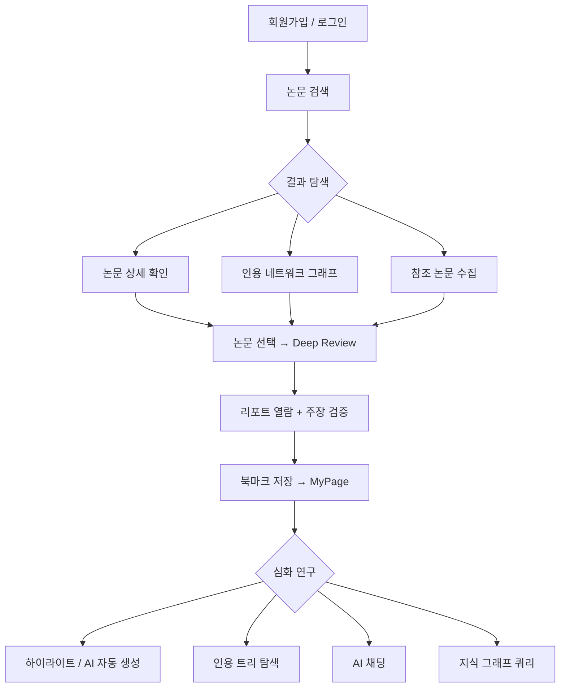

<div align="center">
  

  <h1>Jipyheonjeon (지피현전)</h1>

  <p><strong>5개 학술 데이터베이스 동시 검색 + LLM 멀티에이전트 심층 분석으로<br/>연구자의 논문 탐색과 리뷰를 하나의 플랫폼에서 해결합니다.</strong></p>

  [](https://jipyheonjeon.kr)
  [](./LICENSE)
  [](https://python.org)
  [](https://react.dev)
  [](https://fastapi.tiangolo.com)
  [](https://openai.com)
</div>

---

## 목차

- [서비스 소개](#서비스-소개)
- [핵심 기능](#핵심-기능)
- [사용자 플로우](#사용자-플로우)
- [기술 스택](#기술-스택)
- [시스템 아키텍처](#시스템-아키텍처)
- [프로젝트 구조](#프로젝트-구조)
- [로컬 개발 환경](#로컬-개발-환경)
- [API 엔드포인트](#api-엔드포인트-요약)
- [라이선스](#라이선스)

---

## 서비스 소개

Jipyheonjeon은 연구자가 학술 논문을 **검색하고, 분석하고, 정리하는** 전 과정을 AI로 지원하는 올인원 리서치 플랫폼입니다.

5개 학술 데이터베이스에서 논문을 동시에 수집하고, LLM 멀티에이전트가 논문을 심층 리뷰하며, 인용 네트워크 그래프와 지식 그래프를 통해 연구 흐름을 시각적으로 탐색할 수 있습니다.

> **데이터 저장**: 별도의 데이터베이스 없이 JSON 파일 기반(`papers.json`, `users.json`, `bookmarks.json`)으로 경량 운영됩니다.

---

## 핵심 기능

### 1. 멀티소스 논문 검색

5개 학술 데이터베이스를 **병렬로 동시 검색**하여 가장 포괄적인 결과를 제공합니다.

| 소스 | 특징 |
|------|------|
| **arXiv** | 프리프린트 최신 연구 |
| **Google Scholar** | 가장 광범위한 학술 커버리지 |
| **Connected Papers** | 연관 논문 네트워크 |
| **OpenAlex** | 오픈 액세스 메타데이터 |
| **DBLP** | 컴퓨터과학 특화 |

**검색 파이프라인:**
```
사용자 쿼리 → LLM 쿼리 분석 → 5개 소스 병렬 검색 → 중복 제거 → 하이브리드 랭킹 → LLM 관련성 필터링 → 결과 반환
```

- LLM 기반 쿼리 의도 분석 및 키워드 최적화
- 제목/DOI 기반 자동 중복 제거
- 시맨틱 + 키워드 하이브리드 랭킹
- LLM 관련성 점수 필터링 (0.65 임계값)
- 인메모리 + 파일 이중 캐시 (1시간 TTL, 최대 200 엔트리)

### 2. AI 심층 리뷰 (Deep Review)

선택한 논문들을 LLM 멀티에이전트가 **학술적 관점에서 심층 분석**합니다.

**두 가지 모드:**

| 모드 | 소요 시간 | 방식 |
|------|-----------|------|
| **Fast Mode** | 30~60초 | 단일 LLM 호출 (GPT-4.1, 32K 토큰) |
| **Deep Mode** | 2~5분 | 멀티에이전트 협업 분석 |

**Deep Mode 에이전트 구성:**
```
Master Agent (오케스트레이터)
    ├── Researcher Agent × N (논문별 심층 분석, 병렬 실행)
    ├── Advisor Agent (교차 검증, 합의 도출)
    └── Fact Verification Pipeline
        ├── ClaimExtractor (주장 추출)
        ├── EvidenceLinker (원문 근거 연결)
        └── CrossRefValidator (논문 간 교차 검증)
```

**리포트 구성:**
- 요약 (Abstract)
- 방법론 분석
- 논문 간 교차 분석
- 핵심 인사이트 도출
- 연구 갭 및 향후 방향 제시
- 주장 검증 (Claim Verification) — 검증률/부분검증/반박 시각화

### 3. 인용 네트워크 그래프

논문 간 관계를 **인터랙티브 그래프**로 시각화합니다.

- Plotly.js 기반 Force-directed 그래프
- 논문 유사도 기반 엣지 자동 생성
- 출판 연도별 노드 색상 그라데이션
- 인용 수/연도 필터링
- 노드 클릭 시 상세 정보 연동

### 4. 개인 연구 라이브러리 (MyPage)

리뷰 결과를 체계적으로 관리하는 **개인화된 연구 공간**입니다.

- **북마크 관리**: 리뷰 세션 저장, 토픽별 분류, 드래그앤드롭 정렬
- **하이라이트**: AI 자동 생성 + 수동 주석, 중요도 점수(1~5), 카테고리별 색상 구분
  - 카테고리: 핵심 발견, 방법론, 한계점, 강점, 약점, 의문점
- **노트**: 북마크별 메모 작성 및 자동 저장
- **인용 트리**: 참조/피인용 관계를 1~3 depth로 탐색
- **내보내기**: BibTeX, 리포트 다운로드

### 5. AI 채팅

저장한 논문과 리뷰를 바탕으로 **AI와 대화형 연구 탐색**을 수행합니다.

- SSE 실시간 스트리밍 응답
- 최대 10개 북마크 컨텍스트 활용
- 하이라이트 중요도 기반 맥락 주입
- 번호 매긴 인용 참조 (클릭 가능)
- LightRAG 지식 그래프 연동

### 6. 지식 그래프 (LightRAG)

수집된 논문에서 **엔티티와 관계를 추출**하여 지식 그래프를 구축합니다. (자체 구현: `src/light_rag/`)

- 자동 엔티티 인식 및 관계 추출
- 5가지 쿼리 모드: naive, local, global, hybrid, mix
- 백그라운드 비동기 구축
- 채팅 인터페이스와 통합

### 7. 학회 포스터 생성 (Beta)

Deep Review 리포트를 바탕으로 **학회 발표용 포스터를 자동 생성**합니다.

- Gemini 기반 HTML 포스터 생성
- Critic 루프를 통한 품질 자동 검증 (최대 2회 개선)
- 스타일 가이드 기반 레이아웃 적용
- 생성 포스터 HTML 다운로드

> 현재 Beta 기능으로 비활성화되어 있습니다.

### 8. 관리자 대시보드

시스템 전반을 모니터링하는 **관리자 전용 페이지**입니다.

- 시스템 통계 (사용자 수, 논문 수, 북마크 수, 소스별 분포)
- 사용자 관리 (역할 변경, 삭제)
- 논문/북마크 관리 (조회, 필터링, 삭제)

---

## 사용자 플로우



---

## 기술 스택

### Frontend
| 기술 | 용도 |
|------|------|
| React 19 + TypeScript | UI 프레임워크 |
| Vite 7 | 빌드 도구 |
| Plotly.js | 인터랙티브 그래프 시각화 |
| Axios | HTTP 클라이언트 |
| dnd-kit | 드래그앤드롭 |
| React Markdown | 마크다운 렌더링 |

### Backend
| 기술 | 용도 |
|------|------|
| FastAPI + Uvicorn | 비동기 API 서버 |
| Python 3.12 | 런타임 |
| JWT + bcrypt | 인증 (24시간 토큰 만료) |
| LangChain 0.3 | LLM 오케스트레이션 |
| LangGraph 0.2 | 멀티에이전트 워크플로우 |
| slowapi | API Rate Limiting |

### AI / LLM
| 기술 | 용도 |
|------|------|
| OpenAI GPT-4.1 | 쿼리 분석, 심층 리뷰, AI 하이라이트 |
| OpenAI GPT-4o-mini | AI 채팅, LightRAG 엔티티 추출 |
| Google Gemini (`gemini-3-pro-image-preview`) | 포스터 생성 (Beta) |
| FAISS | 벡터 유사도 검색 |
| NetworkX | 그래프 데이터 처리 |

### 인프라
| 기술 | 용도 |
|------|------|
| AWS EC2 (ap-northeast-2) | 서버 호스팅 |
| Nginx | 리버스 프록시 + 정적 파일 서빙 |
| Let's Encrypt | SSL 인증서 |
| systemd | 프로세스 관리 |

---

## 시스템 아키텍처

```
┌─────────────────────────────────────────────────────────┐
│                     Client (Browser)                     │
│              React 19 + TypeScript + Plotly.js           │
└──────────────────────────┬──────────────────────────────┘
                           │ HTTPS
                           ▼
┌──────────────────────────────────────────────────────────┐
│                    Nginx (Reverse Proxy)                  │
│            jipyheonjeon.kr → Let's Encrypt SSL           │
│         /api/* → FastAPI    /* → web-ui/dist             │
└──────────────────────────┬──────────────────────────────┘
                           │
                           ▼
┌──────────────────────────────────────────────────────────┐
│                   FastAPI (api_server.py)                 │
│         CORS · Rate Limiting (slowapi) · Logging         │
│                                                          │
│  ┌────────┐┌────────┐┌────────┐┌──────────┐┌─────────┐  │
│  │  Auth  ││ Search ││Reviews ││Bookmarks ││  Chat   │  │
│  │ Router ││ Router ││ Router ││  Router  ││ Router  │  │
│  └───┬────┘└───┬────┘└───┬────┘└────┬─────┘└────┬────┘  │
│  ┌───┴────┐┌───┴────┐┌───┴─────┐┌──┴──────┐┌───┴────┐  │
│  │LightRAG││ Admin  ││Explorer.││  Papers ││  deps/ │  │
│  │ Router ││ Router ││ Router  ││  Router ││ config │  │
│  └───┬────┘└───┬────┘└───┬─────┘└────┬────┘└───┬────┘  │
│      │         │         │           │         │        │
│  ┌───▼─────────▼─────────▼───────────▼─────────▼─────┐  │
│  │              Agent System (app/)                    │  │
│  │                                                     │  │
│  │  SearchAgent (QueryAgent 내장)                      │  │
│  │       │                                             │  │
│  │  5 Collectors · Deduplicator · Ranker               │  │
│  │  Query Analyzer · Relevance Filter                  │  │
│  │                                                     │  │
│  │  DeepAgent                                          │  │
│  │       │                                             │  │
│  │  Master → Researcher ×N → Advisor                   │  │
│  │  Fact Verification (Claim · Evidence · CrossRef)    │  │
│  │                                                     │  │
│  │  GraphRAG Agent ─── LightRAG                        │  │
│  │  Citation Graph     Knowledge Graph                 │  │
│  │  FAISS Embeddings   Entity Extraction               │  │
│  └─────────────────────────────────────────────────────┘  │
│                                                          │
│  ┌─────────────────────────────────────────────────────┐  │
│  │         Data Layer (JSON 파일 기반, data/)           │  │
│  │  papers.json  │ paper_graph.pkl │ embeddings.index   │  │
│  │  users.json   │ bookmarks.json  │ light_rag/         │  │
│  │  cache/       │ workspace/      │                    │  │
│  └─────────────────────────────────────────────────────┘  │
└──────────────────────────────────────────────────────────┘
                           │
                           ▼
            ┌──────────────────────────┐
            │     External APIs        │
            │  OpenAI  │  Google AI    │
            │  arXiv   │  Scholar      │
            │  OpenAlex│  DBLP         │
            │  Connected Papers        │
            └──────────────────────────┘
```

---

## 프로젝트 구조

```
PaperReviewAgent/
├── api_server.py              # FastAPI 엔트리포인트 (CORS, 미들웨어, 라우터 등록)
├── routers/                   # API 라우터 (9개)
│   ├── auth.py                #   인증 (JWT 로그인/회원가입)
│   ├── search.py              #   논문 검색 (멀티소스)
│   ├── papers.py              #   논문 관리 (저장/조회/그래프)
│   ├── reviews.py             #   심층 리뷰 (비동기 처리)
│   ├── bookmarks.py           #   북마크 (CRUD + 하이라이트)
│   ├── chat.py                #   AI 채팅 (SSE 스트리밍)
│   ├── lightrag.py            #   지식 그래프 (LightRAG)
│   ├── exploration.py         #   인용 트리 탐색
│   ├── admin.py               #   관리자 대시보드
│   └── deps/                  #   공통 의존성 패키지
│       ├── config.py          #     환경변수, API 키
│       ├── storage.py         #     파일 I/O, Lock 관리
│       ├── auth.py            #     JWT 디코딩
│       ├── middleware.py      #     Rate Limiter
│       ├── agents.py          #     에이전트 싱글톤 초기화
│       └── openai_client.py   #     OpenAI/LightRAG 싱글톤
├── app/                       # 에이전트 모듈
│   ├── SearchAgent/           #   검색 에이전트 (5개 소스 수집기 + QueryAgent 내장)
│   ├── QueryAgent/            #   쿼리 분석 (의도 분류, 관련성 필터링)
│   ├── DeepAgent/             #   심층 리뷰 에이전트 (멀티에이전트 + Fact Verification)
│   └── GraphRAG/              #   그래프 RAG 에이전트
├── src/                       # 핵심 라이브러리
│   ├── collector/             #   논문 수집기 (arXiv, Scholar, OpenAlex, DBLP, ConnectedPapers)
│   ├── graph/                 #   그래프 빌더 (NetworkX)
│   ├── graph_rag/             #   Graph RAG 모듈
│   ├── light_rag/             #   LightRAG 모듈 (자체 구현)
│   └── utils/                 #   유틸리티
├── web-ui/                    # React 프론트엔드
│   └── src/
│       ├── App.tsx            #   메인 앱 (라우팅, 상태 관리)
│       ├── components/        #   UI 컴포넌트
│       ├── hooks/             #   커스텀 훅 (북마크, 채팅, 하이라이트)
│       ├── api/client.ts      #   API 클라이언트
│       └── types.ts           #   TypeScript 인터페이스
└── data/                      # 데이터 저장소 (JSON 파일 기반)
    ├── raw/papers.json        #   수집된 논문 데이터
    ├── graph/                 #   NetworkX 그래프 (pickle)
    ├── embeddings/            #   FAISS 벡터 인덱스
    ├── light_rag/             #   지식 그래프 (엔티티/관계)
    ├── cache/                 #   검색 캐시 (인메모리 + 파일, 1시간 TTL)
    └── workspace/             #   리뷰 세션별 워크스페이스 (24시간 TTL)
```

---

## 로컬 개발 환경

### 요구사항
- Python 3.12+
- Node.js 20+
- OpenAI API Key (필수)
- Google API Key (선택, 포스터 생성 시 필요)

### 환경변수

| 변수 | 필수 | 설명 | 기본값 |
|------|------|------|--------|
| `OPENAI_API_KEY` | 필수 | OpenAI API 키 | - |
| `JWT_SECRET` | 필수 | JWT 서명 시크릿 | - |
| `GOOGLE_API_KEY` | 선택 | Gemini 포스터 생성용 | - |
| `CORS_ORIGINS` | 선택 | 허용 Origin (쉼표 구분) | `*` |

### 실행 방법

```bash
# 1. 저장소 클론
git clone https://github.com/your-repo/PaperReviewAgent.git
cd PaperReviewAgent

# 2. Python 가상환경 + 의존성
python -m venv .venv
source .venv/bin/activate    # Windows: .venv\Scripts\activate
pip install -r requirements.txt

# 3. 환경변수 설정
export OPENAI_API_KEY="your-key"
export JWT_SECRET="your-secret"

# 4. 백엔드 서버 시작
python api_server.py    # http://localhost:8000

# 5. 프론트엔드 개발 서버 (별도 터미널)
cd web-ui
npm install
npm run dev             # http://localhost:5173
```

---

## API 엔드포인트 요약

### 인증
| Method | Endpoint | 설명 |
|--------|----------|------|
| `POST` | `/api/auth/login` | 로그인 (JWT 발급, 24시간 만료) |
| `POST` | `/api/auth/register` | 회원가입 |
| `GET` | `/api/auth/verify` | 토큰 유효성 검증 |

### 검색
| Method | Endpoint | 설명 |
|--------|----------|------|
| `POST` | `/api/search` | 멀티소스 논문 검색 |
| `POST` | `/api/smart-search` | LLM 최적화 검색 |
| `POST` | `/api/analyze-query` | 쿼리 의도 분석 |
| `POST` | `/api/graph-data` | 인용 네트워크 그래프 생성 |

### 심층 리뷰
| Method | Endpoint | 설명 | Rate Limit |
|--------|----------|------|------------|
| `POST` | `/api/deep-review` | 심층 리뷰 시작 (비동기) | 5/분 |
| `GET` | `/api/deep-review/status/{id}` | 리뷰 진행 상태 조회 | |
| `GET` | `/api/deep-review/report/{id}` | 리뷰 리포트 조회 | |
| `GET` | `/api/deep-review/verification/{id}` | 주장 검증 상세 조회 | |
| `POST` | `/api/deep-review/visualize/{id}` | 학회 포스터 생성 (Beta) | |

### 북마크
| Method | Endpoint | 설명 |
|--------|----------|------|
| `POST` | `/api/bookmarks` | 북마크 저장 |
| `GET` | `/api/bookmarks` | 북마크 목록 조회 |
| `GET` | `/api/bookmarks/{id}` | 북마크 상세 조회 |
| `DELETE` | `/api/bookmarks/{id}` | 북마크 삭제 |
| `PATCH` | `/api/bookmarks/{id}/title` | 제목 수정 |
| `PATCH` | `/api/bookmarks/{id}/topic` | 토픽 분류 |
| `POST` | `/api/bookmarks/{id}/auto-highlight` | AI 하이라이트 생성 |
| `POST` | `/api/bookmarks/bulk-delete` | 일괄 삭제 |

### 채팅 / 지식 그래프
| Method | Endpoint | 설명 |
|--------|----------|------|
| `POST` | `/api/chat` | AI 채팅 (SSE 스트리밍) |
| `POST` | `/api/light-rag/build` | 지식 그래프 구축 |
| `POST` | `/api/light-rag/query` | 지식 그래프 쿼리 |
| `GET` | `/api/light-rag/status` | 지식 그래프 상태 조회 |

### 인용 트리
| Method | Endpoint | 설명 |
|--------|----------|------|
| `POST` | `/api/bookmarks/{id}/citation-tree` | 인용 트리 생성 |
| `GET` | `/api/bookmarks/{id}/citation-tree` | 인용 트리 조회 |
| `DELETE` | `/api/bookmarks/{id}/citation-tree` | 인용 트리 삭제 |

### 관리자
| Method | Endpoint | 설명 |
|--------|----------|------|
| `GET` | `/api/admin/dashboard` | 시스템 통계 대시보드 |
| `GET` | `/api/admin/users` | 사용자 목록 |
| `PATCH` | `/api/admin/users/{user}/role` | 역할 변경 |
| `DELETE` | `/api/admin/users/{user}` | 사용자 삭제 |

### 기타
| Method | Endpoint | 설명 |
|--------|----------|------|
| `GET` | `/health` | 헬스 체크 |

전체 API 문서: https://jipyheonjeon.kr/docs

---

## 라이선스

이 프로젝트는 [Apache License 2.0](./LICENSE) 하에 배포됩니다.
