<div align="center">
  

  <h1>Jipyheonjeon (집현전)</h1>

  <p><strong>AI-powered academic research assistant for paper discovery, analysis, and organization</strong></p>

  [](https://jipyheonjeon.kr)
  [](./LICENSE)
  [](https://python.org)
  [](https://react.dev)
  [](https://fastapi.tiangolo.com)
  [](https://openai.com)
</div>

---

## Overview

Jipyheonjeon is an AI-assisted research system that covers paper discovery, analysis, and organization. It performs parallel retrieval across five scholarly databases with BM25-semantic hybrid ranking, and generates systematic-literature-review-level reports through an LLM-based multi-agent system. Citation network graphs and knowledge graphs enable visual exploration of inter-document relationships.

> **Note**: JSON-file-based storage (`papers.json`, `users.json`, `bookmarks.json`) — no external DBMS required.

---

## Features

- **Multi-Source Retrieval** — Parallel search across arXiv, Google Scholar, Connected Papers, OpenAlex, and DBLP with intent-adaptive 4-signal hybrid ranking (BM25 + semantic similarity + citation count + recency) and 3.5-stage cascade deduplication
- **Systematic Deep Review** — Fan-out/Fan-in multi-agent orchestration with parallel Researcher agents, 5-Criterion Advisor validation (25-point scoring), and 3-Phase Fact Verification (regex → FAISS semantic search → LLM Judge)
- **Citation Tree** — Bidirectional reference/cited-by exploration (depth 1–3) via Semantic Scholar API with exponential backoff retry
- **Personal Research Library** — Bookmarks with topic organization, AI-generated highlights (6 categories, significance scoring), notes, BibTeX export, and token-based share links
- **RAG Chat** — 3-Layer Context Assembly (bookmark reports + user highlights + LightRAG knowledge graph) with SSE streaming
- **Knowledge Graph** — Custom LightRAG implementation with Triple-Index Embedding (Entity/Relation/Chunk via FAISS) and 5 retrieval modes (naive, local, global, hybrid, mix)
- **Network Visualization** — Interactive Plotly.js graph with embedding-based similarity edges and citation relationships

---

## Pipeline

```mermaid
flowchart LR
    Q[User Query] --> QA[Query Analysis<br/>Intent Classification]
    QA --> PS[Parallel Search<br/>5 sources]
    PS --> DD[Deduplication<br/>3.5-stage cascade]
    DD --> HR[Hybrid Ranking<br/>4-signal adaptive]
    HR --> RF[Relevance Filter<br/>LLM-as-a-Judge]
    RF --> SR[Search Results]
    SR --> DR[Deep Review<br/>Multi-agent]
    DR --> FV[Fact Verification<br/>3-phase cascade]
    FV --> RP[Review Report]
    RP --> KG[Knowledge Graph<br/>LightRAG]
    KG --> RC[RAG Chat]
```



---

## Tech Stack

| Layer | Technologies |
|-------|-------------|
| **Frontend** | React 19, TypeScript, Vite 7, React Router 7, Plotly.js, dnd-kit, React Markdown |
| **Backend** | FastAPI, Uvicorn, Python 3.12, JWT + bcrypt, slowapi |
| **AI/LLM** | GPT-4.1 (review, highlights), GPT-4o-mini (query analysis, chat, fact verification), `text-embedding-3-small` |
| **Search & Retrieval** | BM25 Okapi (Robertson et al., 1995), FAISS IndexFlatIP (Johnson et al., 2019), NetworkX MultiDiGraph (Hagberg et al., 2008) |
| **External APIs** | arXiv, Google Scholar, OpenAlex, DBLP, Connected Papers, Semantic Scholar |
| **Orchestration** | LangChain 0.3, LangGraph 0.2 |
| **Infrastructure** | AWS EC2, Nginx, Let's Encrypt, systemd |

---

## Getting Started

```bash
# Clone & setup
git clone https://github.com/your-repo/PaperReviewAgent.git
cd PaperReviewAgent
python -m venv .venv && source .venv/bin/activate
pip install -r requirements.txt

# Environment variables
export OPENAI_API_KEY="your-key"
export JWT_SECRET="your-secret"
# Optional: S2_API_KEY (Semantic Scholar), GOOGLE_API_KEY (poster generation)

# Run
python api_server.py              # Backend  → http://localhost:8000
cd web-ui && npm install && npm run dev  # Frontend → http://localhost:5173
```

Full API documentation: [jipyheonjeon.kr/docs](https://jipyheonjeon.kr/docs)

---

## Project Layout

```
routers/        10 API routers (auth, search, papers, reviews, bookmarks, chat, lightrag, exploration, share, admin)
app/            Agent modules (SearchAgent, QueryAgent, DeepAgent, GraphRAG)
src/            Core libraries (collector, graph, graph_rag, light_rag, utils)
web-ui/         React frontend (components, hooks, api client)
data/           JSON storage + FAISS indices + caches
```

---

## References

- Robertson, S. E. et al. (1995). Okapi at TREC-3. *NIST Special Publication*, 500-225.
- Johnson, J. et al. (2019). Billion-scale similarity search with GPUs. *IEEE Trans. Big Data*, 7(3), 535–547.
- Hagberg, A. A. et al. (2008). Exploring network structure, dynamics, and function using NetworkX. *SciPy*, 11–15.
- Guo, Z. et al. (2024). LightRAG: Simple and Fast Retrieval-Augmented Generation. *arXiv:2410.05779*.
- Lewis, P. et al. (2020). Retrieval-Augmented Generation for Knowledge-Intensive NLP Tasks. *NeurIPS*, 33, 9459–9474.

---

## License

[Apache License 2.0](./LICENSE)
