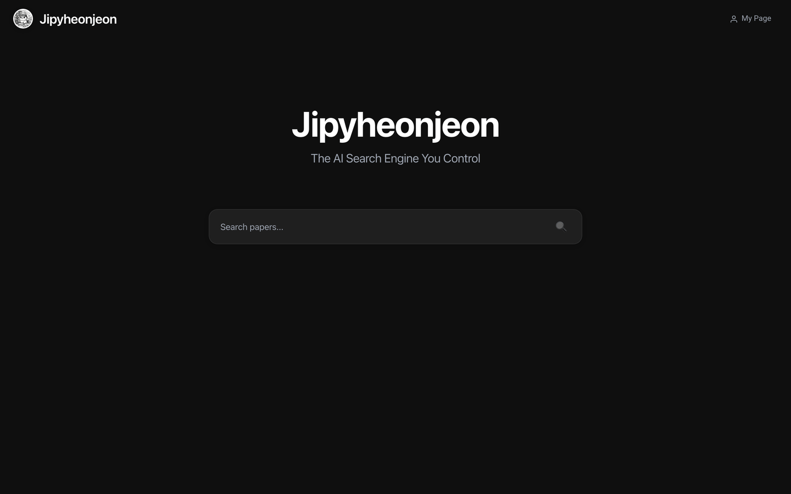

<div align="center">
  <h1>Jiphyeonjeon (집현전)</h1>

  <p><strong>AI-Powered Academic Research Platform</strong></p>

  <p>Search. Review. Learn. — One platform for your entire research workflow.</p>

  [](https://jiphyeonjeon.kr)
  [](./LICENSE)
  [](https://python.org)
  [](https://react.dev)
</div>

---

<div align="center">
  
</div>

---

## Why Jiphyeonjeon?

Researchers spend hours jumping between Google Scholar, arXiv, PDF readers, and note apps. Jiphyeonjeon consolidates the entire workflow — **search, review, annotate, learn** — into a single platform powered by multi-agent AI.

- **6 academic databases** searched in parallel (arXiv, Google Scholar, OpenAlex, DBLP, Connected Papers, Semantic Scholar)
- **Multi-agent review pipeline** with fact verification against source texts
- **Conference-quality poster generation** from review reports (NeurIPS / ICML / CVPR)
- **Personalized learning curricula** generated from your bookmarked papers
- **Zero external DB required** — JSON-file-based storage, deploy anywhere

> Named after the Jiphyeonjeon (집현전), the Hall of Worthies from the Joseon Dynasty — a royal research institute where scholars gathered to study and create knowledge.

---

## Features

### Research & Discovery

| Feature | What it does | How it works |
|---------|-------------|--------------|
| **Multi-Mode Search** | Find papers across 6 databases in one query | 3 modes: **Basic** (keyword), **Smart** (LLM query expansion), **Deep** (ArxivQA ReAct agent with rubric evaluation) |
| **Further Reading** | Explore citation networks up to 3 levels deep | Semantic Scholar API — references, cited-by, influence scoring |
| **Knowledge Graph** | Build and query entity-relationship graphs from papers | Custom LightRAG with 5 retrieval modes (naive, local, global, hybrid, mix) |

### Analysis & Review

| Feature | What it does | How it works |
|---------|-------------|--------------|
| **Deep Review** | Generate systematic review reports | Multi-agent pipeline (LangGraph) — quality validation + fact verification. Fast / Deep modes |
| **Paper Review** | Analyze individual papers in detail | Structured review with PDF highlight extraction + inline math explanation |
| **Notes & Highlights** | Annotate across 6 categories | AI-generated + manual highlights, memos, BibTeX/Markdown export |
| **Chat with Papers** | Q&A over your research collection | Streaming answers using reports + highlights + knowledge graph context |

### Creation & Learning

| Feature | What it does | How it works |
|---------|-------------|--------------|
| **Academic Poster** | Generate conference-style posters | Paper2Poster binary-tree layout, NeurIPS/ICML/CVPR templates, auto SVG diagrams |
| **Auto Figure** | Convert methodology descriptions to diagrams | PaperBanana SVG generation with Gemini fallback |
| **Learning Curriculum** | AI-generated learning paths from bookmarks | Per-module progress tracking, fork & share via public links |
| **Share** | Share bookmarks and curricula externally | Read-only links with configurable expiration |

---

## Architecture

```
User Query
  │
  ├─ SearchAgent ─── arXiv / Scholar / OpenAlex / DBLP / Connected Papers / S2
  │                    ↓
  │              BM25 + FAISS + LLM Rerank → Deduplicated results
  │
  ├─ DeepAgent ──── Multi-agent review pipeline (LangGraph)
  │                    ↓
  │              Quality validation → Fact verification → Review report
  │
  ├─ QueryAgent ─── Query analysis, diversification, rubric evaluation
  │
  └─ GraphRAG ──── Entity extraction → Knowledge graph → 5-mode retrieval
```

### Multi-Agent Pipeline

The review pipeline orchestrates specialized LLM agents through LangGraph:

1. **Query Analysis** — Decompose research questions, diversify search terms
2. **Parallel Search** — Hit 6 databases concurrently, deduplicate via DOI/title similarity
3. **Hybrid Ranking** — BM25 (lexical) + FAISS (semantic) + LLM rerank (relevance judge)
4. **Deep Review** — Multi-pass analysis with section-level fact verification
5. **Post-Processing** — Poster generation, figure synthesis, curriculum creation

---

## Tech Stack

| Layer | Technologies |
|-------|-------------|
| **Frontend** | React 19, TypeScript, Vite 7, React Router, Plotly.js, dnd-kit |
| **Backend** | FastAPI, Python 3.12, Slowapi (rate limiting), JWT + bcrypt |
| **AI / LLM** | GPT-4.1, GPT-4o-mini, Google Gemini, text-embedding-3-small, sentence-transformers |
| **Diagrams & Posters** | PaperBanana (SVG generation), Playwright (HTML → PDF/PNG export) |
| **PDF Processing** | PyMuPDF, pdfplumber, PyPDF2 |
| **Search & Retrieval** | BM25 Okapi, FAISS, NetworkX, LangChain 0.3, LangGraph 0.2 |
| **External APIs** | arXiv, Google Scholar, OpenAlex, DBLP, Connected Papers, Semantic Scholar |
| **Infrastructure** | AWS EC2, Nginx, Let's Encrypt, Docker |

---

## Quick Start

### Option 1: Docker (recommended)

```bash
git clone https://github.com/KimJiSeong1994/PaperReview.git
cd PaperReview
cp .env.example .env      # configure your keys
docker compose up -d       # → http://localhost:8000
```

### Option 2: Manual

```bash
# Backend
python -m venv .venv && source .venv/bin/activate
pip install -r requirements.txt
python api_server.py                      # → http://localhost:8000

# Frontend
cd web-ui && npm install && npm run dev   # → http://localhost:5173
```

### Environment Variables

| Variable | Required | Description |
|----------|----------|-------------|
| `OPENAI_API_KEY` | Yes | OpenAI API key for GPT-4.1, embeddings |
| `JWT_SECRET` | Yes | JWT signing secret (min 32 chars) |
| `S2_API_KEY` | No | Semantic Scholar API key (relaxes rate limits) |
| `GOOGLE_API_KEY` | No | Google Gemini API key (poster/diagram generation) |
| `CORS_ORIGINS` | No | Allowed origins, comma-separated |
| `API_AUTH_KEY` | No | Optional API-level auth key |
| `REQUEST_TIMEOUT` | No | Slow-log threshold in seconds (default: `120`) |

---

## API Overview

All endpoints are prefixed with `/api`. Authentication uses JWT Bearer tokens.
Interactive docs: [`jiphyeonjeon.kr/docs`](https://jiphyeonjeon.kr/docs) (Swagger UI)

| Group | Key Endpoints | Description |
|-------|--------------|-------------|
| **Auth** | `POST /register`, `/login` | JWT authentication |
| **Search** | `POST /search`, `/smart-search`, `/deep-search` | Three search modes |
| **Papers** | `POST /save`, `/extract-texts`, `/enrich-papers` | Paper storage & enrichment |
| **Reviews** | `POST /deep-review`, `GET /deep-review/status/{id}` | Async deep review with polling |
| **Paper Reviews** | `POST /bookmarks/{id}/papers/{idx}/review`, `/math-explain` | Per-paper review & math explanation |
| **Bookmarks** | `POST /bookmarks`, `/bookmarks/{id}/auto-highlight` | Bookmark management & AI highlights |
| **Curriculum** | `POST /curricula/generate`, `/curricula/{id}/fork` | Learning path generation |
| **Chat** | `POST /chat` | Streaming Q&A |
| **Knowledge Graph** | `POST /light-rag/build`, `/light-rag/query` | LightRAG build & query |
| **Exploration** | `POST /bookmarks/{id}/citation-tree` | Citation tree traversal |
| **Auto Figure** | `POST /autofigure/method-to-svg` | SVG diagram generation |
| **PDF** | `GET /pdf/proxy`, `/pdf/resolve` | PDF proxy & URL resolution |
| **Share** | `POST /bookmarks/{id}/share`, `GET /shared/{token}` | Share link management |
| **Admin** | `GET /admin/dashboard`, `/admin/users` | System management |

---

## Project Layout

```
api_server.py          FastAPI entrypoint — middleware, router registration
routers/               14 API routers
  ├── auth.py            Register / login / JWT verify
  ├── search.py          Basic, Smart, Deep search (ArxivQA)
  ├── papers.py          Paper CRUD, references, code repos, graph data
  ├── reviews.py         Deep review pipeline + poster visualization
  ├── paper_reviews.py   Individual paper review, PDF highlights, math explain
  ├── bookmarks.py       Bookmark CRUD, auto-highlight, bulk ops
  ├── curriculum.py      Learning curriculum generate / fork / share
  ├── chat.py            Streaming Q&A over bookmarked papers
  ├── lightrag.py        Knowledge graph build / query / status
  ├── exploration.py     Citation tree (Semantic Scholar)
  ├── autofigure.py      PaperBanana SVG diagram generation
  ├── pdf_proxy.py       PDF proxy, URL resolve, batch resolve
  ├── share.py           Read-only share links with expiration
  └── admin.py           Dashboard, user/paper/bookmark management
app/                   Agent modules
  ├── SearchAgent/       Multi-source parallel search
  ├── QueryAgent/        Query analysis, diversification, rubric evaluation
  ├── DeepAgent/         Multi-agent review pipeline (LangGraph)
  └── GraphRAG/          Graph-based retrieval-augmented generation
src/                   Core libraries
  ├── collector/         Paper collection from external APIs
  ├── graph/             Citation graph construction (NetworkX)
  ├── graph_rag/         Hybrid ranking (BM25 + FAISS + LLM rerank)
  ├── light_rag/         Custom LightRAG implementation
  └── utils/             Shared utilities
web-ui/                React frontend
  ├── src/components/    Page components (MyPage, Curriculum, Admin, ...)
  │   ├── mypage/          Bookmark sidebar, chat, paper viewer, report viewer
  │   └── curriculum/      Course sidebar, module view, detail panel
  ├── src/hooks/         Custom hooks (useDeepReview, useCurriculum, ...)
  └── src/api/           API client
data/                  JSON storage + FAISS indices + caches
```

---

## Contributing

Contributions welcome! Open an [issue](https://github.com/KimJiSeong1994/PaperReview/issues) or submit a PR.

For coding conventions, see [`.claude/rules/`](.claude/rules/) — Python (PEP 8, type hints), TypeScript (strict mode, interface-first), API design patterns.

---

## References

- Robertson, S. E. et al. (1995). Okapi at TREC-3. *NIST Special Publication*, 500-225.
- Johnson, J. et al. (2019). Billion-scale similarity search with GPUs. *IEEE Trans. Big Data*, 7(3).
- Hagberg, A. A. et al. (2008). Exploring network structure using NetworkX. *SciPy*, 11-15.
- Guo, Z. et al. (2024). LightRAG: Simple and Fast Retrieval-Augmented Generation. *arXiv:2410.05779*.
- Lewis, P. et al. (2020). Retrieval-Augmented Generation for Knowledge-Intensive NLP Tasks. *NeurIPS*, 33.
- Mao, K. et al. (2024). ArxivQA: A Dataset for Paper Retrieval Agent Evaluation. *arXiv*.

---

## License

[Apache License 2.0](./LICENSE)
