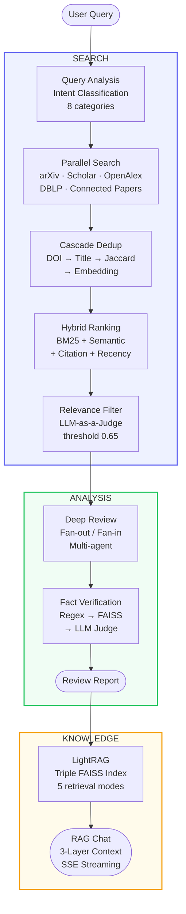

<div align="center">
  <h1>Jipyheonjeon (집현전)</h1>

  <p><strong>AI-Powered Research Assistant</strong></p>

  <p>Search papers across multiple sources, generate in-depth review reports,<br/>and organize your findings — all in one place.</p>

  [](https://jipyheonjeon.kr)
  [](./LICENSE)
  [](https://python.org)
  [](https://react.dev)
  [](https://fastapi.tiangolo.com)
  [](https://openai.com)
</div>

---

## What is Jipyheonjeon?

Jipyheonjeon helps researchers discover, analyze, and organize academic papers. It searches five scholarly databases in parallel, ranks results using hybrid signals, and generates systematic review reports through a multi-agent pipeline. You can explore citation networks, build knowledge graphs, and chat with your collected research.

> No external database required — all data is stored as simple JSON files.

---

## Features

- **Search Papers** — Find relevant papers across arXiv, Google Scholar, Connected Papers, OpenAlex, and DBLP in a single query. Results are deduplicated, ranked by relevance, and filtered by an LLM judge.

- **Deep Review** — Generate comprehensive review reports with multi-agent analysis, quality validation, and automated fact verification. Choose Fast Mode for quick summaries or Deep Mode for thorough analysis.

- **Further Reading** — Discover related papers through citation analysis. Explore references and cited-by relationships up to 3 levels deep via Semantic Scholar.

- **Notes & Highlights** — Annotate your reports with AI-generated or manual highlights across 6 categories. Add memos, take notes, and export as BibTeX or Markdown.

- **Chat with Papers** — Ask questions about your bookmarked research. The assistant combines your reports, highlights, and knowledge graph context to provide grounded answers with real-time streaming.

- **Knowledge Graph** — Build a knowledge graph from your collected papers. Extract entities and relationships, then query them in 5 retrieval modes powered by a custom LightRAG implementation.

- **Share** — Create read-only share links for your bookmarks with configurable expiration.

---

## Pipeline



---

## Tech Stack

| Layer | Technologies |
|-------|-------------|
| **Frontend** | React 19, TypeScript, Vite 7, React Router, Plotly.js, dnd-kit |
| **Backend** | FastAPI, Python 3.12, JWT + bcrypt |
| **AI / LLM** | GPT-4.1, GPT-4o-mini, text-embedding-3-small |
| **Search & Retrieval** | BM25 Okapi, FAISS, NetworkX, LangChain, LangGraph |
| **External APIs** | arXiv, Google Scholar, OpenAlex, DBLP, Connected Papers, Semantic Scholar |
| **Infrastructure** | AWS EC2, Nginx, Let's Encrypt |

---

## Getting Started

```bash
# Clone & setup
git clone https://github.com/your-repo/PaperReviewAgent.git
cd PaperReviewAgent
python -m venv .venv && source .venv/bin/activate
pip install -r requirements.txt

# Environment variables
export OPENAI_API_KEY="your-key"
export JWT_SECRET="your-secret"
# Optional: S2_API_KEY (Semantic Scholar), GOOGLE_API_KEY (poster generation)

# Run
python api_server.py              # Backend  → http://localhost:8000
cd web-ui && npm install && npm run dev  # Frontend → http://localhost:5173
```

Full API documentation: [jipyheonjeon.kr/docs](https://jipyheonjeon.kr/docs)

---

## Project Layout

```
routers/        10 API routers (auth, search, papers, reviews, bookmarks, chat, lightrag, exploration, share, admin)
app/            Agent modules (SearchAgent, QueryAgent, DeepAgent, GraphRAG)
src/            Core libraries (collector, graph, graph_rag, light_rag, utils)
web-ui/         React frontend (components, hooks, api client)
data/           JSON storage + FAISS indices + caches
```

---

## References

- Robertson, S. E. et al. (1995). Okapi at TREC-3. *NIST Special Publication*, 500-225.
- Johnson, J. et al. (2019). Billion-scale similarity search with GPUs. *IEEE Trans. Big Data*, 7(3).
- Hagberg, A. A. et al. (2008). Exploring network structure using NetworkX. *SciPy*, 11–15.
- Guo, Z. et al. (2024). LightRAG: Simple and Fast Retrieval-Augmented Generation. *arXiv:2410.05779*.
- Lewis, P. et al. (2020). Retrieval-Augmented Generation for Knowledge-Intensive NLP Tasks. *NeurIPS*, 33.

---

## License

[Apache License 2.0](./LICENSE)
