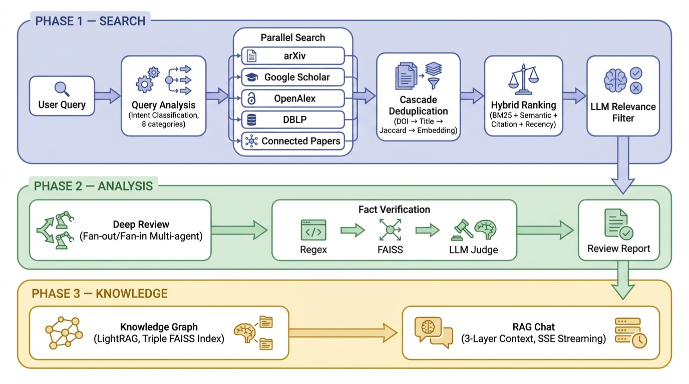

<div align="center">
  <h1>Jiphyeonjeon (집현전)</h1>

  <p><strong>AI-Powered Research Assistant</strong></p>

  <p>Search papers across multiple sources, generate in-depth review reports,<br/>and organize your findings — all in one place.</p>

  [](https://jiphyeonjeon.kr)
  [](./LICENSE)
  [](https://python.org)
  [](https://react.dev)
  [](https://fastapi.tiangolo.com)
  [](https://openai.com)
</div>

---

<div align="center">
  
</div>

---

## What is Jiphyeonjeon?

Jiphyeonjeon helps researchers discover, analyze, and organize academic papers. It searches six scholarly databases in parallel, ranks results using hybrid signals (BM25 + LLM judge), and generates systematic review reports through a multi-agent pipeline. You can explore citation networks, build knowledge graphs, generate academic posters, create personalized learning curricula, and chat with your collected research.

> JSON-file-based storage — no external database required. Designed for individual researchers and small teams. For large-scale multi-user deployments, consider adding a database backend.

---

## Features

- **Multi-Mode Search** — Find papers across arXiv, Google Scholar, Connected Papers, OpenAlex, DBLP, and Semantic Scholar. Three search modes: **Basic** (keyword), **Smart** (LLM-enhanced query expansion), and **Deep** (ArxivQA multi-turn ReAct agent with rubric-based evaluation).

- **Deep Review** — Generate comprehensive review reports with multi-agent analysis, quality validation, and fact verification against source texts. Choose Fast Mode for quick summaries or Deep Mode for thorough analysis.

- **Paper Review** — Analyze individual papers with structured reviews. Supports PDF highlight extraction, AI-generated annotations across 6 categories, and inline math formula explanation.

- **Academic Poster** — Generate conference-style posters (NeurIPS / ICML / CVPR templates) from review reports. Uses Paper2Poster binary-tree layout with auto-generated SVG diagrams via PaperBanana.

- **Learning Curriculum** — Create AI-generated learning paths from bookmarked papers. Track progress per module, fork existing curricula, and share via public links.

- **Further Reading** — Discover related papers through citation analysis. Explore references and cited-by relationships up to 3 levels deep via Semantic Scholar.

- **Auto Figure** — Generate academic diagrams automatically from paper methodology descriptions. Converts method architectures and figures into SVG using PaperBanana with Gemini fallback.

- **Notes & Highlights** — Annotate your reports with AI-generated or manual highlights across 6 categories. Add memos, take notes, and export as BibTeX or Markdown.

- **Chat with Papers** — Ask questions about your bookmarked research. The assistant combines your reports, highlights, and knowledge graph context to provide answers with real-time streaming.

- **Knowledge Graph** — Build a knowledge graph from your collected papers. Extract entities and relationships, then query them in 5 retrieval modes powered by a custom LightRAG implementation.

- **Share** — Create read-only share links for bookmarks and curricula with configurable expiration.

---

## Pipeline

<div align="center">
  
</div>

---

## Tech Stack

| Layer | Technologies |
|-------|-------------|
| **Frontend** | React 19, TypeScript, Vite 7, React Router, Plotly.js, dnd-kit |
| **Backend** | FastAPI, Python 3.12, Slowapi (rate limiting), JWT + bcrypt |
| **AI / LLM** | GPT-4.1, GPT-4o-mini, Google Gemini, text-embedding-3-small, sentence-transformers |
| **Diagrams & Posters** | PaperBanana (SVG generation), Playwright (HTML → PDF/PNG export) |
| **PDF Processing** | PyMuPDF, pdfplumber, PyPDF2 |
| **Search & Retrieval** | BM25 Okapi, FAISS, NetworkX, LangChain 0.3, LangGraph 0.2 |
| **External APIs** | arXiv, Google Scholar, OpenAlex, DBLP, Connected Papers, Semantic Scholar |
| **Infrastructure** | AWS EC2, Nginx, Let's Encrypt, Docker |

---

## Getting Started

### Prerequisites

- Python 3.12+
- Node.js 20+
- OpenAI API Key

### Setup

```bash
# Clone
git clone https://github.com/KimJiSeong1994/PaperReview.git
cd PaperReview

# Backend
python -m venv .venv && source .venv/bin/activate
pip install -r requirements.txt

# Environment variables
cp .env.example .env
# Edit .env with your API keys (see Environment Variables below)

# Start backend (Terminal 1)
python api_server.py                      # → http://localhost:8000

# Start frontend (Terminal 2)
cd web-ui && npm install && npm run dev   # → http://localhost:5173
```

### Docker

```bash
cp .env.example .env   # configure your keys
docker compose up -d   # → http://localhost:8000
```

The container runs a multi-stage build (Node → Python) and mounts `./data` for persistent storage. A built-in health check monitors `/health` every 30 seconds.

### Environment Variables

| Variable | Required | Description |
|----------|----------|-------------|
| `OPENAI_API_KEY` | Yes | OpenAI API key for GPT-4.1, embeddings |
| `JWT_SECRET` | Yes | JWT signing secret (min 32 chars) |
| `S2_API_KEY` | No | Semantic Scholar API key (relaxes citation tree rate limits) |
| `GOOGLE_API_KEY` | No | Google Gemini API key (poster/diagram generation) |
| `CORS_ORIGINS` | No | Allowed origins, comma-separated (default: `https://jiphyeonjeon.kr`) |
| `API_AUTH_KEY` | No | Optional API-level auth key |
| `REQUEST_TIMEOUT` | No | Per-request slow-log threshold in seconds (default: `120`) |

Full API documentation: [jiphyeonjeon.kr/docs](https://jiphyeonjeon.kr/docs)

---

## Project Layout

```
api_server.py          FastAPI entrypoint — middleware, router registration
routers/               14 API routers
  ├── auth.py            Register / login / JWT verify
  ├── search.py          Basic, Smart, Deep search (ArxivQA)
  ├── papers.py          Paper CRUD, references, code repos, graph data
  ├── reviews.py         Deep review pipeline + poster visualization
  ├── paper_reviews.py   Individual paper review, PDF highlights, math explain
  ├── bookmarks.py       Bookmark CRUD, auto-highlight, bulk ops
  ├── curriculum.py      Learning curriculum generate / fork / share
  ├── chat.py            Streaming Q&A over bookmarked papers
  ├── lightrag.py        Knowledge graph build / query / status
  ├── exploration.py     Citation tree (Semantic Scholar)
  ├── autofigure.py      PaperBanana SVG diagram generation
  ├── pdf_proxy.py       PDF proxy, URL resolve, batch resolve
  ├── share.py           Read-only share links with expiration
  └── admin.py           Dashboard, user/paper/bookmark management
app/                   Agent modules
  ├── SearchAgent/       Multi-source parallel search
  ├── QueryAgent/        Query analysis, diversification, rubric evaluation
  ├── DeepAgent/         Multi-agent review pipeline (LangGraph)
  └── GraphRAG/          Graph-based retrieval-augmented generation
src/                   Core libraries
  ├── collector/         Paper collection from external APIs
  ├── graph/             Citation graph construction (NetworkX)
  ├── graph_rag/         Hybrid ranking (BM25 + FAISS + LLM rerank)
  ├── light_rag/         Custom LightRAG implementation
  └── utils/             Shared utilities
web-ui/                React frontend
  ├── src/components/    Page components (MyPage, Curriculum, Admin, ...)
  │   ├── mypage/          Bookmark sidebar, chat, paper viewer, report viewer
  │   └── curriculum/      Course sidebar, module view, detail panel
  ├── src/hooks/         Custom hooks (useDeepReview, useCurriculum, ...)
  └── src/api/           API client
data/                  JSON storage + FAISS indices + caches
```

---

## API Overview

All endpoints are prefixed with `/api`. Authentication uses JWT Bearer tokens.

| Group | Key Endpoints | Description |
|-------|--------------|-------------|
| **Auth** | `POST /auth/register`, `/auth/login`, `GET /auth/verify` | User registration and JWT authentication |
| **Search** | `POST /search`, `/smart-search`, `/deep-search`, `/analyze-query` | Three search modes with query analysis |
| **Papers** | `POST /save`, `/extract-texts`, `/enrich-papers`, `/graph-data` | Paper storage, PDF text extraction, citation graph |
| **Reviews** | `POST /deep-review`, `GET /deep-review/status/{id}`, `/deep-review/report/{id}` | Async deep review with polling |
| **Paper Reviews** | `POST /bookmarks/{id}/papers/{idx}/review`, `/pdf-highlights`, `/math-explain` | Per-paper review, PDF annotation, math explanation |
| **Bookmarks** | `POST /bookmarks`, `GET /bookmarks`, `/bookmarks/{id}/auto-highlight` | Bookmark management with AI highlights |
| **Curriculum** | `POST /curricula/generate`, `GET /curricula/{id}/progress`, `POST /curricula/{id}/fork` | Learning path generation, progress tracking |
| **Chat** | `POST /chat` | Streaming Q&A with knowledge graph context |
| **Knowledge Graph** | `POST /light-rag/build`, `/light-rag/query`, `GET /light-rag/status` | LightRAG build/query in 5 retrieval modes |
| **Exploration** | `POST /bookmarks/{id}/citation-tree` | Citation tree (Semantic Scholar, up to 3 levels) |
| **Auto Figure** | `POST /autofigure/method-to-svg`, `/autofigure/figure-to-svg` | SVG diagram generation from paper content |
| **PDF** | `GET /pdf/proxy`, `/pdf/resolve`, `POST /pdf/resolve-batch` | PDF proxy and URL resolution |
| **Share** | `POST /bookmarks/{id}/share`, `GET /shared/{token}` | Read-only share link management |
| **Admin** | `GET /admin/dashboard`, `/admin/users`, `/admin/papers` | System dashboard and management |

Interactive docs available at [`/docs`](https://jiphyeonjeon.kr/docs) (Swagger UI).

---

## Contributing

Contributions are welcome! Feel free to open an [issue](https://github.com/KimJiSeong1994/PaperReview/issues) for bug reports or feature requests, or submit a pull request.

For development guidelines, see [`.claude/rules/`](.claude/rules/) — covers Python style (PEP 8, type hints), TypeScript conventions (strict mode, interface-first), and API design patterns.

---

## References

- Robertson, S. E. et al. (1995). Okapi at TREC-3. *NIST Special Publication*, 500-225.
- Johnson, J. et al. (2019). Billion-scale similarity search with GPUs. *IEEE Trans. Big Data*, 7(3).
- Hagberg, A. A. et al. (2008). Exploring network structure using NetworkX. *SciPy*, 11–15.
- Guo, Z. et al. (2024). LightRAG: Simple and Fast Retrieval-Augmented Generation. *arXiv:2410.05779*.
- Lewis, P. et al. (2020). Retrieval-Augmented Generation for Knowledge-Intensive NLP Tasks. *NeurIPS*, 33.
- Mao, K. et al. (2024). ArxivQA: A Dataset for Paper Retrieval Agent Evaluation. *arXiv*.

---

## License

[Apache License 2.0](./LICENSE)
