<div align="center">
  

  <h1>Jipyheonjeon (집현전)</h1>

  <p><strong>AI-powered academic research assistant for paper discovery, analysis, and organization</strong></p>

  [](https://jipyheonjeon.kr)
  [](./LICENSE)
  [](https://python.org)
  [](https://react.dev)
  [](https://fastapi.tiangolo.com)
  [](https://openai.com)
</div>

---

## Table of Contents

- [Overview](#overview)
- [Why Jipyheonjeon](#why-jipyheonjeon)
- [Key Features](#key-features)
- [Data Processing Pipeline](#data-processing-pipeline)
- [Tech Stack](#tech-stack)
- [System Architecture](#system-architecture)
- [Project Structure](#project-structure)
- [Getting Started](#getting-started)
- [API Endpoints](#api-endpoints)
- [References](#references)
- [License](#license)

---

## Overview

Jipyheonjeon is an AI-assisted research support system that covers the entire workflow of academic paper discovery, analysis, and organization. It performs parallel retrieval across five scholarly databases (arXiv, Google Scholar, Connected Papers, OpenAlex, DBLP) with BM25-semantic hybrid ranking, and generates systematic-literature-review-level reports through an LLM-based multi-agent system. Citation network graphs and knowledge graphs enable visual exploration of inter-document relationships.

> **Data Storage**: To minimize external dependencies, the system adopts JSON-file-based storage (`papers.json`, `users.json`, `bookmarks.json`) without requiring an external DBMS.

---

## Why Jipyheonjeon

- **Multi-source parallel search** — Concurrent retrieval from 5 scholarly DBs, 3.5-stage cascade deduplication, intent-adaptive hybrid ranking ([Retrieval Pipeline](#1-multi-source-academic-literature-retrieval))
- **Systematic literature analysis** — Fan-out/Fan-in multi-agent orchestration, 3-Phase Fact Verification, 5-Criterion quality validation ([Deep Review](#2-llm-based-systematic-literature-analysis-deep-review))
- **Citation network exploration** — Bidirectional citation tree (depth 1–3) via Semantic Scholar API, document similarity graph visualization ([Network Visualization](#3-document-similarity-network-visualization))
- **Personal research library** — Bookmark management, AI highlights, notes, BibTeX export, share links ([MyPage](#4-personal-research-library-mypage))
- **Knowledge graph-based RAG chat** — Custom LightRAG implementation, 3-Layer Context Assembly, SSE real-time streaming ([RAG Chat](#5-conversational-literature-exploration-rag-based-chat))

---

## Key Features

### 1. Multi-Source Academic Literature Retrieval

Performs parallel retrieval across five scholarly databases and refines results through an intent-adaptive ranking pipeline.

| Source | Characteristics |
|--------|----------------|
| **arXiv** | Preprint server (CS/Physics/Math) |
| **Google Scholar** | Broadest academic coverage |
| **Connected Papers** | Similar paper network-based exploration |
| **OpenAlex** | Open access scholarly metadata (Korean search supported) |
| **DBLP** | Computer science bibliography database |

**Retrieval Pipeline (7 stages):**

1. **Query Analysis**: GPT-4o-mini zero-shot intent classification (8 categories: `paper_search`, `topic_exploration`, `method_search`, `survey`, `latest_research`, etc.), keyword extraction, query refinement (applied only when confidence >= 0.8 and stem overlap >= 0.5)
2. **Source-Specific Query Optimization**: Queries reformulated for arXiv syntax (`ti:`, `abs:`, `cat:`), DBLP keyword format, and Google Scholar natural language
3. **Two-Tier Cache Lookup**: SHA-256-based cache key, in-memory + file-system tiers (TTL: 1 hour, max 200 entries, LRU eviction)
4. **Parallel Retrieval**: Concurrent `asyncio`-based search across all five sources
5. **Cross-Source Deduplication**: 3.5-stage cascade — DOI normalization → normalized title matching (NFKD → ASCII) → Jaccard fuzzy title matching (J >= 0.85, length ratio >= 0.80) → optional embedding similarity (cosine >= 0.90, Union-Find for group merging). Representative records selected by metadata richness score with missing field imputation
6. **Intent-Adaptive 4-Signal Hybrid Ranking**: Weighted combination of BM25 Okapi (Robertson et al., 1995) + dense semantic similarity (OpenAI `text-embedding-3-small`, cosine distance) + log-normalized citation count (`log(1+c)/log(1+max_c)`) + step-wise recency decay. Weight presets auto-selected by query intent (e.g., `latest_research`: recency 0.50; `survey`: citations 0.40)
7. **LLM-as-a-Judge Relevance Filtering**: Batch-parallel evaluation (10 papers/batch, `ThreadPoolExecutor`, max 5 workers), scored on 0.0–1.0 scale, threshold 0.65. Falls back to keyword overlap scoring on LLM failure (title weight 70% + abstract weight 30%)

### 2. LLM-Based Systematic Literature Analysis (Deep Review)

Two analysis modes are provided for selected papers.

| Mode | Method | Characteristics |
|------|--------|----------------|
| **Fast Mode** | Single LLM call (GPT-4.1, 32K tokens, t=0.4) | All papers analyzed in one prompt. No multi-agent |
| **Deep Mode** | Fan-out/Fan-in multi-agent orchestration | Multi-stage pipeline: parallel analysis → validation → fact verification |

**Deep Mode Pipeline:**

```
ReviewOrchestrator (Fan-out/Fan-in Pattern, ThreadPoolExecutor)
    │
    ├── [Step 1] Paper Loading — load paper data from papers.json
    │
    ├── [Step 2] Parallel Analysis — Researcher Agent × N (parallel)
    │       4-Stage Tool-Chain: Comprehensive Analysis → Key Contribution
    │       Extraction → Methodology Deep-Dive → Critical Evaluation
    │
    ├── [Step 3] Advisor Validation — 5-Criterion Scoring (25 points)
    │       Completeness, Accuracy, Depth, Balance, Insight (0-5 each)
    │       APPROVED (20+) / NEEDS_REVISION (15-19) / REJECTED (<15)
    │
    ├── [Step 3.5] Fact Verification Pipeline (3-Phase)
    │       Phase A: ClaimExtractor — LLM claim extraction with 5-type classification
    │           (statistical[t=0.9] / comparative[0.8] / methodological[0.7]
    │            / factual[0.7] / interpretive[excluded])
    │       Phase B: EvidenceLinker — 3-Stage Cascade Verification
    │           Stage 1: Regex numeric exact match
    │           Stage 2: FAISS IndexFlatIP semantic search (cosine >= 0.95 → auto-VERIFIED)
    │           Stage 3: LLM Judge (GPT-4o-mini, t=0.1) → verified/partially/contradicted
    │       Phase C: CrossRefValidator — cross-paper claim pair relation judgment
    │           (supports/contradicts/extends/independent)
    │           Consensus: STRONG / MODERATE / WEAK / DIVIDED
    │
    └── [Step 4] Report Generation — Markdown/HTML dual-format report
```

**Report Sections:**
- Abstract, methodology analysis, cross-paper analysis, key insights
- Research gaps and future directions
- Claim verification statistics — verified/partial/contradicted distribution visualization
- Consensus Meter — strength/weakness ratio visualization across papers (categories: Findings, Analysis, Critique)

### 3. Document Similarity Network Visualization

Visualizes content similarity among collected papers as an interactive Plotly.js graph.

- **Embedding-based edge generation**: Cosine similarity of OpenAI `text-embedding-3-small` embeddings (threshold 0.7, top-k=10)
- **Citation edges**: `difflib.SequenceMatcher` title matching (ratio >= 0.65) for actual citation relationships
- **Graph data structure**: NetworkX `MultiDiGraph` (Hagberg et al., 2008)
- Node color gradient by publication year, filtering by citation count and year
- Node selection triggers detail metadata panel

> Actual citation relationship (reference/cited-by) deep exploration is supported through the Citation Tree feature via Semantic Scholar API (depth 1–3). Automatic exponential backoff retry (2s → 4s → 8s, max 3 attempts) is applied on 429 Rate Limit responses.

### 4. Personal Research Library (MyPage)

A personalized research workspace for systematic management of review results.

- **Bookmarks**: Save review sessions, organize by topic, drag-and-drop sorting (dnd-kit), bulk move/delete
- **Highlights**: GPT-4.1-based auto-generation + manual annotation, significance score (1–5), 6 color-coded categories (key_finding, methodology, limitation, strength, weakness, question), memo attachment
- **Notes**: Per-bookmark memo with auto-save
- **Citation Tree (Further Reading)**: Bidirectional reference/cited-by exploration up to depth 3 via Semantic Scholar API. Provides feedback on papers that could not be resolved
- **Export**: BibTeX, markdown report download
- **Share Links**: Token-based read-only sharing with configurable expiration (default 30 days)

### 5. Conversational Literature Exploration (RAG-Based Chat)

Provides a Retrieval-Augmented Generation (Lewis et al., 2020) interface grounded in saved paper reviews and the knowledge graph.

**3-Layer Context Assembly:**
1. **Bookmark Report Context**: Up to 10 review reports (4000 chars each), numbered citation references
2. **User Highlight Injection**: Top 5 highlights with significance >= 4 injected as key findings
3. **LightRAG Knowledge Graph Retrieval**: Hybrid mode (Local + Global) search, key entities (max 8) + relationships (max 8) + KG analysis

- Real-time streaming responses via SSE (GPT-4o-mini, t=0.7)
- Topic-based filtering to scope chat context

### 6. Knowledge Graph (Custom LightRAG Implementation)

Constructs a knowledge graph by extracting academic entities and relationships from collected papers. Custom implementation of the dual-level retrieval concept from LightRAG (Guo et al., 2024), located in `src/light_rag/`.

**Entity Extraction**: GPT-4o-mini-based structured information extraction. Six entity types (Concept, Method, Dataset, Task, Metric, Tool) and relationships extracted in JSON format. Async batch processing (`asyncio.Semaphore`, max concurrency 4).

**Triple-Index Embedding**: OpenAI `text-embedding-3-small` with separate FAISS `IndexFlatIP` (L2-normalized Inner Product ≈ Cosine) indices for Entity / Relation / Chunk.

**Retrieval Modes:**

| Mode | Strategy | Suitable Query Type |
|------|----------|---------------------|
| naive | Chunk vector similarity search (standard RAG) | General queries |
| local | Keyword → entity vector search → neighbor traversal | Specific, fact-checking queries |
| global | Keyword → relation vector search → entity group extraction | Thematic, synthesizing queries |
| hybrid | local + global combination | Compound queries |
| mix | hybrid + naive integration | KG + vector search fusion |

### 7. Conference Poster Generation (Beta)

Automatically generates conference posters from Deep Review reports. Gemini (`gemini-3-pro-image-preview`) HTML poster generation with self-critique loop (up to 2 iterative refinement cycles).

> Currently disabled as a Beta feature.

### 8. Admin Dashboard

An admin-only page for system-wide monitoring.

- System statistics (users, papers, bookmarks, source distribution)
- User management (role changes, deletion)
- Paper/bookmark management (browse, filter, delete)

---

## Data Processing Pipeline

```mermaid
flowchart LR
    Q[User Query] --> QA[Query Analysis<br/>Intent Classification<br/>8 categories]
    QA --> PS[Parallel Search<br/>5 sources]
    PS --> DD[Deduplication<br/>3.5-stage cascade<br/>DOI→Title→Jaccard→Embedding]
    DD --> HR[Hybrid Ranking<br/>BM25 + Semantic +<br/>Citation + Recency]
    HR --> RF[Relevance Filter<br/>LLM-as-a-Judge<br/>threshold 0.65]
    RF --> SR[Search Results]
    SR --> DR[Deep Review<br/>Fan-out/Fan-in<br/>multi-agent]
    DR --> FV[Fact Verification<br/>3-phase cascade]
    FV --> RP[Review Report]
    RP --> KG[Knowledge Graph<br/>LightRAG<br/>dual-level retrieval]
    KG --> RC[RAG Chat<br/>3-layer context]
```



---

## Tech Stack

### Frontend
| Technology | Purpose |
|------------|---------|
| React 19 + TypeScript | UI framework |
| Vite 7 | Build tool |
| React Router 7 | Client-side routing (Lazy loading) |
| Plotly.js | Interactive graph visualization |
| Axios | HTTP client |
| dnd-kit | Drag and drop |
| React Markdown + remark-gfm | Markdown rendering (GFM support) |

### Backend
| Technology | Purpose |
|------------|---------|
| FastAPI + Uvicorn | Async API server |
| Python 3.12 | Runtime |
| JWT + bcrypt | Authentication (24h token expiry) |
| LangChain 0.3 | LLM orchestration |
| LangGraph 0.2 | Multi-agent workflows |
| slowapi | API rate limiting |

### AI / LLM
| Technology | Purpose |
|------------|---------|
| OpenAI GPT-4.1 | Deep review (Fast Mode), AI highlight generation |
| OpenAI GPT-4o-mini | Query analysis, relevance filtering, chat, entity extraction, fact verification |
| OpenAI `text-embedding-3-small` | Dense semantic retrieval, similarity computation, KG indexing |
| Google Gemini (`gemini-3-pro-image-preview`) | Poster generation (Beta) |
| FAISS `IndexFlatIP` | ANN vector index (Johnson et al., 2019) |
| NetworkX `MultiDiGraph` | Graph data structure (Hagberg et al., 2008) |
| BM25 Okapi (`rank_bm25`) | Sparse lexical retrieval (Robertson et al., 1995) |

### External APIs
| API | Purpose |
|-----|---------|
| Semantic Scholar API | Citation tree exploration (reference/cited-by), 429 retry support |
| arXiv API | Preprint paper search |
| OpenAlex API | Open scholarly metadata search (incl. Korean) |
| Google Scholar | Academic literature search (scholarly library) |
| Connected Papers | Similar paper network |
| DBLP API | CS bibliography search |

### Infrastructure
| Technology | Purpose |
|------------|---------|
| AWS EC2 (ap-northeast-2) | Server hosting |
| Nginx | Reverse proxy + static file serving |
| Let's Encrypt | SSL certificate |
| systemd | Process management |

---

## System Architecture

```
┌─────────────────────────────────────────────────────────┐
│                     Client (Browser)                     │
│              React 19 + TypeScript + Plotly.js           │
│                                                          │
│  Routes: / (Search) │ /mypage │ /graph │ /admin          │
│          /shared/:token (public)                         │
└──────────────────────────┬──────────────────────────────┘
                           │ HTTPS
                           ▼
┌──────────────────────────────────────────────────────────┐
│                    Nginx (Reverse Proxy)                  │
│            jipyheonjeon.kr → Let's Encrypt SSL           │
│         /api/* → FastAPI    /* → web-ui/dist             │
└──────────────────────────┬──────────────────────────────┘
                           │
                           ▼
┌──────────────────────────────────────────────────────────┐
│                   FastAPI (api_server.py)                 │
│         CORS · Rate Limiting (slowapi) · Logging         │
│                                                          │
│  ┌────────┐┌────────┐┌────────┐┌──────────┐┌─────────┐  │
│  │  Auth  ││ Search ││Reviews ││Bookmarks ││  Chat   │  │
│  │ Router ││ Router ││ Router ││  Router  ││ Router  │  │
│  └───┬────┘└───┬────┘└───┬────┘└────┬─────┘└────┬────┘  │
│  ┌───┴────┐┌───┴────┐┌───┴─────┐┌──┴──────┐┌───┴────┐  │
│  │LightRAG││ Admin  ││Explorer ││  Papers ││ Share  │  │
│  │ Router ││ Router ││ Router  ││  Router ││ Router │  │
│  └───┬────┘└───┬────┘└───┬─────┘└────┬────┘└───┬────┘  │
│      │         │         │           │    deps/ │        │
│  ┌───▼─────────▼─────────▼───────────▼─────────▼─────┐  │
│  │              Agent System (app/)                    │  │
│  │                                                     │  │
│  │  SearchAgent (with QueryAgent)                      │  │
│  │  ├─ 5 Collectors (asyncio parallel)                │  │
│  │  ├─ 3.5-Stage Cascade Deduplicator                 │  │
│  │  ├─ 4-Signal Intent-Adaptive Hybrid Ranker         │  │
│  │  └─ LLM-as-a-Judge Relevance Filter                │  │
│  │                                                     │  │
│  │  DeepAgent (mode branching)                         │  │
│  │  ├─ [Fast] Single LLM call (GPT-4.1, 32K)         │  │
│  │  └─ [Deep] ReviewOrchestrator (Fan-out/Fan-in)     │  │
│  │     ├─ Researcher ×N (ThreadPoolExecutor)          │  │
│  │     ├─ Advisor (5-Criterion, 25pt scoring)         │  │
│  │     └─ Fact Verification (3-Phase Cascade)         │  │
│  │                                                     │  │
│  │  GraphRAG Agent ─── LightRAG                        │  │
│  │  ├─ FAISS Triple-Index (Entity/Relation/Chunk)     │  │
│  │  └─ Dual-Level Retrieval (Local/Global/Hybrid/Mix) │  │
│  └─────────────────────────────────────────────────────┘  │
│                                                          │
│  ┌─────────────────────────────────────────────────────┐  │
│  │         Data Layer (JSON file-based, data/)          │  │
│  │  papers.json  │ paper_graph.pkl │ embeddings.index   │  │
│  │  users.json   │ bookmarks.json  │ light_rag/         │  │
│  │  cache/       │ workspace/      │ (threading.Lock)   │  │
│  └─────────────────────────────────────────────────────┘  │
└──────────────────────────────────────────────────────────┘
                           │
                           ▼
            ┌──────────────────────────┐
            │     External APIs        │
            │  OpenAI  │  Google AI    │
            │  arXiv   │  Scholar      │
            │  OpenAlex│  DBLP         │
            │  Connected Papers        │
            │  Semantic Scholar         │
            └──────────────────────────┘
```

---

## Project Structure

```
PaperReviewAgent/
├── api_server.py              # FastAPI entrypoint (CORS, middleware, router registration)
├── routers/                   # API routers (10 total)
│   ├── auth.py                #   Authentication (JWT login/register)
│   ├── search.py              #   Paper search (multi-source, 7-stage pipeline)
│   ├── papers.py              #   Paper management (save/query/references/graph)
│   ├── reviews.py             #   Deep review (Fast/Deep mode branching, async)
│   ├── bookmarks.py           #   Bookmarks (CRUD + highlights + bulk operations)
│   ├── chat.py                #   RAG chat (3-layer context, SSE streaming)
│   ├── lightrag.py            #   Knowledge graph (LightRAG dual-level retrieval)
│   ├── exploration.py         #   Citation tree exploration (Semantic Scholar API)
│   ├── share.py               #   Share links (token-based read-only sharing)
│   ├── admin.py               #   Admin dashboard
│   └── deps/                  #   Shared dependencies
│       ├── config.py          #     Environment variables, API keys
│       ├── storage.py         #     File I/O, lock management
│       ├── auth.py            #     JWT decoding
│       ├── middleware.py      #     Rate limiter
│       ├── agents.py          #     Agent singleton initialization
│       └── openai_client.py   #     OpenAI/LightRAG singletons
├── app/                       # Agent modules
│   ├── SearchAgent/           #   Search agent (5 collectors + QueryAgent)
│   ├── QueryAgent/            #   Query analysis (intent classification, relevance filtering)
│   ├── DeepAgent/             #   Deep review (ReviewOrchestrator + Fact Verification)
│   └── GraphRAG/              #   Graph RAG agent
├── src/                       # Core libraries
│   ├── collector/             #   Paper collectors + Deduplicator + SimilarityCalculator
│   ├── graph/                 #   Graph builder (NetworkX MultiDiGraph)
│   ├── graph_rag/             #   HybridRanker (BM25 + Semantic + Citation + Recency)
│   ├── light_rag/             #   LightRAG (custom: entity extraction, KG, dual-level retrieval)
│   └── utils/                 #   Utilities
├── web-ui/                    # React frontend
│   └── src/
│       ├── App.tsx            #   Main app (routing, lazy loading)
│       ├── components/        #   UI components
│       │   ├── mypage/        #     MyPage sub-components
│       │   │   ├── BookmarkSidebar.tsx   # Bookmark sidebar (dnd-kit)
│       │   │   ├── ReportViewer.tsx      # Report + Further Reading viewer
│       │   │   ├── ChatPanel.tsx         # RAG chat panel
│       │   │   └── ConsensusMeter.tsx    # Consensus visualization
│       │   └── ...            #     Other components (Login, Admin, Graph, SharedView)
│       ├── hooks/             #   Custom hooks
│       │   ├── useBookmarks   #     Bookmark CRUD + selection + bulk operations
│       │   ├── useChat        #     Chat state + topic filtering
│       │   ├── useHighlights  #     Highlight creation/editing/deletion
│       │   └── useExploration #     Citation tree generation/management
│       ├── api/client.ts      #   API client
│       └── types.ts           #   TypeScript interfaces
└── data/                      # Data storage (JSON file-based, threading.Lock concurrency)
    ├── raw/papers.json        #   Collected paper data
    ├── graph/                 #   NetworkX graph (pickle)
    ├── embeddings/            #   FAISS vector index
    ├── light_rag/             #   Knowledge graph (entities/relations, Triple FAISS Index)
    ├── cache/                 #   Search cache (2-tier, SHA-256 key, 1h TTL)
    └── workspace/             #   Per-review session workspace (24h TTL)
```

---

## Getting Started

### Prerequisites
- Python 3.12+
- Node.js 20+
- OpenAI API Key (required)
- Google API Key (optional, for poster generation)

### Environment Variables

| Variable | Required | Description | Default |
|----------|----------|-------------|---------|
| `OPENAI_API_KEY` | Yes | OpenAI API key | - |
| `JWT_SECRET` | Yes | JWT signing secret | - |
| `GOOGLE_API_KEY` | No | For Gemini poster generation | - |
| `S2_API_KEY` | No | Semantic Scholar API key (relaxes citation tree rate limits) | - |
| `CORS_ORIGINS` | No | Allowed origins (comma-separated) | `*` |

### Running Locally

```bash
# 1. Clone the repository
git clone https://github.com/your-repo/PaperReviewAgent.git
cd PaperReviewAgent

# 2. Python virtual environment + dependencies
python -m venv .venv
source .venv/bin/activate    # Windows: .venv\Scripts\activate
pip install -r requirements.txt

# 3. Set environment variables
export OPENAI_API_KEY="your-key"
export JWT_SECRET="your-secret"

# 4. Start backend server
python api_server.py    # http://localhost:8000

# 5. Start frontend dev server (separate terminal)
cd web-ui
npm install
npm run dev             # http://localhost:5173
```

---

## API Endpoints

### Authentication
| Method | Endpoint | Description |
|--------|----------|-------------|
| `POST` | `/api/auth/login` | Login (JWT issued, 24h expiry) |
| `POST` | `/api/auth/register` | Register |
| `GET` | `/api/auth/verify` | Verify token |

### Search
| Method | Endpoint | Description |
|--------|----------|-------------|
| `POST` | `/api/search` | Multi-source literature retrieval (7-stage pipeline) |
| `POST` | `/api/smart-search` | LLM-optimized search |
| `POST` | `/api/llm-search` | LLM context-based search (auto Korean→English translation) |
| `POST` | `/api/analyze-query` | Query intent analysis |

### Paper Management
| Method | Endpoint | Description |
|--------|----------|-------------|
| `POST` | `/api/save` | Save search results |
| `GET` | `/api/papers` | List saved papers |
| `GET` | `/api/papers/count` | Get paper count |
| `DELETE` | `/api/papers` | Clear all papers (admin) |
| `POST` | `/api/paper-references` | Collect references for single paper |
| `POST` | `/api/batch-references` | Batch reference collection (max 5 papers) |
| `POST` | `/api/collect-references` | Background reference collection |
| `POST` | `/api/extract-texts` | Full text extraction |
| `POST` | `/api/enrich-papers` | Enrich papers (references + texts + graph) |
| `POST` | `/api/graph-data` | Generate similarity network graph |

### Deep Review
| Method | Endpoint | Description | Rate Limit |
|--------|----------|-------------|------------|
| `POST` | `/api/deep-review` | Start deep review (async) | 5/min |
| `GET` | `/api/deep-review/status/{id}` | Check review progress | |
| `GET` | `/api/deep-review/report/{id}` | Get review report | |
| `GET` | `/api/deep-review/verification/{id}` | Get fact verification details | |
| `POST` | `/api/deep-review/visualize/{id}` | Generate conference poster (Beta) | |

### Bookmarks
| Method | Endpoint | Description |
|--------|----------|-------------|
| `POST` | `/api/bookmarks` | Save bookmark |
| `GET` | `/api/bookmarks` | List bookmarks |
| `GET` | `/api/bookmarks/{id}` | Get bookmark details |
| `DELETE` | `/api/bookmarks/{id}` | Delete bookmark |
| `PATCH` | `/api/bookmarks/{id}/title` | Update title |
| `PATCH` | `/api/bookmarks/{id}/topic` | Assign topic |
| `PATCH` | `/api/bookmarks/{id}/notes` | Update notes and highlights |
| `POST` | `/api/bookmarks/{id}/auto-highlight` | Generate AI highlights |
| `POST` | `/api/bookmarks/bulk-delete` | Bulk delete |
| `POST` | `/api/bookmarks/bulk-move` | Bulk topic move |

### Share
| Method | Endpoint | Description |
|--------|----------|-------------|
| `POST` | `/api/bookmarks/{id}/share` | Create share link (configurable expiration) |
| `DELETE` | `/api/bookmarks/{id}/share` | Revoke share link |
| `GET` | `/api/shared/{token}` | View shared bookmark (no auth required, 30/min) |

### Citation Tree
| Method | Endpoint | Description | Rate Limit |
|--------|----------|-------------|------------|
| `POST` | `/api/bookmarks/{id}/citation-tree` | Generate citation tree (depth 1-3, Semantic Scholar) | 5/min |
| `GET` | `/api/bookmarks/{id}/citation-tree` | Get citation tree | |
| `DELETE` | `/api/bookmarks/{id}/citation-tree` | Delete citation tree | |

### Chat / Knowledge Graph
| Method | Endpoint | Description |
|--------|----------|-------------|
| `POST` | `/api/chat` | RAG chat (3-layer context, SSE) |
| `POST` | `/api/light-rag/build` | Build knowledge graph |
| `POST` | `/api/light-rag/query` | Query knowledge graph (5 modes) |
| `GET` | `/api/light-rag/status` | Knowledge graph status |

### Admin
| Method | Endpoint | Description |
|--------|----------|-------------|
| `GET` | `/api/admin/dashboard` | System statistics dashboard |
| `GET` | `/api/admin/users` | List users |
| `PATCH` | `/api/admin/users/{username}/role` | Change role |
| `DELETE` | `/api/admin/users/{username}` | Delete user |
| `GET` | `/api/admin/papers` | Browse/filter papers |
| `GET` | `/api/admin/papers/stats` | Paper statistics |
| `DELETE` | `/api/admin/papers` | Delete papers |
| `GET` | `/api/admin/bookmarks` | Browse bookmarks |
| `DELETE` | `/api/admin/bookmarks/{id}` | Delete bookmark |

### Misc
| Method | Endpoint | Description |
|--------|----------|-------------|
| `GET` | `/health` | Health check |

Full API docs: https://jipyheonjeon.kr/docs

---

## References

- Robertson, S. E., Walker, S., Jones, S., Hancock-Beaulieu, M., & Gatford, M. (1995). Okapi at TREC-3. *NIST Special Publication*, 500-225.
- Johnson, J., Douze, M., & Jégou, H. (2019). Billion-scale similarity search with GPUs. *IEEE Transactions on Big Data*, 7(3), 535–547.
- Hagberg, A. A., Schult, D. A., & Swart, P. J. (2008). Exploring network structure, dynamics, and function using NetworkX. *Proceedings of the 7th Python in Science Conference (SciPy)*, 11–15.
- Guo, Z., et al. (2024). LightRAG: Simple and Fast Retrieval-Augmented Generation. *arXiv preprint arXiv:2410.05779*.
- Lewis, P., et al. (2020). Retrieval-Augmented Generation for Knowledge-Intensive NLP Tasks. *Advances in Neural Information Processing Systems (NeurIPS)*, 33, 9459–9474.

---

## License

This project is licensed under the [Apache License 2.0](./LICENSE).
