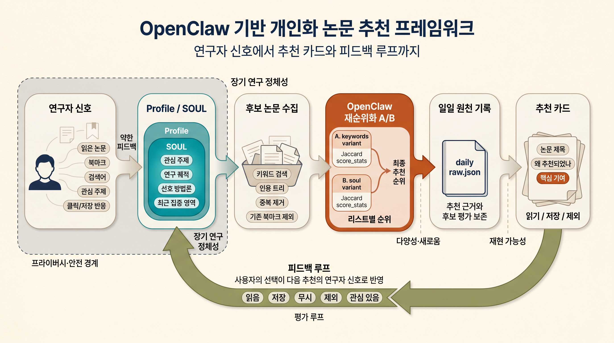
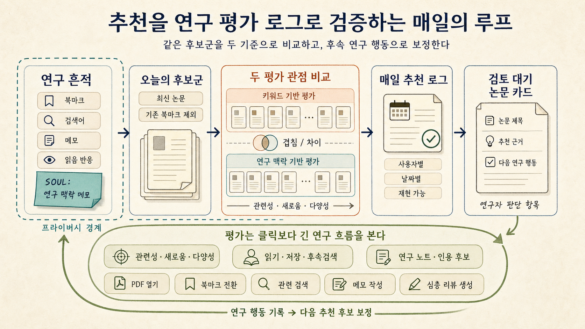
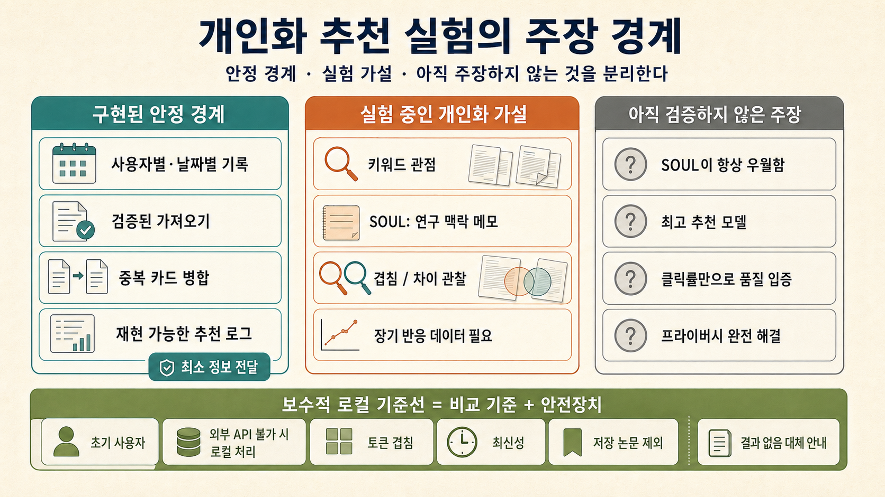

# 오늘의 연구는 어떤 논문에서 시작할까 — 집현전의 연구자 페르소나 기반 논문 추천

논문을 많이 읽는 연구자에게 가장 어려운 질문은 “무엇을 검색할까”가 아니라 “오늘은 무엇부터 읽을까”에 가깝다. 검색창은 이미 충분히 많은 답을 돌려준다. 문제는 답이 너무 많고, 어제의 관심사와 오늘의 연구 질문이 조금씩 달라진다는 데 있다. 북마크는 쌓이고, 딥리뷰와 메모는 늘어나지만, 다음 연구 세션이 시작될 때 서비스가 매번 “다시 검색해보라”고만 말한다면 연구자의 맥락은 끊긴다.

집현전의 추천 문제는 여기서 출발했다. 만들고 싶었던 것은 검색창을 조금 더 똑똑하게 만드는 기능이 아니라, 사용자가 축적해 온 연구 흔적을 읽고 오늘의 연구 세션을 시작할 만한 논문 후보를 먼저 좁혀 주는 장치였다. 추천은 정답을 선언하는 모델이 아니라, 정보 과부하 속에서 연구자가 다음 읽기 결정을 내리도록 돕는 워크플로다.

그래서 이 글은 구현 변경 내역보다 연구 질문을 먼저 다룬다. 연구자가 남기는 피드백은 대체로 약하다. 클릭은 호기심일 수 있고, 북마크는 당장 읽었다는 뜻이 아니며, 읽지 않은 논문도 나중에는 중요해질 수 있다. 좋은 논문 추천은 단일 취향을 맞히는 일이 아니라, 장기 연구 맥락과 오늘의 관심, 익숙한 방향과 새로운 방향 사이의 균형을 매일 다시 조정하는 일에 가깝다.

이번 작업의 핵심도 “최고의 추천 모델을 만들었다”가 아니다. 더 정확히는, 연구자의 장기 맥락을 담는 OpenClaw/AutoResearchClaw 추천 결과와 집현전 안의 보수적 로컬 baseline을 같은 추천 경험으로 연결한 것이다. OpenClaw가 있으면 연구자 페르소나를 더 풍부하게 반영하고, 없거나 실패하면 토큰 overlap·최신성·출처 신호를 이용한 로컬 추천이 최소한의 다음 읽기 후보를 제공한다.

중요한 질문은 모델 하나의 점수가 아니라 이 구조가 연구 워크플로 안에서 어떤 역할을 하느냐다. 추천은 언제 계산되어야 하는가. 오늘 본 추천 목록은 나중에 재현될 수 있는가. 사용자의 연구 정체성은 어떻게 갱신되는가. sparse feedback과 cold start를 어디까지 인정할 것인가. 이 글은 그 질문들에 대한 현재의 설계 답안이다.

이 글에서 다루는 흐름은 세 가지다.

1. 연구자의 다음 읽기 결정을 추천 문제로 다시 정의한다.
2. OpenClaw/SOUL을 “진화하는 연구 정체성”으로 보고, keyword 관점과 soul 관점을 같은 후보군 위에서 비교한다.
3. 추천 결과를 매일의 재현 가능한 artifact로 남기고, 실패 시에는 보수적 baseline으로 후퇴한다.



*그림 1. OpenClaw 기반 개인화 논문 추천 프레임워크. 연구자의 약한 피드백과 장기 연구 맥락은 Profile/SOUL로 축적되고, 후보 논문은 keyword 관점과 SOUL 관점에서 비교 재순위화된다. 추천 결과는 매일의 연구 기록과 추천 카드로 고정되며, 사용자의 읽기·저장·제외 반응은 다시 다음 추천의 연구자 신호로 돌아간다.*

---

## 추천을 연구 워크플로 문제로 다시 쓰기

논문 추천은 쇼핑 추천이나 뉴스 추천과 다르다. 연구자는 논문을 클릭했다고 해서 곧바로 만족한 것이 아니고, 북마크했다고 해서 결론을 낸 것도 아니다. 어떤 논문은 오늘은 지나쳤지만 다음 주 실험 설계에서 중요해지고, 어떤 논문은 제목만 보고 저장했지만 실제로는 연구 방향과 멀 수 있다. 연구자의 피드백은 느리고, 약하고, 맥락 의존적이다.

따라서 집현전이 맞혀야 하는 것은 “사용자가 좋아할 논문 하나”가 아니다. 더 중요한 것은 오늘의 연구 행동으로 이어질 가능성이 있는 후보 집합이다. 한 편은 지금 쓰는 방법론을 보강해야 하고, 한 편은 놓친 관련 연구를 메워야 하며, 또 한 편은 너무 익숙한 경로 밖의 새 가능성을 열어야 한다. 추천은 랭킹 문제이면서 동시에 연구 의제 구성 문제다.

이 관점에서 현재 설계의 난점은 세 가지다.

| 연구 문제 | 연구자에게 나타나는 모습 | 이번 설계의 답 |
|-----------|--------------------------|----------------|
| Cold start | 북마크가 적거나 연구 흔적이 아직 얇다 | 최근 논문과 설명 가능한 baseline으로 빈 화면을 피한다 |
| Implicit feedback | 클릭, 검색, 저장, 메모가 모두 불완전한 선호 신호다 | 단발 행동보다 반복되는 연구 궤적을 본다 |
| Diversity / novelty | 점수만 높이면 이미 보던 주제만 반복될 수 있다 | keyword 관점과 soul 관점을 나란히 남겨 비교한다 |

그래서 집현전은 협업 필터링을 성급히 도입하기보다, 사용자가 직접 남긴 연구 흔적을 중심에 둔다. 사용자 수와 행동 로그가 충분하지 않은 초기 단계에서는 “비슷한 사용자가 읽은 논문”보다 “이 연구자가 반복해서 붙잡아 온 질문과 방법론”이 더 신뢰할 수 있는 출발점이다. 이 선택은 화려하지 않지만, sparse한 연구 피드백을 과장하지 않는 보수적인 판단이다.

---

## 추천의 대상은 취향이 아니라 연구자 페르소나다

이 추천 시스템이 바라보는 사용자는 단순히 논문을 소비하는 독자가 아니다. 그는 여러 논문을 모아 하나의 질문을 다듬고, 어제의 메모를 오늘의 실험으로 바꾸며, 관심 없어진 방향을 의식적으로 내려놓는 연구자다. 같은 “Graph Neural Network”라는 키워드를 검색하더라도 어떤 사람은 이론적 표현력을 보고, 어떤 사람은 추천 시스템 응용을 보고, 또 다른 사람은 도시 이동성 데이터에서의 편향 문제를 본다.

그래서 개인화의 단위도 키워드 목록만으로는 부족하다. 집현전이 다루고 싶은 것은 사용자의 연구 페르소나다. 이 페르소나는 장기적으로 좇는 질문, 선호하는 방법론, 반복해서 돌아오는 문제의식, 최근 피하고 싶은 방향을 포함한다. 추천은 이 페르소나를 바탕으로 “당신은 이런 논문을 좋아할 것”이라고 단정하는 대신, “오늘의 연구 흐름에서는 이 후보들을 먼저 검토해볼 만하다”고 제안해야 한다.

이 차이는 작지만 중요하다. 취향 추천은 과거 행동을 반복하기 쉽고, 연구 추천은 과거 행동에서 다음 질문을 만들어야 한다. 좋은 연구자용 추천은 사용자를 닮아 가되, 사용자를 좁은 필터 버블 안에 가두지 않아야 한다.

---

## OpenClaw는 연구자 페르소나를 실험하는 엔진이다

OpenClaw/AutoResearchClaw는 집현전 바깥에서 동작하는 상위 추천 파이프라인이다. 흐름은 단순한 파일 전달이 아니라 **Profile → SOUL evolve → Candidates → Rerank A/B → Write**에 가깝다. 먼저 사용자의 북마크와 연구 흔적을 읽어 구조화 프로필을 만들고, 이를 바탕으로 사용자별 SOUL을 갱신한다. 그 다음 후보 논문을 모으고, 같은 후보군을 keyword 관점과 soul 관점에서 각각 재정렬한 뒤 추천 artifact로 남긴다.

여기서 OpenClaw의 가치는 “LLM이 점수를 매긴다”보다 “같은 후보군 위에서 서로 다른 개인화 가설을 비교할 수 있다”에 있다. keyword variant는 명시적으로 드러난 관심사와 방법론을 압축한다. soul variant는 사용자의 장기 연구 정체성과 최근의 방향 전환을 더 서사적으로 반영한다. 두 결과가 많이 겹치면 비교적 안정적인 관심 후보일 수 있고, 서로 다르면 연구자의 현재 맥락을 어떻게 해석할지에 대한 실험 신호가 된다.

기술적으로는 OpenClaw가 후보들을 `listwise`로 다시 정렬한다. 후보 하나하나에 독립적으로 점수를 묻는 방식은 이미 어느 정도 필터링된 논문들이 모두 좋아 보일 때 점수가 붙어 버릴 수 있다. 반면 listwise 재랭킹은 같은 후보 묶음 안에서 상대적 우선순위를 묻게 한다. 연구자에게 필요한 것도 절대 점수 하나가 아니라, 오늘의 제한된 시간 안에서 무엇부터 볼지에 대한 순서다.

다만 이 글은 SOUL이 keyword보다 더 낫다고 주장하지 않는다. 현재 단계에서 OpenClaw의 A/B 모드는 Jaccard overlap, 점수 분포, 억제된 후보 수, 피드백 수 같은 관측값을 남기는 실험 장치다. SOUL이 실제로 더 유용한지는 며칠 이상의 추천과 독서 반응, 그리고 후속 연구 행동을 연결해 보아야 판단할 수 있다.



*그림 2. 매일의 추천을 연구 평가 로그로 검증하는 루프. 집현전은 연구자의 북마크, 검색어, 메모, 읽음 반응에서 만든 같은 후보군을 키워드 기반 평가와 연구 맥락 기반 평가로 각각 재정렬하고, 두 결과의 겹침과 차이를 개인화 가설로 기록한다. 여기서 SOUL은 승리한 모델이나 신비한 취향 점수가 아니라, 계속 갱신되는 연구 맥락 메모다. 추천 결과는 사용자별·날짜별 로그로 남고, 이후 PDF 열기, 관련 검색, 북마크 전환, 메모 작성, 심층 리뷰 생성 같은 행동을 통해 관련성·새로움·다양성과 연구 세션 결과까지 이어지는 장기 평가 단위가 된다.*

---

## SOUL은 사용자의 연구 정체성을 기록하는 작은 Markdown 메모다

SOUL은 신비한 취향 점수나 완성된 개인화 모델이 아니다. 사용자별로 유지되는 작은 Markdown 연구 프로필이다. 이 문서에는 장기 연구 질문의 흐름(Research trajectory), 선호하는 방법론과 실험 감각(Methodology stance), 반복적으로 돌아오는 관심사(Recurring obsessions), 덜 맞거나 지나치기 쉬운 방향(Blind spots), 당분간 낮추거나 제외할 키워드(Suppress keywords), 그리고 변경 이력(Changelog)이 들어간다.

중요한 것은 SOUL이 고정 프롬프트가 아니라 계속 갱신되는 연구 메모라는 점이다. 새 북마크, 최근 추천 결과, 읽음·비선호 피드백, 북마크의 시간 감쇠 가중치가 들어오면 SOUL은 조금씩 바뀐다. 예를 들어 사용자가 최근 시스템 구현 논문보다 평가 방법론 논문을 반복해서 저장한다면, SOUL은 단순히 키워드를 추가하는 것이 아니라 “이 사용자가 지금 어떤 연구 판단을 준비하고 있는가”를 다시 요약한다.

그래서 SOUL은 초개인화를 위한 장기 메모리이지만, 동시에 조심해야 할 개인 연구 흔적이기도 하다. 원문 SOUL을 로그나 블로그에 그대로 노출해서는 안 되고, 추천 artifact를 가져올 때도 사용자 ID와 날짜, variant 구조를 검증해야 한다. 현재 SOUL은 완성된 제품 기능이라기보다, 사용자의 연구 정체성을 매일 갱신 가능한 형태로 다뤄 보는 실험적 개인화 계층이다.

---

## 로컬 추천기는 보수적 baseline이다

모든 사용자에게 충분한 개인화 신호가 있는 것은 아니다. 북마크가 적거나 OpenClaw 결과가 없는 경우에는 집현전 안의 로컬 추천기가 동작한다. 이 추천기는 연구적 새로움의 핵심이라기보다 서비스가 빈손으로 멈추지 않게 하는 보수적 baseline이다.

로컬 추천기는 북마크 제목, 주제, 메모, 저장한 논문 제목에서 관심 어휘를 만들고, 후보 논문의 제목·초록·저자·카테고리와 겹치는 정도를 본다. 여기에 최신성 보너스와 PDF/DOI/arXiv 같은 접근 가능성 신호를 작게 더한다. 이미 사용자가 저장한 논문은 추천에서 제외한다. 추천은 “이미 아는 논문을 다시 보여주는 기능”이 아니라 다음 검토 후보를 좁히는 기능이어야 하기 때문이다.

이 방식은 임베딩 기반 의미 검색이나 학습 기반 랭킹이 아니다. 대신 설명 가능하고, 데이터가 적은 단계에서도 안전하게 동작한다. 사용자가 남긴 신호가 충분하지 않으면 “아직 개인화 신호가 적어 최근 수집 논문을 우선 추천했습니다”라고 말할 수 있다. 모르는 것을 아는 척하지 않는 것이 초기 연구 추천 시스템에서는 중요하다.

따라서 로컬 fallback은 OpenClaw/SOUL과 경쟁하는 핵심 모델이 아니라, cold start와 외부 시스템 실패를 견디기 위한 안전망이다. 이 baseline이 있기 때문에 OpenClaw는 더 과감한 개인화 실험을 하더라도 서비스 전체의 추천 경험을 깨뜨리지 않는다.

---

## 추천을 매일의 연구 기록으로 고정한다

추천을 요청할 때마다 계산하면 UI는 느려지고, 같은 날에도 사용자가 볼 때마다 목록이 흔들릴 수 있다. 연구자에게 오늘의 추천은 단순한 화면 상태가 아니라 나중에 평가해야 할 기록이다. 어떤 후보를 보여줬고, 사용자가 무엇을 열었고, 무엇을 북마크했는지 연결하려면 그날의 추천 목록이 재현 가능해야 한다.

그래서 집현전은 추천 결과를 사용자별·날짜별 artifact로 남긴다.

```text
data/recommendations/{user_id}/{YYYY-MM-DD}/raw.json
```

알림 API는 추천을 새로 계산하지 않고 가장 최신 artifact를 읽는다. 이 선택은 연구적으로도 중요하다. 추천을 매일의 스냅샷으로 고정하면, 나중에 사용자의 PDF 열기, 관련 검색, 북마크, 딥리뷰 생성 같은 반응을 그날의 추천 후보와 연결할 수 있다. 모델을 먼저 복잡하게 만들기보다, 평가 가능한 기록을 먼저 남기는 쪽을 택한 것이다.

외부에서 들어온 artifact는 그대로 믿지 않는다. path-safe한 사용자 ID인지, 날짜와 variant 구조가 맞는지, 제목이 있는 item이 있는지 검증한 뒤에만 서비스 디렉터리에 둔다. 개인화가 강해질수록 노출 경계는 더 엄격해야 한다. 추천 시스템에서 신뢰는 좋은 후보를 찾는 능력뿐 아니라, 사용자의 연구 맥락을 불필요하게 흘리지 않는 경계에서 생긴다.

---

## 여러 관점의 추천은 한 논문 카드로 모은다

OpenClaw artifact는 `keywords`, `soul`, `narrative`처럼 여러 variant를 담을 수 있다. 같은 논문이 여러 관점에서 반복 추천될 수도 있다. 이것을 그대로 노출하면 사용자는 같은 논문을 여러 장의 카드로 보게 된다. 그래서 집현전은 같은 논문을 하나의 카드로 묶고, 어떤 variant에서 왜 추천되었는지를 카드 안에 보존한다.

이 병합은 단순한 UI 정리가 아니다. 연구자에게는 “이 논문이 keyword 기준에서도, soul 기준에서도 걸렸다”는 사실 자체가 신호가 될 수 있다. 반대로 한 관점에서만 나온 논문은 더 낯선 방향을 열어 주는 후보일 수 있다. 추천 카드는 결론이 아니라 질문이다. “이 논문이 지금의 연구 흐름을 한 걸음 진전시킬 수 있는가?”를 빠르게 확인하게 해주는 인터페이스다.

카드의 다음 행동도 이 관점에서 제한했다. PDF를 열어 검토하고, 제목으로 관련 검색을 이어 가고, 원문 링크를 확인한다. 추천의 목적은 화면 안에서 점수를 소비하게 하는 것이 아니라, 다음 연구 행동으로 넘어가게 하는 것이다.

---

## 평가는 클릭보다 긴 연구 흐름을 봐야 한다

논문 추천의 품질은 클릭률 하나로 판단하기 어렵다. 연구자는 오늘 논문을 열지 않았더라도 내일 읽을 수 있고, 읽지 않았더라도 나중에 관련 연구 정리에 필요할 수 있다. 반대로 클릭은 했지만 초록만 보고 닫았을 수도 있다. 따라서 추천 평가는 짧은 행동과 긴 연구 흐름을 함께 봐야 한다.

첫 번째 층위는 오프라인 품질이다. 이미 북마크한 논문을 다시 추천하지 않았는지, 같은 논문이 중복 카드로 나타나지 않는지, 사용자 관심 토큰과 후보 논문이 어느 정도 연결되는지 확인한다. 두 번째 층위는 사용자 행동이다. PDF 보기, 관련 검색, 원문 열기, 북마크 전환 같은 행동이 추천 이후에 일어났는지 본다. 세 번째 층위는 연구 세션 품질이다. 추천이 딥리뷰 생성, 커리큘럼 추가, 네트워크 그래프 탐색처럼 더 긴 연구 작업으로 이어졌는지 봐야 한다.

특히 앞으로 중요한 과제는 diversity와 novelty다. 점수만 높이면 이미 보던 주제의 비슷한 논문이 상위권을 차지한다. 하지만 연구자에게는 익숙한 축을 깊게 파는 논문과, 다른 방법론이나 인접 분야를 열어 주는 논문이 함께 필요하다. SOUL과 keyword variant를 나란히 남기는 구조는 이 균형을 실험할 수 있는 출발점이다.

---

## 이 글이 주장하지 않는 것

이 추천 시스템은 아직 완성된 개인화 모델이 아니다. 로컬 추천기는 북마크 기반 토큰 overlap과 최신성·출처 보너스를 결합한 baseline이고, OpenClaw/SOUL은 더 풍부한 개인화 가설을 실험하는 단계다. SOUL이 keyword보다 더 좋은지, 어떤 사용자에게 유용한지, novelty를 얼마나 높여야 하는지는 아직 장기 반응 데이터가 필요하다.



*그림 3. 개인화 추천 실험의 주장 경계. 집현전 추천 기능에서 현재 안정적으로 구현된 것은 사용자별·날짜별 기록, 검증된 가져오기, 중복 카드 병합, 재현 가능한 추천 로그 같은 운영 경계다. 키워드 관점과 SOUL 연구 맥락 메모는 같은 후보군을 다르게 해석해 보는 개인화 가설이며, SOUL이 항상 우월하다거나 최고 추천 모델이라는 주장은 아직 장기 반응 데이터로 검증되지 않았다. 보수적 로컬 기준선은 초기 사용자와 외부 API 불가 상황에서도 토큰 겹침, 최신성, 저장 논문 제외를 이용해 결과 없음 상태를 완화하는 비교 기준이자 안전장치다.*

따라서 지금 주장할 수 있는 것은 “최고의 논문 추천 모델을 만들었다”가 아니다. 더 정확한 주장은 다음과 같다.

> 집현전은 연구자의 흔적을 매일의 추천 artifact로 고정하고, OpenClaw의 연구자 페르소나 기반 추천과 로컬 baseline을 하나의 알림 경험으로 연결했다.

이 차이를 분명히 해야 한다. 추천 알고리즘은 계속 바뀔 수 있다. 하지만 사용자별 날짜 artifact, 검증된 import, variant 병합, 그리고 다음 연구 행동으로 이어지는 알림 경험은 앞으로 더 정교한 추천 모델을 실험하기 위한 안정적인 경계가 된다.

---

## 앞으로의 연구 질문

첫째, SOUL이 실제로 어떤 사용자에게 유용한지 관찰해야 한다. keyword variant와 soul variant가 얼마나 겹치는지, 서로 다른 후보가 어떤 후속 행동으로 이어지는지, SOUL의 suppress keyword가 과도하게 후보를 줄이지는 않는지 봐야 한다.

둘째, cold start를 더 정직하게 다뤄야 한다. 북마크가 적은 사용자에게 최근 논문을 보여주는 것은 빈 화면보다 낫지만, 충분한 개인화는 아니다. 가입 직후 관심 분야를 고르는 onboarding이나, 최근 검색어를 임시 신호로 사용하는 방법을 검토할 수 있다.

셋째, 다양성과 새로움의 균형을 조정해야 한다. 연구자는 익숙한 주제를 깊게 파는 논문도 필요하지만, 너무 익숙한 후보만 보면 연구 방향이 좁아진다. 추천 상위권 안에 방법론 논문, 최신 논문, 서베이 논문, 인접 분야 논문을 어떻게 섞을지 별도의 re-ranking 문제가 남아 있다.

넷째, 개인 연구 흔적의 프라이버시를 계속 유지해야 한다. SOUL은 강력한 개인화 신호이지만, 그만큼 민감한 연구 맥락이다. 원문 SOUL이나 raw 추천 JSON을 노출하지 않고, 필요한 최소 정보만 서비스 경험으로 전달하는 경계가 중요하다.

---

## 맺음말

좋은 논문 추천은 연구자의 생각을 대신하지 않는다. 대신 이미 남긴 흔적을 읽고, 오늘의 질문을 시작할 만한 후보를 좁혀 준다. 집현전의 추천 알림은 논문 목록의 정답지가 아니라 연구 세션의 입구다.

이번 설계에서 OpenClaw와 SOUL은 그 입구를 더 개인적인 것으로 만들기 위한 실험이다. 사용자가 어떤 질문을 반복해 왔는지, 어떤 방법론을 선호하는지, 최근 어떤 방향은 덜 보고 싶어 하는지를 작은 연구 정체성 메모로 남기고, 그 메모를 매일의 추천 후보 위에서 시험한다. 동시에 로컬 baseline과 artifact 계약은 이 실험이 실패해도 서비스가 안정적으로 후퇴할 수 있게 한다.

아직 해결할 문제는 많다. sparse feedback, cold start, score calibration, privacy, diversity와 novelty의 균형은 모두 남아 있다. 하지만 추천을 모델 점수의 문제가 아니라 연구 워크플로의 문제로 보면, 다음 단계가 분명해진다. 우리는 더 많은 논문을 보여주는 것이 아니라, 연구자가 오늘 읽을 이유가 있는 논문을 더 잘 고르는 방향으로 가야 한다.
