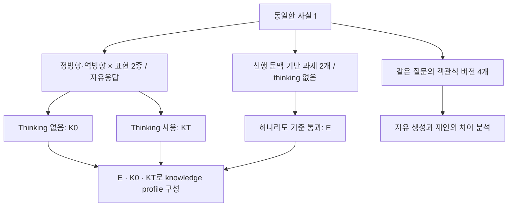

# Empty Shelves or Lost Keys? — LLM은 모르는가, 알고도 떠올리지 못하는가

**Paper:** Calderon, N., Ben-David, E., Gekhman, Z., Ofek, E., & Yona, G. (2026). *Empty Shelves or Lost Keys? Recall Is the Bottleneck for Parametric Factuality*. ICML 2026(논문 첫 페이지 표기). [arXiv:2602.14080v2](https://arxiv.org/abs/2602.14080v2) · [PDF](https://arxiv.org/pdf/2602.14080v2) · [공식 WikiProfile 데이터셋](https://huggingface.co/datasets/google/WikiProfile). 이 글은 2026년 6월 19일 개정된 v2를 기준으로 한다.

**Abstract:** LLM의 오답을 모두 지식 부족으로 해석하면 개선 방향도 더 많은 학습 데이터와 더 큰 모델로 기울기 쉽다. 이 논문은 같은 사실을 학습 문맥과 유사한 조건에서 복원할 수 있는지, 문맥 없이 방향과 표현을 바꾸어 물어도 답할 수 있는지를 분리한다. Wikipedia에서 추출한 2,150개 사실에 각각 10개 과제를 붙인 WikiProfile로 13개 모델을 평가한 결과, 일부 대형 모델은 encoding 기준을 거의 포화 수준으로 충족하면서도 상당한 사실을 안정적으로 회상하지 못했다. Thinking은 특히 희귀 사실과 역방향 질문에서 성능을 개선했다. 다만 여기서 encoding은 가중치 내부의 저장 여부를 직접 측정한 값이 아니라, 문맥을 제공한 두 과제 중 하나를 통과했는지를 나타내는 행동적 지표다. 이 글은 그 정의를 수식으로 재구성하고, 실험의 분모와 통제 조건을 확인하며, 회상 병목이라는 해석이 어디까지 설득력 있는지 검토한다. [논문 §§1–5](https://arxiv.org/pdf/2602.14080v2#page=1)

---

## Executive Summary

| 항목 | 설명 |
| --- | --- |
| 연구 질문 | 사실 질문에 실패하는 이유를 지식 저장의 실패와 저장된 사실에 접근하는 실패로 구분할 수 있는가? |
| 핵심 기여 | 질문 하나의 정오답 대신, 동일 사실을 여러 조건에서 평가해 knowledge profile을 구성한다. |
| 방법 | 문맥 기반 과제 2개로 encoding을, 정·역방향 × 표현 2종의 질문 4개로 knowledge를 판정한다. 객관식 4개는 재인 능력을 별도로 측정한다. |
| 대표 결과 | Table 2의 선택된 설정에서 encoding 비율은 Gemini-3-Pro 98.1%, GPT-5 95.3%다. 같은 표의 Direct Recall profile은 각각 72.2%, 61.6%다. |
| Thinking의 효과 | Thinking에 최적화된 모델군에서, encoded이지만 thinking 없이 known이 되지 못한 사실의 약 40–65%가 thinking으로 known이 된다. 전체 정확도가 40–65%p 상승했다는 뜻은 아니다. |
| 해석의 경계 | Wikipedia의 영어 단일 사실 QA, 문맥에 의존하는 저장 판정, 제한된 질문 변형, 모델마다 다른 thinking 설정을 전제로 한다. |

표의 수치와 정의는 [논문 §2, §5.3 및 Table 2의 Selected 블록](https://arxiv.org/pdf/2602.14080v2#page=28)을 기준으로 한다.

## 목차

1. 오답 하나로는 실패의 원인을 알 수 없다
2. 저장·회상·재인을 어떻게 구분하는가
3. Knowledge profiling의 수식과 판정 절차
4. WikiProfile은 어떻게 만들어졌는가
5. 기존 연구에서 한 걸음 더 나아간 부분
6. 실험 결과: 저장량과 접근성은 함께 움직이지 않는다
7. 결과를 신뢰할 근거와 해석의 한계
8. Thinking, RAG, 후속 평가에 주는 시사점
9. 결론

---

## 1. 오답 하나로는 실패의 원인을 알 수 없다

어떤 모델이 밴드의 첫 공연 장소를 틀렸다고 하자. 단순 QA 평가는 이 응답을 오답으로 기록한다. 하지만 연구자나 시스템 설계자가 알고 싶은 것은 그다음이다. 학습 중 접하지 못한 사실인가? 관련 문맥을 주면 복원하는가? 공연 장소에서 밴드를 찾는 역방향 질문만 실패하는가? 답을 후보로 보여주면 알아보는가?

논문 제목의 **Empty Shelves**는 지식이 없는 상태를, **Lost Keys**는 지식에 접근하지 못하는 상태를 비유한다. 두 상태는 똑같은 오답을 만들지만 대응은 달라질 수 있다. 전자라면 학습 데이터의 범위나 모델 용량이 중요하고, 후자라면 질의 조건, post-training, 추론 시 계산의 배분이 중요해진다. 논문의 출발점은 이 차이를 외부에서 관측할 수 있는 평가 절차로 바꾸는 것이다. [논문 §1](https://arxiv.org/pdf/2602.14080v2#page=1)

분석 단위를 질문에서 사실로 바꾸면 서로 다른 관측을 묶을 수 있다. “Oasis의 첫 공연 장소”와 “Boardwalk club에서 첫 공연을 한 밴드”는 답변 문자열은 다르지만 같은 사실의 서로 다른 조회 방식이다. 한쪽만 성공하는 모델을 그 사실을 완전히 안다고 볼지, 부분적으로 접근할 수 있다고 볼지가 이 논문의 핵심 문제다.

이 연구는 새로운 모델이나 검색 알고리즘을 제안하는 논문이 아니다. **정확도 점수 뒤에 감춰진 실패의 구성을 드러내는 평가 프레임워크와 벤치마크 논문**이다. 따라서 가장 중요한 검토 대상은 성능 향상 폭뿐 아니라, 각 지표가 무엇을 측정하도록 설계되었는지다.

## 2. 저장·회상·재인을 어떻게 구분하는가

### 2.1 Parametric factuality: 외부 도구 없이 사실에 답하기

Parametric factuality는 모델이 외부 검색이나 도구 없이 자신의 파라미터에 의존해 사실 질문에 정확히 답하는 능력을 뜻한다. WikiProfile의 knowledge 평가는 짧은 답을 요구하는 closed-book QA다. 벤치마크를 **만드는 과정**에는 Google Search가 사용되지만, 평가 대상 모델에게 검색 권한을 주는 실험은 아니다. [논문 §§2–4](https://arxiv.org/pdf/2602.14080v2#page=3)

또한 이 논문의 recall은 RAG의 recall@k와 다르다. Recall@k는 검색 결과에 정답 근거가 포함되는 정도를 측정하지만, 여기서는 모델이 encoding 기준을 통과한 사실에 답할 수 있는지를 다룬다. 이름이 같아도 대상과 분모가 다르다.

### 2.2 Encoding: 학습 때와 비슷한 문맥에서 복원할 수 있는가

저자들은 사실의 정답 개체가 등장하기 직전까지의 문서, 즉 **left context**를 제공한다. 정답 개체 자체는 이 문맥에 등장하지 않도록 한다. 그다음 두 가지 형식으로 사실을 묻는다.

| Encoding 과제 | 모델에 주어지는 입력 | 두 과제를 함께 쓰는 이유 |
| --- | --- | --- |
| Proposition completion | 정답 직전에서 끊긴 문맥을 이어 쓰게 한다. | 사전학습의 next-token prediction과 유사한 조건을 만든다. |
| Contextual questioning | 같은 선행 문맥을 주고 마지막 문장을 직접 질문으로 바꾼다. | 대화형 모델이 문장을 자유롭게 이어 쓰다 목표 사실을 말하지 않는 문제를 줄인다. |

두 과제 중 하나에서 기준을 넘으면 encoded로 판정한다. Encoding 측정에서는 thinking을 사용하지 않는다. 추가 추론으로 다른 사실들을 조합해 맞힌 경우를 저장의 증거로 혼동하지 않으려는 설계다. [논문 §2.1](https://arxiv.org/pdf/2602.14080v2#page=3)

이하에서 ‘저장’은 편의를 위한 번역이다. 엄밀하게는 **논문이 정한 문맥 기반 복원 검사에 성공했다**는 뜻이다. 모델의 실제 학습 데이터에 해당 문장이 있었는지, 어느 가중치에 어떤 형태로 저장됐는지를 확인한 것은 아니다.

### 2.3 Knowledge와 recall: 문맥이 바뀌어도 답할 수 있는가

같은 사실에 대해 문서의 긴 문맥을 제거하고, 독립적인 질문 네 개를 만든다. 정방향 질문 두 개는 object를 답으로 요구하고, 역방향 질문 두 개는 subject를 요구한다. 각 방향에는 원문 표현을 많이 유지한 질문과 자연스러운 재표현이 하나씩 있다.

주의할 점은 subject와 object가 고정된 지식 그래프 스키마에서 정해지지 않는다는 것이다. 이 논문에서는 **선택한 원문에 먼저 등장한 개체가 subject**다. 따라서 역방향은 원문 속 등장 순서를 뒤집는다는 뜻이며, 모델의 전체 학습 데이터에서 실제로 덜 등장한 방향을 직접 측정한 것은 아니다. [논문 §2.1](https://arxiv.org/pdf/2602.14080v2#page=3)

*원논문 Figure 2. 왼쪽은 선행 문맥을 제공해 사실을 복원하는 조건이고, 오른쪽은 문맥을 바꾸고 질문 방향도 뒤집는 조건이다. 같은 사실이어도 복원 성공과 질문 응답 성공이 달라질 수 있다는 연구의 출발점을 보여준다. Calderon et al. (2026), [arXiv v2, PDF p. 3](https://arxiv.org/pdf/2602.14080v2#page=3). 도판 영역을 직접 추출했으며 축·범례·표시값은 유지했다(CC BY-SA 4.0).*

그림을 누르면 원본 해상도로 볼 수 있다. 아래 도판도 같은 방식으로 확대할 수 있다.

### 2.4 Recognition: 답을 보여주면 알아보는가

네 QA 질문에는 각각 정답과 distractor 세 개를 넣은 객관식 버전이 있다. 자유 생성에서 답을 꺼내지 못하더라도 후보 중 정답을 고를 수 있는지 확인한다. 이를 논문은 verification 또는 recognition 관점에서 해석한다.

여기서 verification은 검색으로 사실을 검증한다는 뜻이 아니다. **주어진 보기 중 정답을 선택하는 능력**이다. 객관식은 별도의 분석 도구이며, 기본 knowledge profile을 판정하는 네 자유응답 질문을 대체하지 않는다. [논문 §3 및 Appendix A.1](https://arxiv.org/pdf/2602.14080v2#page=18)

## 3. Knowledge profiling의 수식과 판정 절차

### 3.1 한 번 맞혔는지가 아니라 반복 응답에서 기준을 넘는지 본다

질문 $q$에 대해 여러 응답을 생성하고, 정답으로 채점된 수를 $c_q$, 오답으로 채점된 수를 $i_q$라 하자. 질문 점수는 다음과 같다.

$$
g(q)=\frac{c_q}{c_q+i_q}.
$$

주 실험은 질문당 8개 응답을 생성하고 $g(q)>0.5$를 성공 기준으로 쓴다. 모두 채점 가능하다면 적어도 5개를 맞혀야 한다. 부분적으로 맞거나 채점할 수 없는 응답은 분모에서 제외되므로, 실제 분모가 언제나 8인 것은 아니다. 이는 8개 답변 중 최종 정답을 투표로 골라 사용자에게 내놓는 시스템을 평가한 것과도 다르다. [논문 §2.1, §4](https://arxiv.org/pdf/2602.14080v2#page=6)

### 3.2 Encoding은 존재 조건, knowledge는 전칭 조건이다

사실 $f$의 encoding 과제 집합을 $\mathcal E_f$, 네 QA 질문 집합을 $\mathcal Q_f$라 하자. 원문의 정의를 판정 변수로 옮기면 다음과 같다.

$$
E(f)=\mathbf 1\!\left[\max_{q\in\mathcal E_f}g_0(q)>\tau\right],
\qquad \tau=0.5.
$$

$$
K_t(f)=\mathbf 1\!\left[\min_{q\in\mathcal Q_f}g_t(q)>\tau\right],
\qquad t\in\{0,T\}.
$$

$g_0$는 thinking 없이 얻은 점수, $g_T$는 thinking을 사용한 점수다. 위의 $E,K_t$ 표기는 설명을 위한 재구성이며, 각각 원문의 $\exists q\in\mathcal E_f$와 $\forall q\in\mathcal Q_f$ 조건에 대응한다. [논문 §2.1](https://arxiv.org/pdf/2602.14080v2#page=4)

위 식은 모든 과제가 채점 가능한 경우의 기본 정의다. 실제 집계는 Appendix D.1의 Selected 전략을 적용한다. Encoding·정방향·역방향 과제를 각각 쌍으로 묶고, 어느 쌍의 두 과제 모두 채점 불가능할 때 사실을 제외한다. 한 과제만 채점 불가능한 경우까지 사실 전체를 버리는 더 엄격한 처리와는 다르다. 따라서 비채점 응답의 처리를 생략한 수식만으로 표의 수치를 재현할 수는 없다. [논문 Appendix D.1](https://arxiv.org/pdf/2602.14080v2#page=25)

Encoding은 “사실을 끌어낼 수 있는 문맥이 **하나라도** 있는가”를 묻는다. Knowledge는 “평가한 질문 **모두에서** 기준을 넘는가”를 묻는다. 가령 네 질문 중 세 개를 잘 답해도 한 역방향 질문을 계속 틀리면 known이 아니다. 이 엄격함은 우연한 한 번의 성공보다 접근의 안정성을 보려는 선택이다.

동시에 지표의 비대칭도 기억해야 한다. 두 문맥 과제의 최댓값과 네 비문맥 과제의 최솟값을 비교하므로, 두 지표의 격차에는 문맥 효과뿐 아니라 과제 수와 판정 규칙의 차이도 반영된다. **이 격차 자체를 내부 메모리의 순수한 손실량으로 해석할 수는 없다.** 이는 평가 정의에서 직접 도출되는 주의점이다.

판정 규칙을 한 사실에 적용해 보자. **설명용 가상 예시**에서 두 encoding 과제의 정답 수가 각각 8회 중 6회·3회이고, thinking 없는 네 QA의 정답 수가 7회·6회·5회·4회라면 $E=1$이지만 $K_0=0$이다. 마지막 질문의 정답률은 정확히 0.5여서 엄격한 부등호 $>0.5$를 통과하지 못하기 때문이다. Thinking 조건에서 네 질문이 모두 5회 이상 정답이면 $K_T=1$로 바뀐다. 이는 다음 표의 Recall with Thinking에 해당한다. 이 예시는 모든 응답을 채점할 수 있다고 놓은 정의 설명이며 실험에서 관찰한 개별 사례는 아니다.

만약 한 질문의 모든 응답이 PARTIALLY 또는 OTHER라면 $c_q+i_q=0$이어서 위 비율은 정의되지 않는다. 이를 임의로 0점 처리하면 논문의 Selected 집계와 달라진다. 원문의 제외 규칙을 적용한 뒤 분모와 제외 사실 수를 함께 보고해야 한다. (논문 §2.1, Appendix D.1)

### 3.3 다섯 가지 knowledge profile

| Profile | 관측 조건 | 해석 |
| --- | --- | --- |
| Encoding Failure | $E=0, K_0=0, K_T=0$ | 문맥 기반 복원과 두 QA 조건 모두에서 기준을 넘지 못한다. |
| Recall Failure | $E=1, K_0=0, K_T=0$ | 문맥에서는 복원하지만 thinking을 사용해도 네 질문을 모두 통과하지 못한다. |
| Direct Recall | $E=1, K_0=1$ | Thinking 없이 네 질문 모두에서 기준을 넘는다. |
| Recall with Thinking | $E=1, K_0=0, K_T=1$ | Thinking을 사용할 때에만 안정적인 QA 기준을 충족한다. |
| Inference without Encoding | $E=0, K_0=0, K_T=1$ | 복원 검사에는 실패하지만 thinking QA에는 성공한다. |

이 표는 [논문 §2.2와 Figure 1](https://arxiv.org/pdf/2602.14080v2#page=4)을 재구성했다. Direct Recall은 $K_T$의 값과 무관하게 $K_0$의 성공으로 분류한다. 또한 $E=0,K_0=1$인 드문 사례는 별도 주 profile을 만들지 않고 제외한다. 마지막 행의 명칭도 “추론이 실제로 확인되었다”는 뜻은 아니다. 저자들은 encoding 검사에서 놓친 지식일 가능성도 인정한다.

*보조도 A. WikiProfile의 측정 구조. Calderon et al. (2026), §§2–3을 바탕으로 직접 재구성한 설명도이며 원논문의 그림을 복사한 것이 아니다. 각 QA 조건에서는 네 질문 모두가 기준을 넘어야 known으로 판정한다.*

### 3.4 회상률과 회복률은 분모부터 구분해야 한다

정의의 의미를 드러내기 위해 두 비율을 재구성하면 다음과 같다.

$$
\mathrm{RecallRate}_t=P(K_t=1\mid E=1).
$$

$$
\mathrm{RecoveryRate}=P(K_T=1\mid E=1,K_0=0).
$$

첫째는 encoding 기준을 통과한 사실 중 QA 기준도 통과한 비율이다. 둘째는 그중 thinking 없이 실패한 사실이 thinking으로 회복되는 비율이다. Figure 5의 인기 구간별 회상률과 Figure 8의 회복률은 서로 다른 질문에 답한다. 방향별 분석에서는 $K$를 해당 방향의 질문 쌍을 통과하는 조건으로 제한한다. [논문 §§5.2–5.3, Figures 5–8](https://arxiv.org/pdf/2602.14080v2#page=7)

반면 Direct Recall **profile의 비중**은 전체 분석 대상 사실에서 그 profile이 차지하는 비율이다. 이후 표에서 제시하는 61.6%와 “저장된 사실 가운데 몇 퍼센트를 회상했는가”를 같은 값으로 읽으면 안 된다.

## 4. WikiProfile은 어떻게 만들어졌는가

### 4.1 자연 문장에서 출발하는 이유

벤치마크는 Wikipedia 문서 요약 10,000개에서 출발한다. 문서를 주제별로 분류하고 개체를 추출한 뒤, 답이 하나로 정해지고 시간에 따라 쉽게 바뀌지 않는 사실을 고른다. 최종 구성은 2,150개 사실과 사실당 10개 과제다. 영어 QA라는 점은 공식 데이터셋 카드에서도 확인된다. [논문 §3, Appendix A.2](https://arxiv.org/pdf/2602.14080v2#page=19), [공식 데이터셋](https://huggingface.co/datasets/google/WikiProfile)

선택 목표도 중요하다. 저자들은 작은 모델에서도 encoding을 측정할 수 있도록, 이미 인코딩됐을 가능성이 높으면서 자명하지 않은 사실을 추출하려 했다고 명시한다. 후보는 주제와 정답 개체 유형의 균형을 고려해 축소한다. 따라서 이 집합의 높은 encoding 비율은 자연스러운 Wikipedia 사실 빈도나 실제 사용자 질의 분포를 그대로 추정한 값이 아니라, **이러한 구성 목표 아래 선택된 사실들의 통계**다. [논문 Appendix A.2](https://arxiv.org/pdf/2602.14080v2#page=19)

정해진 관계 스키마의 지식 베이스 triple만 사용하는 대신 자연 문장에서 사실을 추출하면, 문맥을 포함한 복잡한 관계도 다룰 수 있다. 여기서 single-hop은 관계 표현이 언제나 간단하다는 뜻이 아니다. 질문의 답이 선택한 하나의 사실로 결정되며, 정답을 얻는 데 여러 사실의 연쇄 결합을 요구하지 않는다는 뜻이다.

### 4.2 질문 생성보다 모호성 제거가 중요하다

*원논문 Figure 3. 왼쪽의 사실·개체 선택에서 시작해 가운데의 정·역방향 질문 검증을 통과하고, 오른쪽에서 자연스러운 재표현과 객관식 과제를 만든다. 휴지통 표시는 질문이 모호하거나 자명해질 때 해당 사실이 탈락하는 지점이다. Calderon et al. (2026), [arXiv v2, PDF p. 5](https://arxiv.org/pdf/2602.14080v2#page=5). 도판 영역을 직접 추출했으며 축·범례·표시값은 유지했다(CC BY-SA 4.0).*

Gemini-2.5-Pro with thinking을 사용해 사실을 추출하고 질문을 생성·수정·검증한다. 정방향 질문에서 역방향 질문을 만들 때에는 개체만 교환하는 것으로 충분하지 않다. 어떤 장소에서 공연한 밴드는 여러 개일 수 있으므로, 정답을 하나로 제한할 문맥을 보충해야 한다. 그러나 문맥을 너무 많이 보충해 답이 자명해지면 역시 버린다. Google Search를 사용한 필터링은 실제로 답이 있는지, 복수 정답이나 추가 설명이 필요한 질문인지 확인한다. [논문 Figure 3, Appendix A.3](https://arxiv.org/pdf/2602.14080v2#page=20)

이 과정은 역방향 실패를 단순한 질문 오류와 구분하려는 장치다. 동시에 모든 사실이 살아남는 것은 아니다. **유일한 정답이 있고, 양방향으로 자연스럽게 물을 수 있으며, 적절한 문맥 복원이 가능한 사실**이 선택된다. 따라서 이 벤치마크의 사실 분포를 실제 사용자 질문 전체의 분포로 볼 수는 없다.

### 4.3 사람의 품질 검토는 어려운 사례에 집중한다

자동 파이프라인 이후 저자들은 여러 강한 모델이 공통으로 실패하는 사실을 우선 확인했다. Appendix A.4는 237개 사실을 대상으로 한 수동 점검에서 품질이 낮은 43개를 제거했고, 별도 50개 사실 점검에서 오류 3개를 발견했다고 보고한다. [논문 Appendix A.4](https://arxiv.org/pdf/2602.14080v2#page=21)

이 방식은 비용 대비 오류 발견에 유리하지만 전체 데이터의 무작위 품질 감사와 같지는 않다. 어려운 사례를 검토했다는 이유만으로 선택 편향이 입증되는 것은 아니다. 다만 모델 실패를 단서로 표본을 골랐으므로, 보고된 오류 수를 데이터셋 전체의 불편 추정 오류율처럼 읽을 수 없다는 제한은 남는다.

## 5. 기존 연구에서 한 걸음 더 나아간 부분

이 논문의 위치는 새로운 기억 메커니즘의 발명보다, 기존에 서로 떨어져 있던 평가 질문들을 같은 사실 위에서 연결한 데 있다.

| 연구 관점 | 주로 관측하는 것 | WikiProfile이 추가하는 비교축 |
| --- | --- | --- |
| 일반적인 closed-book QA | 질문에 대한 정답률 | 같은 사실의 복원·정방향·역방향 결과를 묶어 실패를 분해한다. |
| Memorization 평가 | 학습과 유사한 문맥에서 내용을 재생하는 능력 | 재생 성공과 문맥을 바꾼 QA 성공이 얼마나 어긋나는지 본다. |
| Latent knowledge 분석 | 내부 표현에서 답 관련 정보를 읽을 수 있는지 | 가중치나 hidden state에 접근하지 않고 입출력 행동만으로 비교한다. |
| Reversal curse 연구 | A→B 학습이나 응답이 B→A로 일반화되는지 | 자유 생성과 객관식 재인을 비교하고, thinking의 영향을 분리한다. |
| Thinking의 factuality 평가 | 추가 추론이 정확도를 높이는지 | 증가한 정답이 encoding 성공 사실에 집중되는지, 반복 응답의 안정성도 높아지는지 확인한다. |

이 비교는 [논문 §6의 관련연구 정리](https://arxiv.org/pdf/2602.14080v2#page=9)에 따른다. 특히 WikiProfile은 동일한 입출력 평가로 폐쇄형 모델까지 포함할 수 있다는 장점이 있다.

직접 연결되는 선행연구를 보면 기여의 범위가 더 명확해진다. Berglund et al. (2024)의 *The Reversal Curse*는 한 방향으로 학습한 관계가 반대 방향으로 일반화되지 않는 현상을 다룬다. WikiProfile은 자연 문서의 사실에 대해 encoding 조건을 확인하고, 자유 생성과 객관식 사이의 차이를 추가로 측정한다. 전자가 학습 방향의 일반화를 묻는다면, 후자는 서로 다른 질의 형식에서 접근 가능한 정보를 비교한다. 따라서 기존 reversal curse를 없던 현상으로 만든 것이 아니라, 그 실패를 해석할 추가 관측을 제공한 것이다. [Berglund et al. (2024)](https://proceedings.iclr.cc/paper_files/paper/2024/hash/5178b2f2d7c44aa390c0777dc77b3f0c-Abstract-Conference.html)

Kandpal et al. (2023)은 학습 데이터에서 드문 지식과 QA 성능의 관계를 분석했고, Mallen et al. (2023)은 인기도가 낮은 사실에서 parametric memory와 검색을 통한 non-parametric memory를 비교했다. WikiProfile은 이 long-tail 문제를 encoding과 recall로 더 나누어 보는 접근이다. 모델·코퍼스·평가 조건이 다르므로 “희귀 지식의 학습 문제는 해결됐다”는 반박으로 읽기보다, 오답 원인에 접근 실패를 포함하는 보완으로 읽는 편이 타당하다. [Kandpal et al. (2023)](https://proceedings.mlr.press/v202/kandpal23a.html), [Mallen et al. (2023)](https://aclanthology.org/2023.acl-long.546/)

## 6. 실험 결과: 저장량과 접근성은 함께 움직이지 않는다

### 6.1 실험 조건과 숫자를 읽는 기준

| 축 | 설정 |
| --- | --- |
| 평가 모델 | Gemini-3 Pro/Flash, Gemini-2.5 Pro/Flash, GPT-5.2, GPT-5, GPT-5-mini, GPT-4.1, GPT-4.1-mini, Gemma3 1B/4B/12B/27B 등 13개 |
| 응답 생성 | 과제당 8개 응답, temperature 1을 사용했다고 보고 |
| Thinking 비교 | Native thinking 모델은 effort/budget을 조절하고, GPT-4.1과 Gemma3에는 CoT prompting 적용 |
| Encoding 판정 | Thinking을 사용하지 않은 조건만 반영 |
| 채점 | Gemini-2.5-Pro with thinking 기반 autorater. Completion과 QA에 서로 다른 채점 프롬프트 사용 |
| 객관식 통제 | 보기 순서를 바꾸어 각 위치에 정답이 두 번씩 등장하도록 구성 |

설정은 [논문 §4](https://arxiv.org/pdf/2602.14080v2#page=6)의 보고다. 서로 다른 모델의 thinking이 같은 토큰 예산이나 같은 연산을 뜻하지는 않는다. 또한 모델 이름은 이 논문에서 평가한 대상이며, 글 작성 시점의 모델 순위를 뜻하지 않는다.

전체 생성 규모는 저자 산식으로 약 450만 응답이다. 이는 450만 개의 독립된 사실을 평가했다는 뜻이 아니다. 같은 2,150개 사실에 대한 과제·모델·thinking 조건·반복 샘플을 합산한 양이다.

### 6.2 가장 강한 결과: 높은 encoding과 남아 있는 Recall Failure

*원논문 Figure 4. 작은 Gemma3 모델에서 크게 보이는 노란 encoding 실패 영역이 강한 모델에서는 줄지만, 빨간 recall 실패 영역은 남는다. 진한 초록색은 직접 회상, 연한 초록색은 thinking으로 회복한 profile이다. 검은 선과 상단 Knows는 Direct Recall·Recall with Thinking·Inference without Encoding 세 성공 profile의 합이며 encoding 비율이 아니다. 마지막 profile은 아래의 간략 표에서는 생략했다. 아래 표의 정확한 수치는 Table 2 Selected를 기준으로 한다. Calderon et al. (2026), [arXiv v2, PDF p. 6](https://arxiv.org/pdf/2602.14080v2#page=6). 도판 영역을 직접 추출했으며 축·범례·표시값은 유지했다(CC BY-SA 4.0).*

아래는 Appendix Table 2의 **Selected** 설정에서 필요한 열만 옮긴 것이다. 모든 수치는 백분율이며, Direct Recall과 Recall with Thinking, Recall Failure는 profile별 비중이다.

| 모델 | Encodes | Direct Recall | Recall with Thinking | Recall Failure | Encoding Failure | Excluded |
| --- | ---: | ---: | ---: | ---: | ---: | ---: |
| Gemini-3-Pro | 98.1 | 72.2 | 14.9 | 10.9 | 1.6 | 1.3 |
| Gemini-3-Flash | 97.2 | 73.2 | 12.6 | 11.4 | 2.5 | 3.2 |
| GPT-5 | 95.3 | 61.6 | 21.5 | 12.2 | 4.0 | 1.6 |
| GPT-5.2 | 92.1 | 56.6 | 17.9 | 17.6 | 6.8 | 2.0 |
| GPT-5-mini | 82.8 | 43.5 | 20.3 | 19.0 | 14.0 | 1.8 |
| Gemma3-27B | 76.4 | 36.2 | 8.6 | 31.6 | 23.1 | 3.5 |
| Gemma3-1B | 14.3 | 0.9 | 0.5 | 13.0 | 85.2 | 10.0 |

수치는 [논문 Table 2, Selected 블록](https://arxiv.org/pdf/2602.14080v2#page=28)에 따른다. Encodes는 별도 집계 지표여서 다른 열과 합산하지 않는다. 다섯 profile 중 Inference without Encoding은 이 표에서 생략했다. Excluded는 비채점 처리와 드문 별도 사례 때문에 분석에서 제외한 사실의 비율이며, profile 비중과 분모가 다르다. 특히 Gemma3-1B는 제외 비율이 10.0%이므로 모든 모델이 같은 사실 집합에서 비교됐다고 볼 수 없다. 반올림도 있으므로 표에서 생략한 비율을 임의로 역산하지 않는 편이 좋다.

Gemini-3-Pro와 GPT-5에서 encoding 실패는 적지만, thinking까지 사용해도 Recall Failure에 남는 사실이 각각 10.9%, 12.2%다. 논문의 주장은 이 차이에서 힘을 얻는다. 단순히 “생각을 더 하면 정답률이 오른다”보다, **문맥 기반 복원이 가능한 사실에도 안정적인 질문 응답의 여지가 상당히 남는다**는 결과가 중요하다.

또한 GPT-5.2의 모든 지표가 GPT-5보다 높은 것은 아니다. 이 표를 모델 출시 순서에 따른 단조로운 발전의 증거로 읽어서는 안 된다. 저자들이 통제된 계열 내 크기 비교에 사용한 예시는 Gemma3다.

여기서는 같은 이름의 **Knows**도 도표마다 집계 정의를 확인해야 한다. Figure 4·13의 Knows는 Direct Recall·Recall with Thinking·Inference without Encoding 세 profile을 합친 잠재적 knowledge다. Appendix C.1은 thinking을 켜면 오히려 unknown이 되는 사실도 있으므로, 이 합이 thinking 조건에서의 실제 성능을 조금 높게 나타낼 수 있다고 설명한다. 따라서 thinking으로 새로 회복한 사실과 기존 성공을 유지한 사실은 구분해야 한다.

Table 2의 Knows(+Think)·Knows 열은 여기에 **Direct Inference** 사례의 처리도 다르다. 표 캡션은 두 knowledge 열을 Direct Inference를 포함해 계산한다고 명시하지만, 기본 profile 분포는 이 드문 사례를 제외한다. 따라서 위의 간략 표에서 일부 profile을 더해 Table 2의 knowledge 열을 역산하거나, 표와 도판의 차이를 전부 thinking의 퇴행으로 돌릴 수는 없다. 반올림, 분석 대상 집합, thinking 조건을 먼저 맞춰야 한다. (논문 Appendix C.1, D.1 및 Table 2 캡션)

### 6.3 Scaling: 저장의 병목을 줄여도 회상의 병목은 남는다

Gemma3의 Encoding Failure 비중은 1B의 85.2%에서 27B의 23.1%로 줄어든다. 모델 크기가 커지면서 더 많은 사실이 복원 검사에 성공한다는 방향은 분명하다. 그러나 27B에서도 Recall Failure가 31.6%를 차지한다. [논문 Figure 4 및 Table 2](https://arxiv.org/pdf/2602.14080v2#page=6)

그렇다고 13.0%에서 31.6%로 늘어난 Recall Failure만 보고 “큰 모델이 기억을 더 못 꺼낸다”고 결론내릴 수는 없다. 작은 모델에서 encoding 실패였던 사실이 큰 모델에서는 encoded 집합으로 들어오기 때문이다. 저장 성공 집합의 크기와 구성 자체가 바뀐다. 이 결과가 뒷받침하는 것은 **모델 크기 증가만으로 저장과 안정적 접근 사이의 차이가 자동으로 해소되지 않는다**는 주장이다.

### 6.4 Long-tail: 덜 유명한 사실은 덜 저장되기만 하는가

*원논문 Figure 5. 각 패널의 Encodes는 사실이 복원 검사를 통과한 비율이고, Recalls는 그중 thinking 없이 회상되는 비율이다. 인기도에 따른 간격이 저장보다 회상에서 더 크게 나타난다. 첫 패널은 그림에 표시된 Gemini-3-Flash이며 원문의 인접 본문에 있는 Pro 표기와 구분한다. Calderon et al. (2026), [arXiv v2, PDF p. 7](https://arxiv.org/pdf/2602.14080v2#page=7). 도판 영역을 직접 추출했으며 축·범례·표시값은 유지했다(CC BY-SA 4.0).*

논문은 Wikipedia 페이지 조회수를 사실의 인기도에 대한 대리 지표로 삼아 상위 20%와 하위 20%를 비교한다. Figure 5의 GPT-5 수치는 다음과 같다.

| GPT-5의 평가 지표 | 인기도 상위 20% | 인기도 하위 20% |
| --- | ---: | ---: |
| Encoding 비율 | 98.4 | 90.7 |
| Encoded 사실 중 thinking 없는 회상률 | 77.8 | 52.9 |

[논문 Figure 5](https://arxiv.org/pdf/2602.14080v2#page=7)

하위 구간에서도 대부분의 사실이 encoding 기준을 넘는다. 그러나 그중 안정적으로 회상되는 비율은 크게 낮아진다. 따라서 이 평가에서는 희귀 사실의 어려움을 “저장되지 않았기 때문”으로만 설명하기 어렵다.

두 가지 범위 제한은 필요하다. 조회수는 실제 사전학습 데이터에서 사실이 등장한 빈도가 아니다. 또 Wikipedia 안의 하위 인기 구간은 웹 전체나 사내 전문 문서의 극단적인 long-tail과 같지 않다. 논문도 Wikipedia가 비교적 잘 알려진 백과사전적 사실을 담는다는 한계를 인정한다. [논문 §7](https://arxiv.org/pdf/2602.14080v2#page=10)

### 6.5 Reversal curse: 직접 말하지 못하는 답도 고를 수 있다

*원논문 Figure 6. 갈색과 청록색은 각각 정방향과 역방향이다. Generate에서는 역방향 막대가 낮지만, Verify에서는 차이가 작거나 방향이 뒤집힌다. 후보에서 답을 알아보는 능력과 답을 직접 생성하는 능력의 차이를 읽는 그림이다. Calderon et al. (2026), [arXiv v2, PDF p. 7](https://arxiv.org/pdf/2602.14080v2#page=7). 도판 영역을 직접 추출했으며 축·범례·표시값은 유지했다(CC BY-SA 4.0).*

Figure 6은 encoding 기준을 통과한 사실에 대해 정방향과 역방향을 비교한다. GPT-5는 자유응답에서 역방향 성능이 낮지만, 객관식에서는 관계가 반대로 나타난다.

| GPT-5, thinking 없음 | 정방향 | 역방향 |
| --- | ---: | ---: |
| 자유응답으로 생성 | 83.0 | 74.0 |
| 객관식 보기에서 선택 | 86.0 | 90.7 |

각 값은 해당 방향의 질문들에 대한 성공 기준을 적용한 비율이며 [논문 Figure 6](https://arxiv.org/pdf/2602.14080v2#page=7)의 표시값을 따른다.

이 결과는 “역방향에서 답하지 못하면 그 관계에 대한 정보가 전혀 없다”는 강한 해석에 제동을 건다. 답을 후보로 제시했을 때에는 역방향에서도 유용한 구별 능력이 나타나기 때문이다.

다만 객관식 성공이 대칭적인 내부 표현을 증명하지는 않는다. 보기 속 후보를 원래의 정방향 관계에 대입해 확인하거나 소거해도 답을 고를 수 있다. 이는 실험 설계에서 가능한 직접적 해석이며, 논문이 그런 경로를 관찰했다는 뜻은 아니다. **생성과 재인 사이의 행동적 비대칭은 확인되지만, 이를 구현하는 내부 계산은 미확정**으로 남는다.

### 6.6 Thinking: 회복되는 것은 무엇인가

*원논문 Figure 8. 빨간 선은 encoded이지만 thinking 없이 known이 되지 못한 사실이 회복되는 비율이고, 노란 선은 encoding에도 실패한 집단의 회복률이다. 각 선은 서로 다른 조건부 집단을 분모로 쓴다. 원문 캡션의 노란 선 범위는 본문·부록과 다르므로, 이 글은 도표의 전체 경향과 일관되게 보고된 빨간 선의 40–65% 범위에 근거한다. Calderon et al. (2026), [arXiv v2, PDF p. 8](https://arxiv.org/pdf/2602.14080v2#page=8). 도판 영역을 직접 추출했으며 축·범례·표시값은 유지했다(CC BY-SA 4.0).*

Figure 8의 대표 결과는 thinking에 최적화된 모델군에서 encoded-but-not-directly-known 사실의 약 40–65%가 thinking을 사용하면 known이 된다는 것이다. 이는 §3.4의 RecoveryRate에 해당한다. [논문 §5.3, Figure 8](https://arxiv.org/pdf/2602.14080v2#page=8)

*원논문 Figure 7. 진한 부분은 thinking 없는 회상률, 옅은 부분은 thinking의 추가 이득이다. 왼쪽은 인기도, 오른쪽은 질문 방향에 따른 격차를 비교한다. 각 막대의 높이는 두 부분의 합이며, Δ와 ΔT는 각각 thinking 전후의 격차다. GPT-5의 오른쪽 패널에서 역방향의 추가 이득이 더 크다. Calderon et al. (2026), [arXiv v2, PDF p. 8](https://arxiv.org/pdf/2602.14080v2#page=8). 도판 영역을 직접 추출했으며 축·범례·표시값은 유지했다(CC BY-SA 4.0).*

Thinking의 이득은 어려운 조건에 더 크게 나타난다. Figure 7에서 GPT-5의 정방향 회상률은 12.0%p, 역방향은 19.0%p 높아진다. 표시값 기준 두 방향의 격차는 thinking 없이 9.0%p였지만 thinking을 사용하면 2.0%p로 줄어든다. 단순히 모든 조건에 같은 양의 계산 이득이 더해진 양상은 아니다. [논문 Figure 7](https://arxiv.org/pdf/2602.14080v2#page=8)

왜 그런가? 저자들은 세 설명을 구분한다.

1. **응답 다양성 증가:** 더 다양한 답을 생성하니 여러 샘플 중 하나가 우연히 맞는다.
2. **추론:** 다른 사실을 조합해 목표 답을 도출한다.
3. **회상 촉진:** 이미 접근 가능한 형태로 저장된 정보를 질문에 맞게 활성화한다.

부록은 단순히 “적어도 한 번 맞힌 질문”만 보지 않고, 반복 응답에서 높은 정답 비율을 유지한 질문도 분석한다. Native thinking 모델은 높은 정답 비율 기준에서도 개선되므로, 다양성 증가만으로 이득을 설명하기 어렵다는 논거가 된다. 또한 encoding에 성공한 사실에서 회복이 더 많이 나타난다. [논문 Appendix B, Figure 12](https://arxiv.org/pdf/2602.14080v2#page=22)

이 두 관측은 회상 촉진 해석을 지지한다. 하지만 추론과 회상을 인과적으로 완전히 분리한 것은 아니다. 저자들도 encoding에 실패한 사실은 추론에 필요한 주변 전제 역시 부족할 수 있다고 인정한다. 질문이 single-hop이라는 점도 모델이 실제로 우회 추론을 하지 않았음을 보장하지 않는다. 따라서 적절한 결론은 **회상 촉진과 일치하는 행동적 증거를 확보했다**는 것이다.

*원논문 Figure 12. 가로축 p가 커질수록 반복 응답에서 더 일관되게 맞혀야 한다. 세로축은 그 기준을 충족하는 질문의 비율이다. 주황색은 thinking, 회색은 base다. Gemini·GPT-5 계열과 달리 오른쪽 Gemma3 패널에서는 높은 p에서 주황색이 회색 아래로 내려가므로, 더 다양한 답을 내는 것과 더 안정적으로 맞히는 것을 구분할 수 있다. Calderon et al. (2026), [arXiv v2, PDF p. 24](https://arxiv.org/pdf/2602.14080v2#page=24). 도판 영역을 직접 추출했으며 축·범례·표시값은 유지했다(CC BY-SA 4.0).*

Thinking 구현에 따른 차이도 남는다. Appendix B.3–B.5에서 native-thinking 모델은 정답을 한 번 이상 생성하는 availability와 높은 정답 비율을 유지하는 robustness가 함께 개선되는 경향을 보였다. 반면 분석된 Gemma3의 CoT prompting은 availability를 높이면서 robustness는 낮췄고, GPT-4.1에서는 두 측면의 개선이 제한적이었다. 저자들은 이 차이를 thinking 전용 학습의 효과로 단정하지 않는다. 모델 크기·학습 데이터·post-training도 모델군과 함께 달라지기 때문이다. 따라서 “더 길게 생각하라고 프롬프트하면 같은 회상 이득을 얻는다”는 결론으로 옮길 수 없다. [논문 Appendix B.3–B.5](https://arxiv.org/pdf/2602.14080v2#page=23)

## 7. 결과를 신뢰할 근거와 해석의 한계

### 7.1 문턱값과 채점기만으로 생긴 현상인가

저자들은 몇 가지 중요한 검증을 수행했다.

| 검증 | 보고된 관측 | 남아 있는 경계 |
| --- | --- | --- |
| 채점기 교체 | 4,160개 응답에서 Gemini-2.5-Pro와 GPT-5 기반 채점기의 일치율 98.2% | 두 채점기의 일치가 사람 기준 정확도 98.2%를 의미하지는 않는다. |
| 판정 문턱 변경 | Appendix D.2에서 문턱을 바꿔도 encoding과 recall의 큰 경향이 유지됨 | 비율의 절대값은 여전히 정의와 문턱에 의존한다. |
| 부분 정답·비채점 응답 처리 변경 | Table 2에서 서로 다른 제외·가중 전략 비교 | 모델별 제외 비율과 분석 대상 사실 집합이 같지는 않다. |
| 반복 응답 수 점검 | 관측한 응답을 재표집한 bootstrap에서 8개 샘플의 집계 안정성 확인 | 새 사실, 새 모델 버전, 다른 프롬프트에 대한 외적 타당성을 보장하지 않는다. |
| 역방향 분석 통제 | Encoding으로 조건화하지 않은 분석과 답 개체 유형별 비교에서도 경향 유지 | 모델의 실제 학습 방향 분포를 복원한 실험은 아니다. |

각 검증은 [논문 Appendix C.4, D.1–D.4](https://arxiv.org/pdf/2602.14080v2#page=25)에 따른다. 세 번째 열은 검증 범위에 대한 이 글의 해석이다.

이 통제들은 중요하다. 예를 들어 encoding 과제와 정방향 QA는 같은 object를 정답으로 요구하므로, encoded 사실만 선택하면 정방향에 유리한 표본이 만들어질 수 있다. 논문은 이 우려를 인식하고 조건화를 제거한 분석도 제시한다. 비판적 독해는 이런 통제를 생략한 채 선택 편향 가능성만 제기하는 방식이어서는 안 된다.

### 7.2 표현 변화에 강하다는 결론도 평가된 변화 안에서 읽어야 한다

논문은 원문 어휘를 유지한 질문과 자연스러운 재표현을 비교한 104개 가설검정에서 FDR 보정 후 유의한 차이를 찾지 못했다고 보고한다. [논문 §5.2, Appendix C.3](https://arxiv.org/pdf/2602.14080v2#page=24)

이는 이번 표현 변형이 주된 설명 변수가 아니었다는 근거다. 모든 패러프레이즈에 동등하게 강하다거나, 한국어 번역·복잡한 부정·대명사·대화 문맥에도 불변이라는 뜻은 아니다. 통계적 차이를 찾지 못한 것과 광범위한 동등성을 입증한 것은 구별해야 한다.

### 7.3 Encoding은 저장의 충분조건인가

이 논문의 가장 큰 개념적 가정은 학습과 비슷한 문맥에서의 복원을 저장의 증거로 삼는 것이다. 정답 문자열을 문맥에서 제거하고 thinking을 끄는 조치는 직접적인 정답 누출과 긴 명시적 추론을 줄인다. 그러나 일반 forward pass 안에서도 문맥 단서와 다른 지식을 결합할 수 있다.

반대로 두 encoding 과제를 모두 실패해도, 다른 문맥에서는 사실을 꺼낼 가능성을 배제할 수 없다. 저자들이 Inference without Encoding에 대해 검사에서 놓친 저장 가능성을 인정한 이유이기도 하다. 따라서 encoded/not-encoded는 내부 지식의 존재·부재를 완전히 식별하는 판정이 아니라, **지정된 검사 조건에서 얻은 구분**으로 읽어야 한다. [논문 §2.1–2.2](https://arxiv.org/pdf/2602.14080v2#page=4)

이 제한은 연구의 실용성을 없애지 않는다. 어떤 단서를 줄 때 답이 회복되고 어떤 질의에서 실패하는지는 시스템 설계에 직접 유용하다. 다만 “내부에는 정답이 확실히 저장되어 있다”는 존재론적 주장보다 “특정 조건에서 정답을 재현할 수 있다”는 행동적 주장이 더 단단한 근거를 가진다.

### 7.4 Wikipedia 포화와 세계 지식의 포화는 다르다

저자들은 Wikipedia라는 비교적 유명하고 안정적인 사실 영역, single-hop 질문, 방향과 표현이라는 두 변화 축에 연구를 제한한다. [논문 §7](https://arxiv.org/pdf/2602.14080v2#page=10)

최신 사건, 비공개 사내 자료, 전문 분야의 드문 사실, 다국어 지식, 서로 충돌하는 출처는 이 실험의 결론 범위 밖이다. 그러므로 98.1%는 “세계 지식의 98.1%가 저장되어 있다”는 수치가 아니다. 선택된 벤치마크와 판정 규칙 아래의 값이다.

특히 이 실험은 알려진 정보가 사전학습에 들어갔는지를 감사하는 설계가 아니다. 학습에 포함됐을 가능성이 높은 Wikipedia를 활용해 기억과 접근을 평가한다. 반면 벤치마크 공개 후 평가된 모델을 동일 조건으로 비교하려면, 평가 문항 자체가 학습에 포함됐는지 별도로 점검해야 한다. 후자는 이후 재현 연구에 필요한 구분이지, 현재 결과의 오염이 확인되었다는 주장은 아니다.

### 7.5 Thinking의 이득에는 비용과 제어 문제가 따른다

논문은 frontier 모델 하나의 WikiProfile 전체 profiling 비용을 약 500달러로 보고한다. 이는 저자 실험 당시의 **벤치마크 전체 실행 비용**이며 현재 API 요금이나 한 질문의 thinking 비용이 아니다. [논문 §7](https://arxiv.org/pdf/2602.14080v2#page=10)

더 중요한 문제는 thinking을 언제 켤지다. 이 연구는 gold answer를 가진 평가자가 사후적으로 knowledge profile을 만든다. 실제 서비스에는 현재 질문이 Recall Failure인지 Encoding Failure인지 알려주는 정답표가 없다. 따라서 이 논문은 thinking의 잠재적 이득을 보여주지만, 최소 비용으로 그 이득을 얻는 online routing 정책까지 검증하지는 않는다.

## 8. Thinking, RAG, 후속 평가에 주는 시사점

### 8.1 사실성 개선은 저장과 접근을 함께 평가해야 한다

이하 내용은 논문의 결과에서 도출한 설계 시사점이다. WikiProfile에서 직접 실험한 배포 기법으로 읽어서는 안 된다.

Fine-tuning 이후 QA 성능이 좋아졌다면 새로운 사실을 학습했는지, 기존 사실에 대한 접근이 개선됐는지를 구분할 필요가 있다. 같은 사실의 encoding 지표와 방향별 QA를 함께 측정하면 두 변화의 양상을 더 잘 볼 수 있다. 다만 training 전후에 동일 사실 집합을 유지하고, 새 학습 데이터에 포함된 사실과 그렇지 않은 사실을 구분해야 개선의 성격을 해석하기 쉽다.

실험 결과를 정확도 하나로 보고하기보다, 어떤 실패 profile이 줄었는지까지 보여주는 것이 이 논문의 가장 직접적인 활용법이다.

### 8.2 RAG와의 접점: 단서 공급과 새 지식 공급을 구분한다

RAG가 답을 개선했을 때에도 두 설명이 가능하다. 검색 문서가 모델이 갖지 못한 사실을 공급했을 수도 있고, 이미 재현 가능한 사실에 대한 접근 단서를 제공했을 수도 있다. WikiProfile의 구분은 이 둘을 분석하는 출발점이 될 수 있다.

그러나 encoding 과제에 사용한 left context를 그대로 일반 RAG 성능으로 해석해서는 안 된다. 그 문맥은 목표 사실의 원문에서 정답 직전까지 잘라낸 것으로, 실제 검색기가 질의만 보고 찾아낸 결과가 아니다. 이 논문에는 retriever 선택, 검색 오류, 출처 인용 품질을 평가한 RAG 비교 실험도 없다.

따라서 이 결과에서 “모델이 이미 다 아니까 RAG가 필요 없다”는 결론은 나오지 않는다. 새 정보의 공급, 최신성, 근거 추적은 closed-book 회상 성공과 별개의 기능이다. 이전 HippoRAG 리뷰에서 다룬 **외부 기억에서 근거를 회수하는 문제**와 이 논문의 **파라미터 기반 응답의 접근성 문제**는 연결해서 볼 수 있지만 같은 실험 문제는 아니다.

### 8.3 다음 실험은 무엇을 분리해야 하는가

| 후속 평가 | 분리하려는 문제 | 비교가 필요한 조건 |
| --- | --- | --- |
| 문맥 강도 조절 | 문맥 단서가 답을 얼마나 도와주는가 | 원래 left context, 재표현 문맥, 짧은 단서, 무관한 문맥을 비교한다. |
| 판정 규칙의 대칭화 | 존재·전칭 조건이 격차에 주는 영향 | 과제 수와 집계 규칙을 맞춘 보조 지표를 기본 profile과 함께 보고한다. |
| 통제된 새 사실 학습 | 학습된 내용과 접근 실패의 관계 | 학습 노출과 방향을 직접 통제한 사실에서 양방향 QA와 객관식을 비교한다. |
| 계산 예산 통제 | 추가 계산과 thinking 학습의 기여 | 같은 모델에서 토큰·지연 예산별 정답률과 반복 응답 안정성을 측정한다. |
| 다른 코퍼스와 언어 | Wikipedia 밖으로의 일반화 | 도메인·언어별로 질문 품질을 검증하고 encoding 및 recall을 재측정한다. |

이 표는 이 글이 제안하는 평가 설계다. 기대 성능이나 아직 수행하지 않은 결과를 주장하지 않는다. 특히 정확도를 높이는 방법을 먼저 고르기보다, **어떤 관측이 회상 촉진과 추론·문맥 도움을 구별할 수 있는가**를 명확히 하는 것이 후속 연구의 핵심이다.

## 9. 결론

WikiProfile의 기여는 LLM의 지식을 하나의 QA 점수로 보지 않게 만드는 데 있다. 같은 사실을 문맥에서 복원하는 능력, 독립 질문에서 안정적으로 답하는 능력, 역방향으로 찾아내는 능력, 후보를 보고 알아보는 능력은 실제 평가에서 서로 어긋난다. 특히 일부 강한 모델에서는 문맥 기반 encoding 검사가 거의 포화되어도 상당한 회상 실패가 남고, thinking이 그 일부를 회복한다.

가장 설득력 있는 결론은 **이번 Wikipedia 사실 집합에서는 지식에 접근하는 조건이 사실성의 중요한 병목이라는 것**이다. 저장량을 늘리는 것만으로 충분하지 않을 수 있다는 문제 제기는 유효하다. 동시에 행동적 encoding을 내부 저장의 직접 관찰로, 객관식 성공을 대칭적 기억 구조의 증명으로, thinking의 이득을 순수 회상 메커니즘의 인과적 증명으로 확대해서는 안 된다.

연구자에게 이 논문은 실패를 더 세밀하게 측정하는 도구를 준다. 시스템 설계자에게는 모델이 틀렸을 때 더 많은 지식이 필요한지, 더 적절한 접근 조건이 필요한지를 구분해 보라는 과제를 남긴다. 그 구분을 실제 도메인과 비용 제약 아래에서 얼마나 신뢰성 있게 수행할 수 있는지가 다음 연구의 가치가 될 것이다.

*이 글은 Calderon et al. (2026)의 [arXiv v2](https://arxiv.org/abs/2602.14080v2)를 분석·재구성했다. 원논문의 arXiv 등록 라이선스는 [CC BY-SA 4.0](https://creativecommons.org/licenses/by-sa/4.0/)이며, 이 리뷰도 같은 라이선스로 제공한다. 원논문 Figures 2–8 및 12는 해당 도판 영역을 고해상도로 추출해 인용했으며, 주변 본문과 영문 캡션을 제외하고 한국어 해설을 덧붙였다. 도표 안의 데이터·축·범례는 변경하지 않았다. 보조도 A는 새로 작성했다.*

## References

Berglund, L., Tong, M., Kaufmann, M., Balesni, M., Stickland, A. C., Korbak, T., & Evans, O. (2024). *The reversal curse: LLMs trained on “A is B” fail to learn “B is A”*. International Conference on Learning Representations. [ICLR proceedings](https://proceedings.iclr.cc/paper_files/paper/2024/hash/5178b2f2d7c44aa390c0777dc77b3f0c-Abstract-Conference.html)

Calderon, N., Ben-David, E., Gekhman, Z., Ofek, E., & Yona, G. (2026). *Empty shelves or lost keys? Recall is the bottleneck for parametric factuality* (arXiv:2602.14080v2). arXiv. [https://doi.org/10.48550/arXiv.2602.14080](https://doi.org/10.48550/arXiv.2602.14080)

Google. (2026). *WikiProfile* [Data set]. Hugging Face. [https://huggingface.co/datasets/google/WikiProfile](https://huggingface.co/datasets/google/WikiProfile)

Kandpal, N., Deng, H., Roberts, A., Wallace, E., & Raffel, C. (2023). Large language models struggle to learn long-tail knowledge. In *Proceedings of the 40th International Conference on Machine Learning* (Vol. 202, pp. 15696–15707). PMLR. [PMLR proceedings](https://proceedings.mlr.press/v202/kandpal23a.html)

Mallen, A., Asai, A., Zhong, V., Das, R., Khashabi, D., & Hajishirzi, H. (2023). When not to trust language models: Investigating effectiveness of parametric and non-parametric memories. In *Proceedings of the 61st Annual Meeting of the Association for Computational Linguistics (Volume 1: Long Papers)* (pp. 9802–9822). Association for Computational Linguistics. [https://doi.org/10.18653/v1/2023.acl-long.546](https://doi.org/10.18653/v1/2023.acl-long.546)
